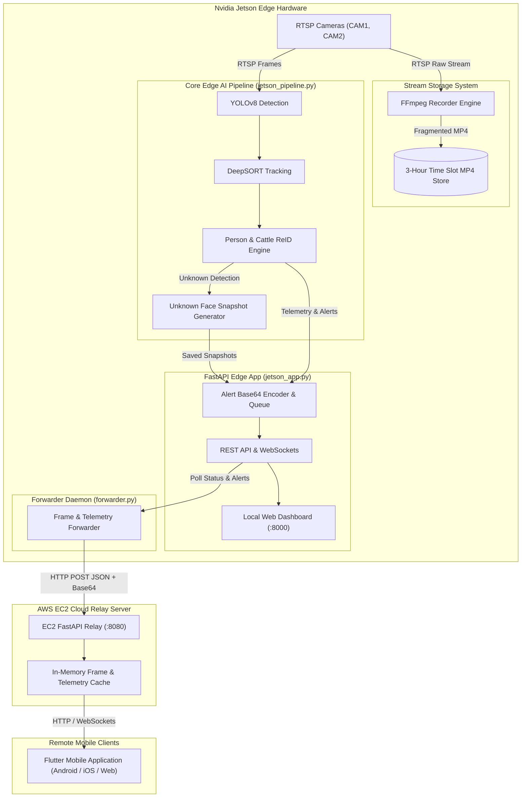
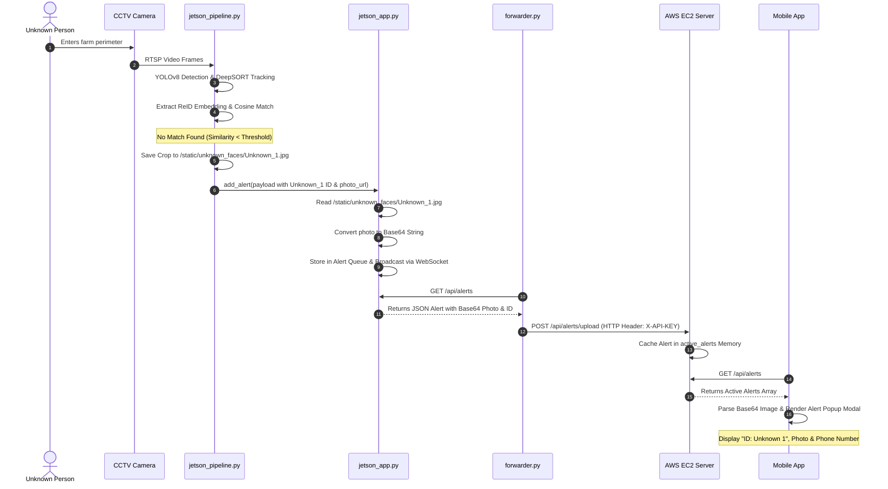
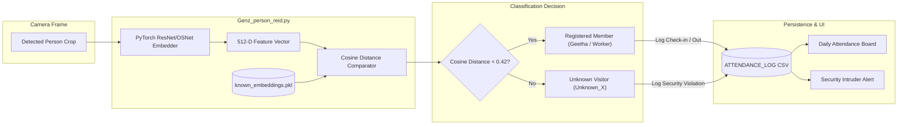
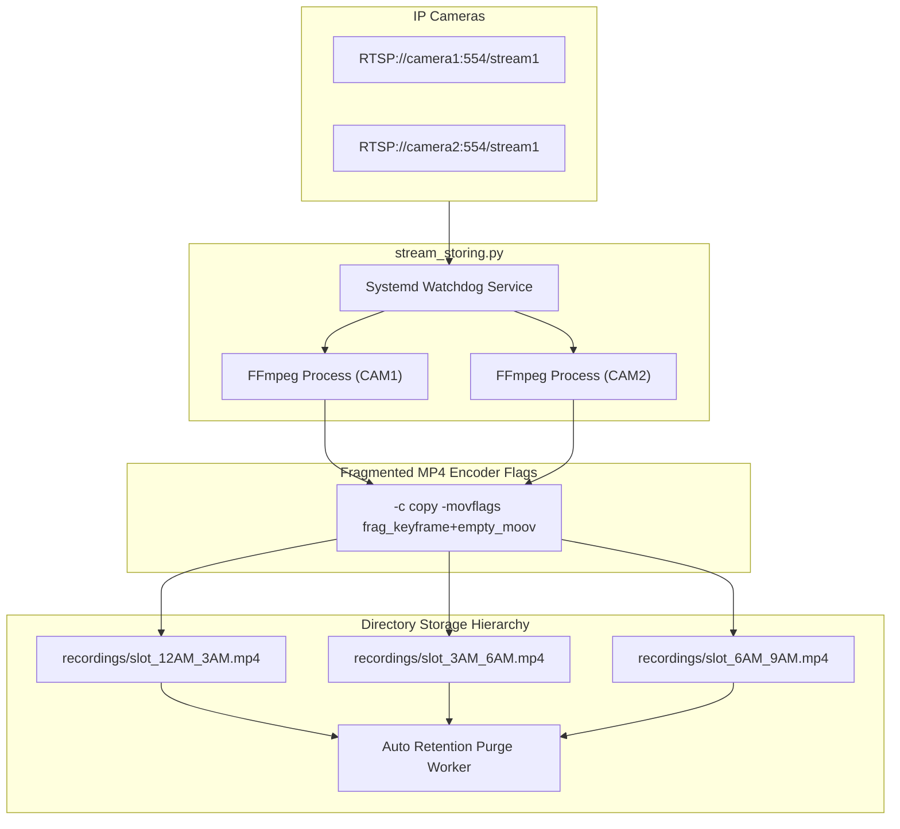

# Kisan CattleVision: System Architecture & Data Flow Diagrams

## 1. High-Level System Architecture

---

## 2. Unknown Person Alert & Telemetry Propagation Flow

---

## 3. Security Attendance Board & Member ReID Architecture

---

## 4. 24/7 CCTV Recording & Fragmented Storage Architecture

---

## 5. Storage & Persistence Schema

| Component | Storage Type | Path / Location | Purpose |
| :--- | :--- | :--- | :--- |
| **Embeddings** | Pickle (`.pkl`) | `known_embeddings.pkl` | Registered member ReID vectors |
| **Attendance Logs** | CSV | `security_logs.csv` | Visitor check-in/out records |
| **Unknown Crops** | JPEG Images | `/static/unknown_faces/` | Snapshots of unauthorized visitors |
| **Video Streams** | Fragmented MP4 | `/recordings/slot_XX_YY.mp4` | 24/7 continuous camera recordings |
| **Master Tag Sheet**| JSON / Memory | `/api/master_sheet` | Registered cattle ear tag ID list |
| **Alert Queue** | In-Memory (Capped 50) | `jetson_app.py` & `ec2_server` | Real-time push alert buffer |
