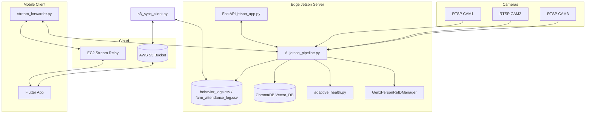
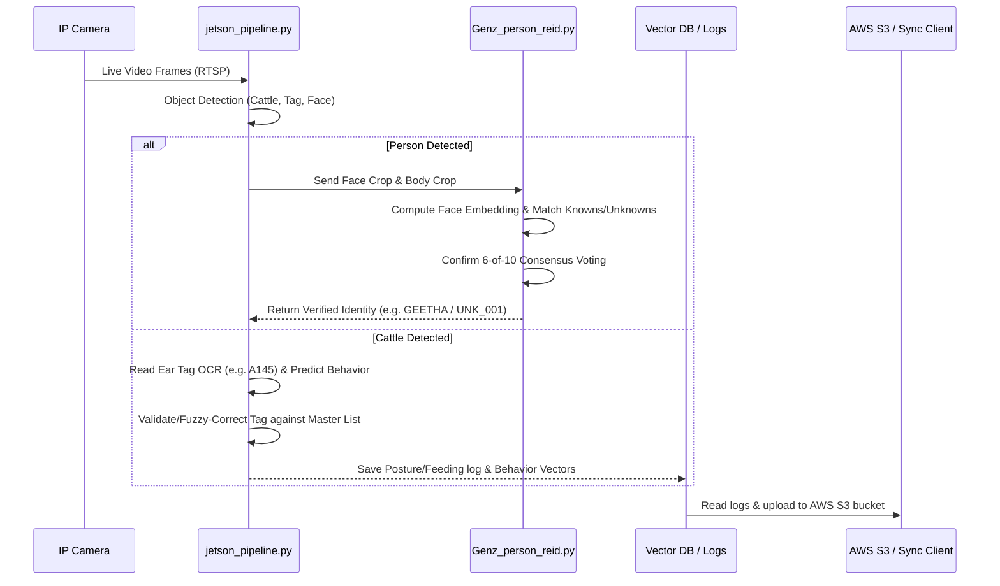

# System Architecture

## System Overview
The system runs on the edge (NVIDIA Jetson) consuming real-time IP camera RTSP streams. It utilizes multiple neural networks, OCR processors, and vector databases in parallel. Local files and templates are backed up and kept in sync with AWS cloud services, which in turn interface with mobile client apps.

## Architecture Diagram

## Component Descriptions
### `Kisan_Jetson`
- **Purpose**: Main computer vision inference and hosting environment.
- **Responsibilities**:
  - Live RTSP stream ingestion.
  - Multi-class object tracking and neural network predictions.
  - Hosts the FastAPI dashboard server.
- **Dependencies**: PyTorch, Ultralytics YOLO, EasyOCR, ChromaDB.
- **Type**: Application

### `4_jetson_connection_member_monitoring`
- **Purpose**: Background daemon syncing edge database logs to S3.
- **Responsibilities**:
  - Uploads CSV records.
  - Downloads remote registration embedding updates.
- **Dependencies**: Boto3, Python-dotenv.
- **Type**: Client / Infrastructure

### `Kisan_Jetson_Mobile`
- **Purpose**: Mobile companion app ecosystem.
- **Responsibilities**:
  - Live socket video frame forwarders.
  - User configuration and registration pages.
- **Dependencies**: Flutter, Python requests.
- **Type**: Clients / Applications

## Data Flow

## Integration Points
- **External Telegram API**: Sends markdown health/anomaly alerts to Chat ID `5137106552` (currently disabled via local stub to prevent notifications spam).
- **ChromaDB**: On-disk persistent client storing cattle posture/feeding vectors for similarity scoring.
- **CSV Logs**: Database files (`behavior_logs.csv` and `farm_attendance_log.csv`) saved in local storage.
- **AWS S3**: Bucket synchronization for remote monitoring and active template database backups.
