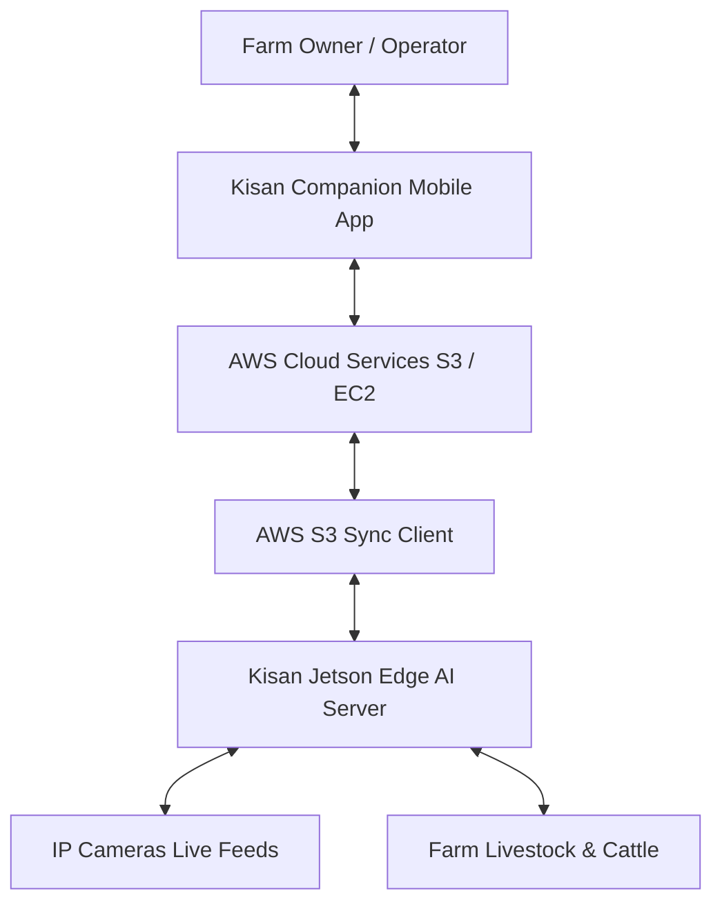

# Business Overview

## Business Context Diagram

## Business Description
- **Business Description**: The Kisan CattleVision system is an automated IoT livestock monitoring and farm security system designed for edge deployment (e.g., NVIDIA Jetson Orin Nano). It provides real-time cattle behavior monitoring (posture detection, feeding logs), automatic individual cattle identification via ear-tag OCR, adaptive health anomaly alerts, and secure farm visitor/worker re-identification (Re-ID) to ensure farm security and automated attendance tracking.
- **Business Transactions**:
  - **Cattle Health Tracking & Behavior Logging**: Logs the daily standing, lying, and feeding activities of individual cows.
  - **Ear Tag Identification & Registry Locking**: Automatically detects cow ear tags and verifies them against the official farm master list.
  - **Adaptive Health Alerting**: Detects critical shifts in daily feeding or posture durations and fires alerts.
  - **Worker Attendance & Greet**: Recognizes registered farm workers via facial recognition and logs their attendance, playing welcome voice audio.
  - **Stranger / Intruder Tracking**: Dynamically identifies unregistered visitors as sequential unknowns and flags potential security threats.
  - **Cloud Synchronization**: Syncs local database files and attendance records to S3 for remote web access.
- **Business Dictionary**:
  - **Cattle Behavior**: The binary categorization of cow state into Standing/Lying and Feeding/Idle.
  - **Ear Tag OCR**: Optically reading alphanumeric identifiers (e.g., A145) from plastic tags attached to cow ears.
  - **Vector DB Memory**: Behavior features stored in ChromaDB to track historical activities per entity.
  - **Worker / Known Person**: Farm members whose face templates are registered in the local database.
  - **Stranger / Unknown Person**: Unregistered individuals whose profiles are captured dynamically by the edge server.
  - **HSV Clothing Histogram**: Color signatures of upper/lower body apparel used to re-identify lost tracks.

## Component Level Business Descriptions
### `Kisan_Jetson`
- **Purpose**: Runs the edge processing pipeline for video analytics and manages local farm operation dashboards.
- **Responsibilities**:
  - Inferences deep learning models on GPU (Cattle, Ear Tags, Face detector, Behaviors).
  - Processes OCR characters and verifies them against the registry.
  - Serves the local dashboard for managers to review live streams and logs.

### `4_jetson_connection_member_monitoring`
- **Purpose**: Bridges local edge storage with cloud storage backups.
- **Responsibilities**:
  - Monitors directory changes and uploads behavior logs/attendance records to AWS S3.
  - Downloads new member face templates registered remotely from the mobile app.

### `Kisan_Jetson_Mobile`
- **Purpose**: Enables mobile streams viewing and remote registry management.
- **Responsibilities**:
  - Streams video frames from Jetson pipelines to owners' mobile devices.
  - Serves registration flows for adding new worker names and face photos.
