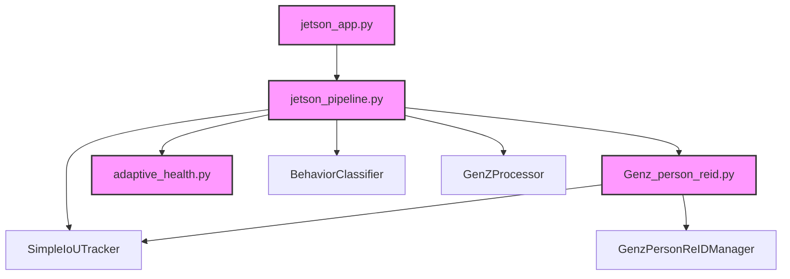

# Code Structure

## Build System
- **Type**: Python / Pip environment packages.
- **Configuration**: Managed via `requirements.txt` in the root workspace directory, detailing dependency packages and versions.

## Key Classes/Modules

### Existing Files Inventory
* **`Kisan_Jetson/jetson_app.py`** - FastAPI web application orchestrating REST API endpoints, WebSockets stream distribution, and camera processing threads.
* **`Kisan_Jetson/jetson_pipeline.py`** - Core computer vision tracking pipeline managing frame ingestions, model inferences (Cattle, Tag, Face, Behavior), EasyOCR text recognition, and rendering frames.
* **`Kisan_Jetson/Genz_person_reid.py`** - Re-ID manager class that extracts face embeddings, implements known matching priority margins, consensus voting, and clothing HSV correlation.
* **`Kisan_Jetson/adaptive_health.py`** - Evaluates cattle statistics logs and flags anomaly risk scores based on deviation metrics.
* **`Kisan_Jetson/storage_utils.py`** - Helper script calculating storage path destinations dynamically based on host OS.
* **`Kisan_Jetson/kisan_sync_manager.py`** - Periodically packages training crops and handles automated CSV database backups.
* **`Kisan_Jetson/stream_storing.py`** - Manages local video segment recording.
* **`Kisan_Jetson/build_trt_engines.py`** - Automates building TensorRT engine models on Jetson.
* **`4_jetson_connection_member_monitoring/s3_sync_client.py`** - AWS S3 directory sync script keeping local templates and cloud backups synchronized.
* **`Kisan_Jetson_Mobile/stream_forwarder/forwarder.py`** - Feeds frame segments to EC2 relay servers.

## Design Patterns
### Coordinator / Delegation Pattern
- **Location**: `jetson_pipeline.py` delegating Re-ID tasks to `Genz_person_reid.py`.
- **Purpose**: Decouples heavy frame tracking steps from detailed embedding databases, similarity scores, and consensus math.
- **Implementation**: The pipeline feeds cropped face and body frames to the manager, which returns a locked identity.

### Singleton / Global Lock Pattern
- **Location**: Multiple model locks (`cattle_model_lock`, `tag_model_lock`, `face_model_lock`) inside `jetson_pipeline.py`.
- **Purpose**: Prevents threading race conditions on Jetson when multiple cameras share the same global models on the single GPU/CPU context.
- **Implementation**: Wrapped prediction calls inside thread lock scopes.

## Critical Dependencies
### `ultralytics`
- **Version**: `>=8.0.0`
- **Usage**: Deep learning object detection models for cows, tags, and human faces.
- **Purpose**: Handles fast object bounding box detection.

### `facenet-pytorch`
- **Version**: `>=2.5.0`
- **Usage**: Custom `InceptionResnetV1` backbone.
- **Purpose**: Generates high-confidence 512-D face features.

### `chromadb`
- **Version**: `>=0.4.0`
- **Usage**: persistent client saving behavior log features.
- **Purpose**: Cattle behavior memory search.
