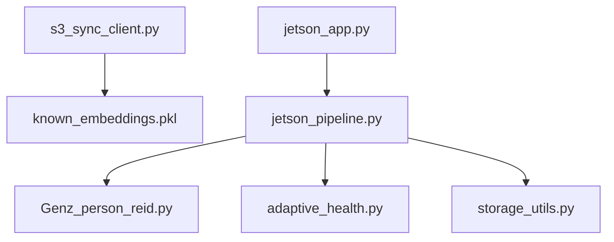

# Dependencies

## Internal Dependencies

### `jetson_pipeline.py` depends on `Genz_person_reid.py`
- **Type**: Runtime import.
- **Reason**: The tracking pipeline delegates face embedding calculation and known/unknown track classification to the Re-ID coordinator.

### `s3_sync_client.py` depends on `known_embeddings.pkl`
- **Type**: Runtime file monitoring.
- **Reason**: The S3 sync daemon monitors `known_embeddings.pkl` modification times and automatically synchronizes updates to/from the cloud bucket.

---

## External Dependencies
### `ultralytics`
- **Version**: `>=8.0.0`
- **Purpose**: Cattle, Tag, and Face detection.
- **License**: AGPL-3.0

### `easyocr`
- **Version**: `>=1.6.0`
- **Purpose**: Alphanumeric tag OCR character reading.
- **License**: Apache-2.0

### `chromadb`
- **Version**: `>=0.4.0`
- **Purpose**: Behavior feature memory vectors storage.
- **License**: Apache-2.0

### `boto3`
- **Version**: `>=1.26.0`
- **Purpose**: AWS S3 API communication.
- **License**: Apache-2.0
