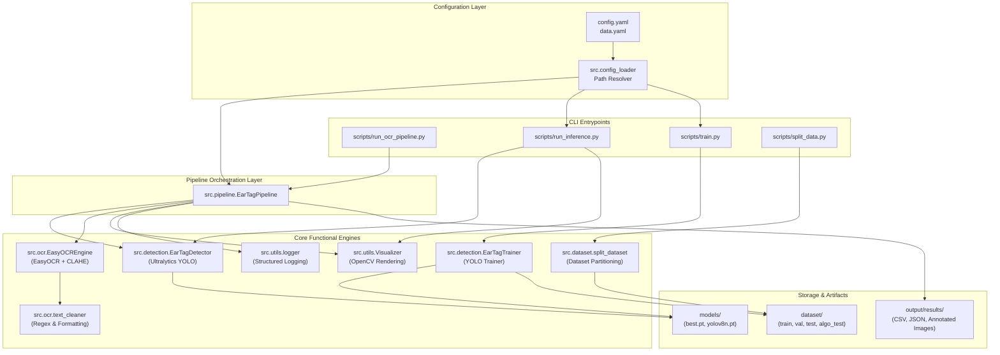
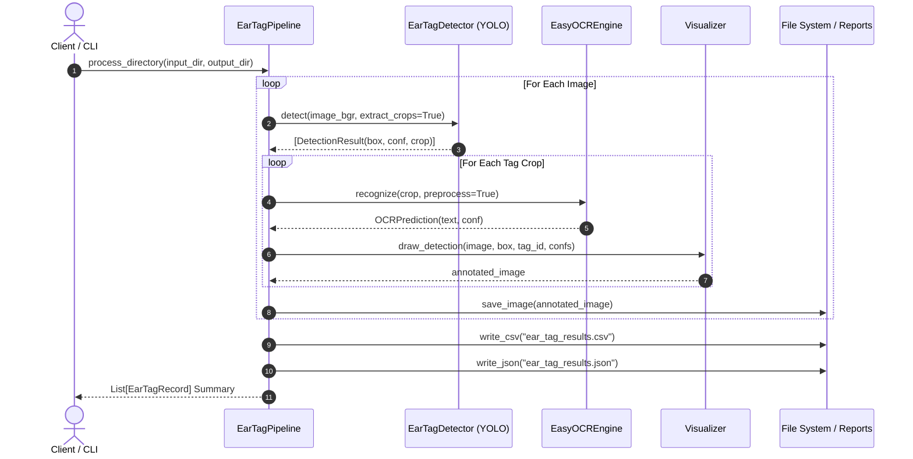

# System Architecture

## System Overview
The Cattle Ear Tag Monitoring System employs a modular two-stage deep learning pipeline. The architecture is decoupled into configuration management, image preprocessing, bounding-box localization (YOLO), optical character recognition (EasyOCR), and structured data delivery.

---

## Architecture Diagram

---

## Component Descriptions

### `src.detection`
- **Purpose**: Ear tag visual object detection and model training.
- **Responsibilities**:
  - `EarTagDetector`: Loads YOLO weights (`models/best.pt`), validates compute device (CUDA/CPU), runs batched prediction, generates cropped sub-images.
  - `EarTagTrainer`: Manages YOLO training hyperparameters, epoch schedules, checkpoints, and Windows-safe worker configurations.
- **Dependencies**: `ultralytics`, `torch`, `torchvision`, `cv2`, `src.utils`.
- **Type**: Application / Model Layer.

### `src.ocr`
- **Purpose**: Image enhancement and character recognition on ear tag crops.
- **Responsibilities**:
  - `EasyOCREngine`: Applies resizing, grayscale conversion, bilateral denoising, and CLAHE adaptive histogram equalization. Invokes EasyOCR.
  - `text_cleaner`: Normalizes casing, strips non-alphanumeric noise, validates minimum/maximum string lengths.
- **Dependencies**: `easyocr`, `cv2`, `numpy`, `torch`.
- **Type**: Application / Recognition Layer.

### `src.pipeline`
- **Purpose**: End-to-end integration of localization, recognition, and reporting.
- **Responsibilities**:
  - Coordinates execution across directory files or single frames.
  - Compiles `EarTagRecord` dataclasses into structured Pandas DataFrames.
  - Writes annotated `.jpg` visual files, `.csv` spreadsheets, and `.json` files.
- **Dependencies**: `src.detection`, `src.ocr`, `src.utils`, `pandas`, `tqdm`.
- **Type**: Application Orchestrator.

### `src.utils`
- **Purpose**: Logging, visualization, and formatting utilities.
- **Responsibilities**:
  - `Visualizer`: Renders bounding box outlines with background pill badges for high readability.
  - `setup_logger`: Formats timestamped log streams.
- **Dependencies**: `cv2`, `logging`, `sys`.
- **Type**: Utility Layer.

---

## Data Flow

---

## Integration Points
- **Local / Network File Storage**: Ingests input images from local directories, exports timestamped reports and crops to `output/results/`.
- **Pretrained Checkpoints**: Integrates Ultralytics PyTorch `.pt` models (`models/best.pt`, `yolov8n.pt`, `yolo11n.pt`).
- **Database / Farm Management Feeds**: The generated standard CSV/JSON reports provide direct ingestion schemas for livestock management databases.

---

## Infrastructure Components
- **Deployment Model**: Standalone Python CLI / Package / Docker-ready modular structure.
- **Compute Acceleration**: Automatic CUDA device binding for PyTorch (`cuda:0`) with automatic CPU fallback.
- **Worker Configuration**: Multiprocessing-safe execution designed specifically for Windows and Unix operating environments (`workers=0` safe default).
