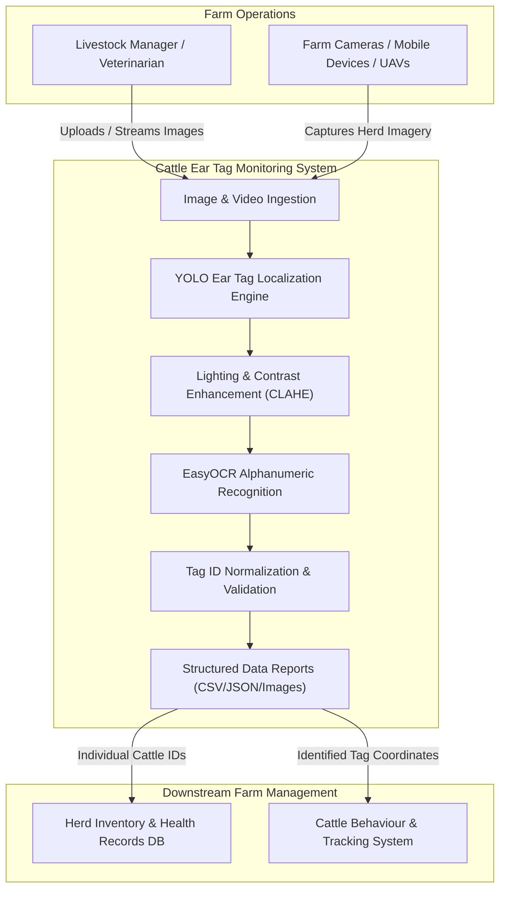

# Business Overview

## Business Context Diagram

## Business Description
- **Business Description**: The **Cattle Ear Tag Detection & Identification System** is an automated precision livestock farming solution designed to eliminate manual, error-prone ear tag inspections. By integrating high-speed deep learning object detection (YOLOv8/YOLO11) with adaptive optical character recognition (EasyOCR), the system identifies and registers individual cattle directly from farm imagery under variable lighting, dirt, and motion conditions.
- **Business Transactions**:
  1. **Automated Cattle Tag Ingestion & Extraction**: Ingests raw batch imagery or single photographs, detects ear tags with confidence scores, extracts the alphanumeric identifier, and generates auditable timestamps and coordinates.
  2. **Herd Inventory & Activity Reconciliation**: Maps detected tag numbers to central livestock records to log cattle presence, location, health inspection logs, and behavior monitoring.
  3. **Custom Model Training & Dataset Splitting**: Enables farm operators and ML engineers to partition domain-specific cattle images and retrain/fine-tune detection models for specific tag colors, geometries, or herd breeds.
- **Business Dictionary**:
  - **Ear Tag**: Physical plastic or RFID-backed visual tag attached to a bovine's ear containing a unique alphanumeric identifier.
  - **Tag ID**: The standardized numeric or alphanumeric string stamped on the physical tag (e.g. `0851`, `7028`, `50521`, `28F`).
  - **Precision Livestock Farming (PLF)**: Technology-driven livestock management focused on real-time individual animal monitoring.
  - **Detection Confidence (`det_conf`)**: Statistical certainty of the YOLO model in locating the bounding box of an ear tag.
  - **OCR Confidence (`ocr_conf`)**: Statistical certainty of the OCR engine in correctly decoding the character sequence.

---

## Component Level Business Descriptions

### `src.detection` (Ear Tag Localization)
- **Purpose**: Locates visual ear tags within high-resolution, unconstrained farm images.
- **Responsibilities**:
  - Scans full-frame images for cattle ears and attached tags.
  - Bounds ear tags accurately and extracts high-resolution crops.
  - Manages YOLO training and fine-tuning lifecycles.

### `src.ocr` (Text Extraction & Image Enhancement)
- **Purpose**: Decodes textual identification numbers from cropped ear tag regions.
- **Responsibilities**:
  - Enhances contrast using CLAHE to counter farm shadows and dust.
  - Reads alphanumeric strings via GPU-accelerated deep OCR.
  - Filters non-tag visual artifacts and normalizes string casing and spacing.

### `src.pipeline` (End-to-End Orchestrator)
- **Purpose**: Orchestrates the multi-stage detection-to-recognition workflow.
- **Responsibilities**:
  - Coordinates detection, cropping, OCR, and annotation.
  - Formats output reports into structured CSV and JSON feeds for herd databases.
  - Generates visual verification images with confidence badges.

### `src.dataset` (Dataset Lifecycle Management)
- **Purpose**: Manages dataset partitioning for model training.
- **Responsibilities**:
  - Partitions labeled image collections into Train, Validation, and Test splits.
  - Maintains strict image-label pair consistency.
