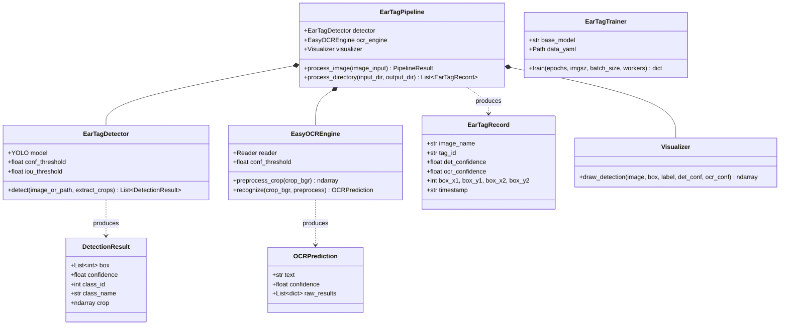

# Code Structure

## Build System
- **Type**: Standard Python package / pip environment
- **Configuration**: `requirements.txt`, `.gitignore`

---

## Key Classes & Module Hierarchy

---

## Existing Files Inventory

- `config/config.yaml` — Central configuration declaring model paths, detection thresholds, OCR preprocessing options, and training defaults.
- `config/data.yaml` — YOLO dataset configuration declaring relative image paths (`dataset/train`, `dataset/val`, `dataset/test`) and class labels.
- `src/__init__.py` — Top-level package metadata and exports.
- `src/config_loader.py` — Dynamic project-root path resolver and YAML configuration parser.
- `src/dataset/split_dataset.py` — Dataset partitioner (Train/Val/Test) with verification of image-label pairings.
- `src/detection/detector.py` — `EarTagDetector` wrapping Ultralytics YOLO inference, bounding box extraction, and crop creation.
- `src/detection/trainer.py` — `EarTagTrainer` managing model training loops, device selection, and weight saving.
- `src/ocr/ocr_engine.py` — `EasyOCREngine` providing CLAHE contrast enhancement, resizing, denoising, and EasyOCR text extraction.
- `src/ocr/text_cleaner.py` — String cleaning, noise filtering, and ear tag format validation.
- `src/pipeline/ear_tag_pipeline.py` — `EarTagPipeline` orchestrating detection, OCR, visualization, and CSV/JSON reporting.
- `src/utils/logger.py` — Standardized timestamped console/file logging utility.
- `src/utils/visualizer.py` — OpenCV bounding-box and text badge rendering utility.
- `scripts/run_ocr_pipeline.py` — CLI entrypoint for running the end-to-end detection and OCR pipeline.
- `scripts/run_inference.py` — CLI entrypoint for running detection-only inference.
- `scripts/train.py` — CLI entrypoint for training and fine-tuning YOLO models.
- `scripts/split_data.py` — CLI entrypoint for splitting raw dataset folders.
- `requirements.txt` — Python dependencies specification.
- `README.md` — Complete system manual, quickstart guide, and API documentation.
- `.gitignore` — Ignore rules for Python cache, virtual environments, and weights.

---

## Design Patterns

### 1. Pipeline Pattern
- **Location**: `src/pipeline/ear_tag_pipeline.py`
- **Purpose**: Sequentially processes images through independent stages: Load -> Detect -> Crop -> Preprocess -> OCR -> Clean -> Annotate -> Export.
- **Implementation**: `EarTagPipeline.process_image()` and `process_directory()`.

### 2. Configuration Injection / Strategy Pattern
- **Location**: `src/config_loader.py`
- **Purpose**: Eliminates hardcoded values by decoupling execution parameters and file paths from business logic.
- **Implementation**: `load_config()` reads `config.yaml` and injects resolved absolute paths dynamically.

### 3. Factory / Wrapper Pattern
- **Location**: `src/detection/detector.py` & `src/ocr/ocr_engine.py`
- **Purpose**: Encapsulates external libraries (`ultralytics`, `easyocr`) behind clean domain interfaces returning standard dataclasses (`DetectionResult`, `OCRPrediction`).

---

## Critical Dependencies

### `ultralytics`
- **Version**: `>=8.0.20`
- **Usage**: Deep learning object detection engine (YOLOv8 & YOLO11).
- **Purpose**: High-speed, high-accuracy localization of ear tags on cattle ears.

### `easyocr`
- **Version**: `>=1.7.0`
- **Usage**: Deep learning text recognition engine.
- **Purpose**: Optical character recognition for extracting tag IDs.

### `opencv-python`
- **Version**: `>=4.8.0`
- **Usage**: Image loading, resizing, CLAHE contrast enhancement, bounding-box drawing, and saving.
- **Purpose**: Core computer vision and image manipulation operations.

### `torch` & `torchvision`
- **Version**: `>=2.0.0`
- **Usage**: Deep learning tensor computation and GPU acceleration backend.
- **Purpose**: Powers both YOLO and EasyOCR models.
