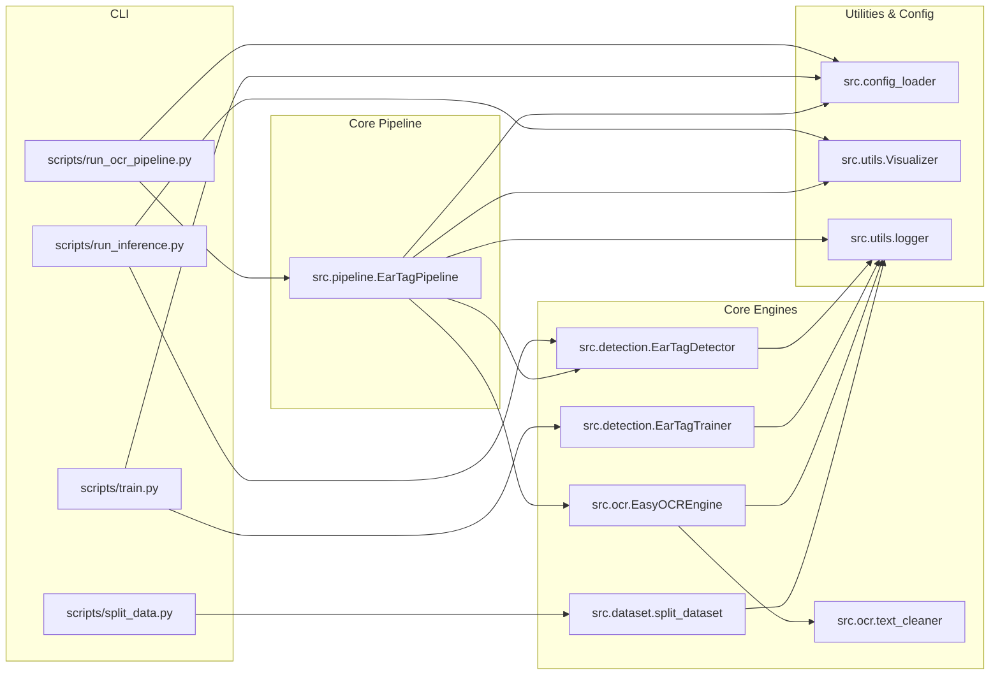

# Dependencies

## Internal Dependencies

### Dependency Relationships
- **`src.pipeline` depends on `src.detection`**: Runtime dependency to locate ear tags and extract bounding box coordinates.
- **`src.pipeline` depends on `src.ocr`**: Runtime dependency to read text from extracted crops.
- **`src.pipeline` depends on `src.utils.Visualizer` & `logger`**: Visual annotation and logging.
- **`src.ocr.ocr_engine` depends on `src.ocr.text_cleaner`**: Clean and validate raw extracted characters.
- **`scripts/*` depend on `src.*`**: CLI wrappers calling core modular business logic.

---

## External Dependencies

| Dependency | Minimum Version | Purpose | License |
|---|---|---|---|
| `ultralytics` | `8.0.20` | YOLOv8/v11 detection architecture | AGPL-3.0 / Enterprise |
| `easyocr` | `1.7.0` | Deep OCR character recognition | Apache-2.0 |
| `torch` | `2.0.0` | PyTorch deep learning framework | Modified BSD |
| `torchvision` | `0.15.0` | Image transformation utilities | BSD-3-Clause |
| `opencv-python` | `4.8.0` | Computer vision and image processing | Apache-2.0 |
| `pandas` | `2.0.0` | Tabular data handling and CSV generation | BSD-3-Clause |
| `numpy` | `1.23.0` | Numerical and array computing | BSD-3-Clause |
| `pyyaml` | `6.0` | YAML configuration file parser | MIT |
| `tqdm` | `4.65.0` | Progress bar visualization | MPL-2.0 / MIT |
| `pillow` | `9.5.0` | Image file handling backend | HPND |
