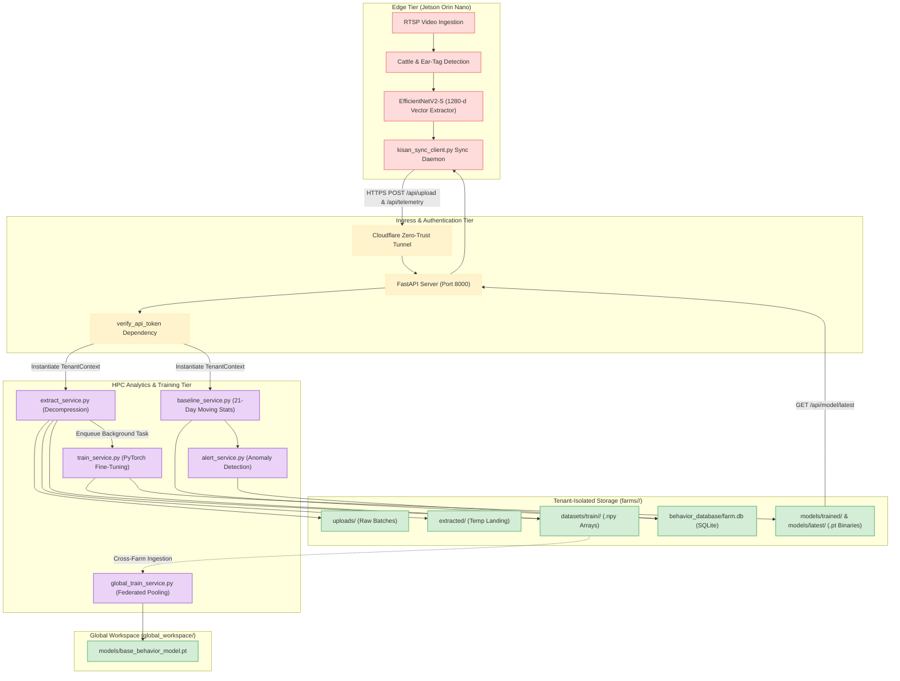
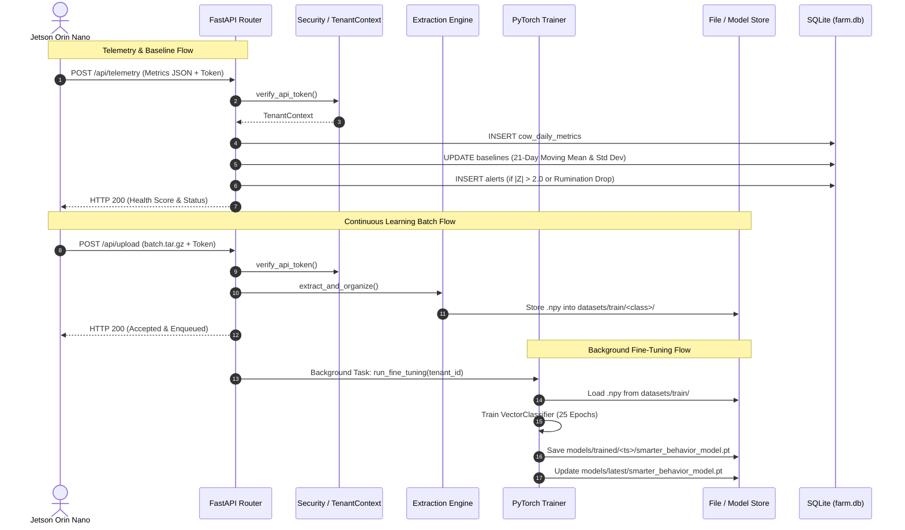

# System Architecture

## System Overview
The **Kisan Intelligence Hub (HPC)** is an asynchronous, multi-tenant continuous learning server built on FastAPI and PyTorch. It provides a robust, decoupled architecture connecting edge inference nodes (NVIDIA Jetson Orin Nano) with cloud/HPC resources over secure Cloudflare tunnels.

## Architecture Diagram

## Component Descriptions

### `app/api/upload_api.py`
- **Purpose**: Handles multipart batch vector uploads and daily telemetry logs.
- **Responsibilities**: Validates request formats, executes synchronous file writes, triggers extraction, and delegates fine-tuning to FastAPI `BackgroundTasks`.
- **Dependencies**: `app.core.security`, `app.core.config`, `app.services.extract_service`, `app.services.train_service`, `app.services.baseline_service`, `app.services.alert_service`.
- **Type**: Application / API Controller.

### `app/api/model_api.py`
- **Purpose**: Serves tenant-specific fine-tuned PyTorch model binaries.
- **Responsibilities**: Streams `smarter_behavior_model.pt` and lists versioned checkpoints.
- **Dependencies**: `app.core.security`, `app.core.config`.
- **Type**: Application / Model Distribution.

### `app/api/health_api.py`
- **Purpose**: System diagnostics and resource utilization telemetry.
- **Responsibilities**: Reports GPU status, CUDA availability, CPU utilization percentage, and memory usage.
- **Dependencies**: `torch`, `psutil`, `app.core.config`.
- **Type**: Application / Diagnostics.

### `app/core/config.py` & `app/core/security.py`
- **Purpose**: Configuration management and multi-tenant security boundary.
- **Responsibilities**: Dynamic path resolution for `farms/<Tenant_ID>/` directories, token-to-tenant mapping, and request authorization.
- **Dependencies**: `pydantic-settings`, `python-dotenv`.
- **Type**: Infrastructure / Core Framework.

### `app/core/database.py`
- **Purpose**: Isolated database connection manager.
- **Responsibilities**: Creates and manages SQLite connections and DDL schemas for `cow_daily_metrics`, `baselines`, and `alerts` inside `farms/<Tenant_ID>/behavior_database/farm.db`.
- **Dependencies**: `sqlite3`.
- **Type**: Data Store / Persistence Layer.

### `app/services/train_service.py` & `app/services/global_train_service.py`
- **Purpose**: Machine learning training engines.
- **Responsibilities**: Defines `VectorDataset`, `VectorClassifier` (3-layer MLP), handles 2D vector dimension squeezing, executes 25-epoch fine-tuning per tenant, and aggregates cross-farm data for universal distillation.
- **Dependencies**: `torch`, `numpy`, `torch.utils.data`.
- **Type**: Machine Learning Engine.

## Data Flow

## Integration Points
- **External APIs**: Cloudflare Zero-Trust Tunnel for encrypted public ingress.
- **Databases**: Per-tenant SQLite databases (`farms/<Tenant_ID>/behavior_database/farm.db`).
- **Edge Integration**: RESTful API integration with Jetson Orin Nano edge daemons running `kisan_sync_client.py`.

## Infrastructure Components
- **Deployment Model**: Local / Cloud Virtual Machine with NVIDIA GPU acceleration.
- **Networking**: HTTP/1.1 on Port 8000 mapped through Cloudflare Quick Tunnel (`trycloudflare.com`).
- **File System**: Physical hierarchical disk partitioning for strict data residency and isolation.
