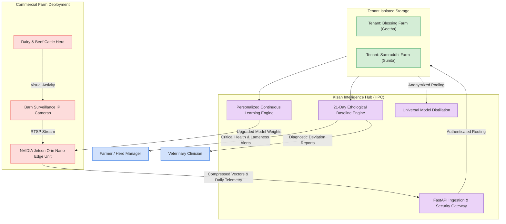

# Business Overview

## Business Context Diagram

## Business Description
- **Business Description**: The **Kisan Intelligence Hub** provides a centralized, multi-tenant High-Performance Computing (HPC) backend for precision livestock farming. It interfaces with edge computer vision nodes (NVIDIA Jetson Orin Nano) installed across commercial dairy farms to automate 24/7 cattle behavioral monitoring, early sickness/lameness detection, and continuous transfer learning without requiring high-bandwidth raw video transmission.
- **Business Transactions**:
  1. **Daily Ethological Telemetry Ingestion (`TX-01`)**: Edge nodes upload daily aggregated durations for standing, lying, eating, rumination, and locomotion.
  2. **Statistical Baseline Calibration (`TX-02`)**: System computes 21-day rolling averages and standard deviations per animal to establish personalized normalcy baselines.
  3. **Automated Veterinary & Sickness Alerting (`TX-03`)**: System triggers real-time alerts for acute health deviations (e.g., severe rumination drops indicating acidosis, or excessive lying indicating claw horn disruption/lameness).
  4. **Vector Embedding Continuous Reinforcement (`TX-04`)**: Edge devices upload feature embedding archives (`.tar.gz`) extracted from local video, triggering automated background fine-tuning of personalized farm classifiers.
  5. **Model Checkpoint Distribution (`TX-05`)**: Jetson edge nodes poll and download updated model weights (`smarter_behavior_model.pt`) to improve on-device inference accuracy over time.
  6. **Global Knowledge Distillation (`TX-06`)**: Cross-farm data aggregation distills generalized base behavior models to serve as high-accuracy defaults for new farm onboardings.
- **Business Dictionary**:
  * **Precision Livestock Farming (PLF)**: Quantitative, automated management of livestock using real-time sensing.
  * **Ethology**: Scientific study of animal behavior patterns (e.g., rumination time, lying bouts, feeding cycles).
  * **Rumination**: Essential digestive mastication and cud chewing in ruminants; a drop below baseline indicates acute metabolic illness.
  * **Lameness**: Locomotor impairment indicated by abnormally prolonged lying duration and reduced activity score.
  * **Tenant Context**: An isolated partition assigned to a specific commercial farm entity.

## Component Level Business Descriptions

### `app/api` (Ingestion & Delivery Gateway)
- **Purpose**: Exposes authenticated REST endpoints for edge devices to stream telemetry, upload training vectors, and download updated model weights.
- **Responsibilities**: API token validation, payload validation, non-blocking background task orchestration, model file streaming.

### `app/core` (Security, Configuration & Database Engine)
- **Purpose**: Enforces strict multi-tenancy, configuration management, and isolated SQLite database connections.
- **Responsibilities**: Resolving `TenantContext` from `X-API-KEY`, creating tenant folder hierarchies, initializing per-farm database schemas.

### `app/services` (Analytics & Continuous Learning Engines)
- **Purpose**: Executes deep learning fine-tuning, statistical anomaly detection, dataset management, and cross-farm distillation.
- **Responsibilities**: Vector decompression, PyTorch MLP fine-tuning, 21-day rolling Z-score evaluation, health score computation ($0-100$), alert generation.
