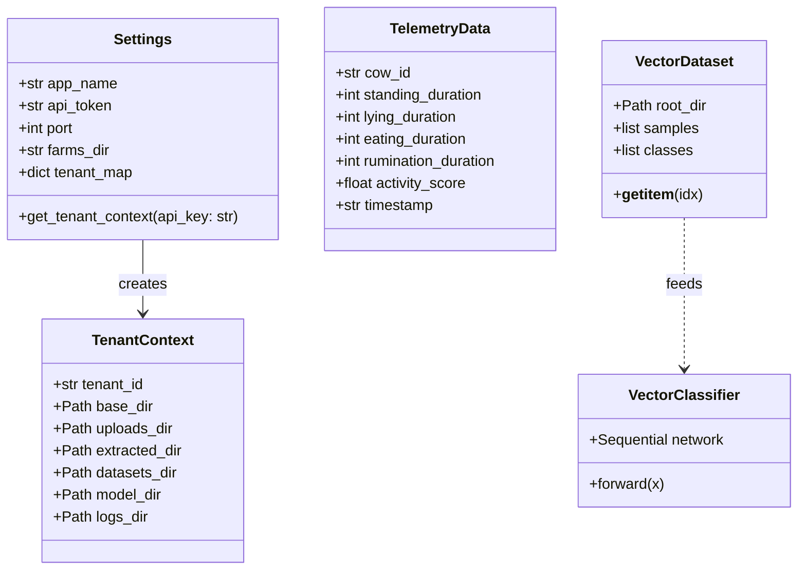

# Code Structure

## Build System
- **Type**: Python / Pip (`setuptools` / `virtualenv`)
- **Configuration**: `.env` configuration file, standard `requirements.txt` environment layout, and Windows batch execution script (`start_hpc_hub.bat`).

## Key Classes/Modules

### Existing Files Inventory

- `app/main.py` - FastAPI entry point, exception handler for validation logging, and router mount points.
- `app/api/upload_api.py` - Endpoint handlers for `.tar.gz` batch uploads (`/api/upload`) and daily cow telemetry (`/api/telemetry`).
- `app/api/model_api.py` - Endpoint handlers for serving latest model binaries (`/api/model/latest`) and listing versions (`/api/model/versions`).
- `app/api/health_api.py` - Diagnostic endpoint reporting GPU, CPU, and RAM telemetry (`/api/health`).
- `app/core/config.py` - Configuration loading (`Settings`) and tenant directory encapsulation (`TenantContext`).
- `app/core/security.py` - FastAPI authentication dependency (`verify_api_token`) mapping API keys to `TenantContext`.
- `app/core/database.py` - SQLite schema generation (`cow_daily_metrics`, `baselines`, `alerts`) and per-tenant connection factory.
- `app/core/logger.py` - Application logging setup with console and file handlers.
- `app/services/extract_service.py` - Decompresses incoming `.tar.gz` archives and structures `.npy` arrays into class folders.
- `app/services/train_service.py` - PyTorch `VectorDataset`, `VectorClassifier` MLP, and 25-epoch `run_fine_tuning` engine.
- `app/services/baseline_service.py` - Computes 21-day rolling mean/std-dev, calculates $Z$-scores, and scores cow health ($0-100$).
- `app/services/alert_service.py` - Clinical heuristic rules for metabolic illness (rumination drop) and lameness (excessive lying).
- `app/services/global_train_service.py` - Cross-tenant crawler (`GlobalAnonymizedDataset`) and universal base model trainer (`run_global_distillation`).
- `tests/verify_multitenancy.py` - Automated integration test verifying multi-tenant isolation, extraction, and model downloads.
- `tests/verify_complete_hub.py` - Automated integration test verifying 21-day telemetry seeding, rolling baselines, alerts, and global distillation.
- `tests/trigger_vector_training.py` - Manual verification script to trigger fine-tuning sessions on mock vector datasets.
- `tests/verify_hub.py` - Basic sanity test for API health and connectivity.
- `generate_docx.py` - Automated publication-grade DOCX compilation script with embedded Base64 Mermaid rendering and dynamic page numbering.
- `start_hpc_hub.bat` - Windows batch execution script to launch the FastAPI server.

## Design Patterns

### 1. Multi-Tenant Directory Partitioning (Sandbox Pattern)
- **Location**: `app/core/config.py` (`TenantContext`)
- **Purpose**: Guarantees physical file isolation between different farms on the shared server.
- **Implementation**: Every tenant is assigned a dedicated folder tree (`farms/<Tenant_ID>/`) containing its own uploads, datasets, models, logs, and SQLite database.

### 2. Dependency Injection for Security & Context
- **Location**: `app/core/security.py` & `app/api/*.py`
- **Purpose**: Eliminates boilerplate authentication code and seamlessly resolves tenant context on every request.
- **Implementation**: Uses FastAPI's `Depends(verify_api_token)` to validate headers and pass `TenantContext` directly into route functions.

### 3. Asynchronous Background Task Delegation
- **Location**: `app/api/upload_api.py`
- **Purpose**: Prevents long-running PyTorch training loops from blocking HTTP responses to edge devices.
- **Implementation**: Uses FastAPI `BackgroundTasks.add_task(run_fine_tuning, tenant.tenant_id)` to return HTTP 200 immediately while training runs in the background.

### 4. Robust Dimension Squeeze (Defensive Adapter Pattern)
- **Location**: `app/services/train_service.py` (`VectorDataset.__getitem__`)
- **Purpose**: Handles variations in vector shapes emitted by different edge export tools (`(1, 1280)`, `(1280, 1)`, or `(1280,)`).
- **Implementation**: Applies `vector.squeeze()` prior to tensor conversion to guarantee standard 1D float vectors.

## Critical Dependencies

### `torch` (PyTorch)
- **Version**: `2.4.0+`
- **Usage**: Deep learning tensor math, neural network layers (`nn.Module`), DataLoader, and CUDA GPU acceleration.
- **Purpose**: Powers `VectorClassifier` personalized fine-tuning and universal distillation.

### `fastapi` & `uvicorn`
- **Version**: `FastAPI 0.110+`, `Uvicorn 0.28+`
- **Usage**: Core REST API framework, asynchronous request handling, multipart upload streaming.
- **Purpose**: High-throughput edge communication gateway.

### `pydantic-settings` & `pydantic`
- **Version**: `Pydantic v2`
- **Usage**: Request schema validation (`TelemetryData`) and environment variable management.
- **Purpose**: Type safety and payload integrity.
