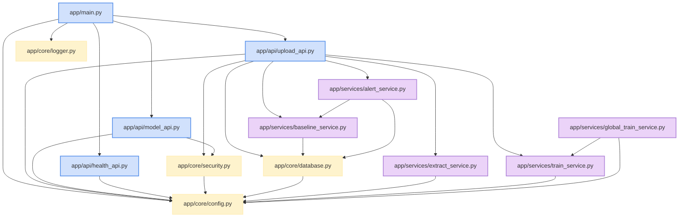

# Dependencies

## Internal Dependencies

### Dependency Relationships:
1. **`app/api/upload_api.py` depends on `app/core/security.py`**:
   - **Type**: Runtime / Injected Dependency
   - **Reason**: Authenticates API tokens and passes active `TenantContext`.
2. **`app/api/upload_api.py` depends on `app/services/extract_service.py` & `app/services/train_service.py`**:
   - **Type**: Runtime
   - **Reason**: Executes decompression and triggers background fine-tuning.
3. **`app/services/alert_service.py` depends on `app/services/baseline_service.py`**:
   - **Type**: Runtime
   - **Reason**: Retrieves $Z$-scores and health scores for anomaly evaluation.
4. **`app/services/global_train_service.py` depends on `app/services/train_service.py`**:
   - **Type**: Runtime / Class Re-use
   - **Reason**: Re-uses `VectorClassifier` model architecture for universal distillation.

## External Dependencies

| Dependency Name | Version | Purpose / Role | License |
| :--- | :--- | :--- | :--- |
| `fastapi` | `^0.110.0` | High-performance REST web framework | MIT |
| `uvicorn` | `^0.28.0` | Production ASGI web server | BSD-3-Clause |
| `torch` | `^2.4.0` | Tensor computation & neural network library | BSD-style |
| `pydantic` | `^2.6.0` | Data validation and schema parsing | MIT |
| `pydantic-settings` | `^2.2.0` | Settings management using environment variables | MIT |
| `python-dotenv` | `^1.0.0` | `.env` file loading | BSD-3-Clause |
| `psutil` | `^5.9.0` | CPU and memory system monitoring | BSD-3-Clause |
| `numpy` | `^1.26.0` | Feature vector manipulation and mathematical utilities | BSD-3-Clause |
| `python-docx` | `^1.1.0` | Automated Word document compiler generation | MIT |
| `requests` | `^2.31.0` | HTTP client for edge synchronization and tests | Apache 2.0 |
| `Pillow` | `^10.2.0` | Image processing library | HPND |
