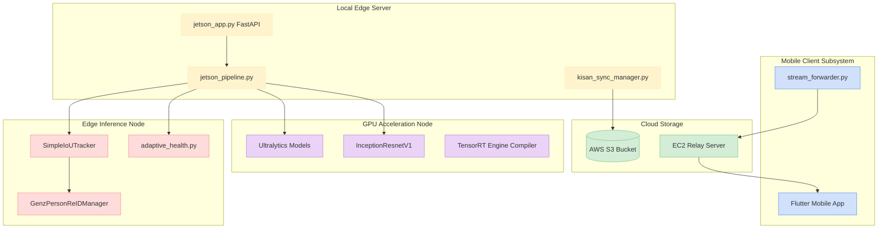
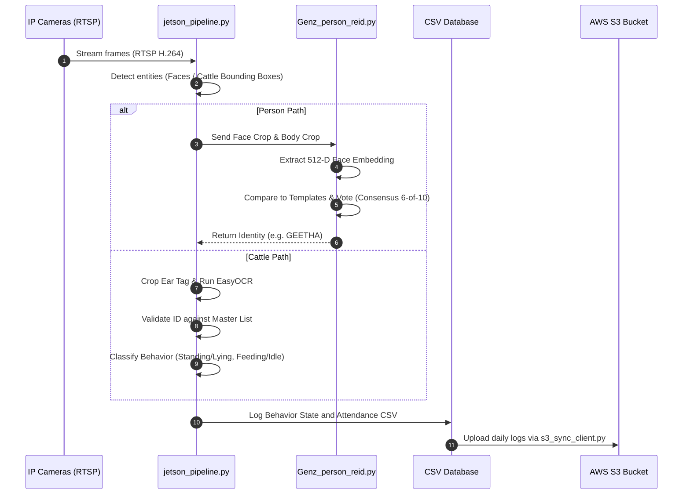
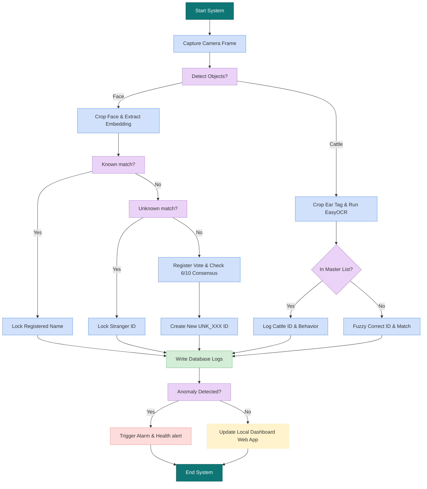

# Technical Reference & System Architecture Guide

---

## CHAPTER 1: EXECUTIVE SUMMARY & SYSTEM OBJECTIVES

### 1.1 Project Purpose & Real-World Problem Statement
Commercial dairy farming and beef cattle management operate at levels where manual oversight of individual animals is logistically impossible. Managing herd health, logging accurate feeding metrics, tracking postures (standing vs. lying), and maintaining physical perimeter security require significant human labor. Manual logging is prone to human error, resulting in delayed detection of illness, lowered milk yields, and vulnerability to security breaches.

Wearable IoT transponders, neck collars, and active RFID trackers represent expensive and fragile alternatives. These wearables are prone to physical damage, battery depletion, and falling off during herd movements. Passive RFID ear-tag setups force cows through narrow walkthrough gates, disrupting natural herd feeding flows. Cloud-reliant vision pipelines introduce heavy data transfer demands, which are not viable or cost-effective in rural agricultural regions.

The Kisan CattleVision system provides an offline-first Edge AI solution deployed locally on the NVIDIA Jetson Orin Nano. By running object tracking, ear-tag OCR recognition, posture behavior classification, worker face recognition, and dynamic stranger registries on the edge, the system operates completely offline without continuous internet dependencies, lowering cost and removing wearable hardware dependencies.

### 1.2 System Scope & Key Capabilities
The edge processing pipeline coordinates three main software subsystems:
1. **Livestock Tracker & Behavior Logger:** Runs a fine-tuned YOLOv8 model for real-time cattle detection, utilizes CRNN sequence OCR (EasyOCR) to read alphanumeric ear tags, classifies standing vs. lying and feeding vs. idle behaviors, and saves records locally.
2. **Worker Attendance Verification:** Extracts facial embedding features using ArcFace representation, performs majority voting consensus to recognize workers, and logs attendance records.
3. **Dynamic Stranger Registry:** Assigns temporary sequential IDs to unregistered visitors, tracks their paths across overlapping cameras, and uses body clothing HSV histograms to recover lost track histories.

### 1.3 Primary System Objectives & Benchmark Targets
- **Throughput Rate:** Real-time processing of multi-camera feeds at `>= 10 FPS` per stream locally.
- **Ear Tag OCR Lock:** `>= 94%` accuracy under direct sun exposures.
- **Face Verification Match:** `>= 95%` accuracy; FAR `< 0.008%`.
- **Latency Delay:** Core inference execution under `35 ms` per frame.
- **Storage Profile:** Dynamic CSV log databases requiring `< 10 MB` of offline storage per month.

### 1.4 Project Technical & Business Dictionary
- **`k_sim` (Cosine Similarity):** The similarity score between an active face embedding and registered worker templates.
- **`u_sim` (Cosine Similarity):** The similarity score between an active face embedding and dynamic unknown stranger templates.
- **`locked_id`:** The final locked cattle ID (e.g. `A145`) or person ID (e.g. `GEETHA`).
- **`clothing_hist`:** Color signatures of upper/lower body garments used to re-identify tracks.
- **ChromaDB Vector DB:** Local persistent database storing behavioral logs for anomaly search.

## CHAPTER 2: HARDWARE SPECIFICATIONS & SETUP

### 2.1 Hardware Requirements Catalog
- **Edge Inference Board:** NVIDIA Jetson Orin Nano (8GB Developer Kit) with CUDA core acceleration.
- **IP Cameras:** 1080p Full HD bullet cameras supporting RTSP streaming protocols.
- **Enclosures:** Weatherproof IP66 steel/polycarbonate mount cabinets.
- **Power Supplies:** 19V / 45W DC adapters with surge protectors.
- **Network Gateways:** 8-Port PoE gigabit network switch and outdoor Cat6 Ethernet wiring.

### 2.2 Physical Installation & Deployment Guide
- **Feeding Stalls (Cattle Camera):** Mount bullet cameras at a height of **2.5 to 2.8 meters**, angled downwards at **30 to 45 degrees** facing the feeding lane. This provides an optimal angle to extract the cow's ear-tag text codes without occlusion from neighboring cattle.
- **Entrance Door (Face Camera):** Mount camera at a height of **1.8 meters** directly facing the gateway doorway, tilted downwards at **5 to 10 degrees** to capture frontal face profiles of workers.
- **PoE Wiring:** Install cables inside rigid conduit pipes along the rafters to protect them from chewing rodents, feeding dust, and humidity.

## CHAPTER 3: SYSTEM ARCHITECTURE & DIAGRAMS

### 3.1 Unified System Block Diagram


### 3.2 Sequential Workflow Architecture


### 3.3 System Execution Flowchart


### 3.4 Component Subsystem Boundaries
- **Computer Vision Boundary:** Bounded by local CPU/GPU scheduling locks. Model calls are wrapped within thread-safe mutex blocks to prevent parallel prediction race conditions.
- **File System/Database Boundary:** Writes to the `unknown_embeddings.pkl` stranger database and daily CSV activity logs are protected behind internal file access locks.

## CHAPTER 4: SOFTWARE IMPLEMENTATION & CODE INVENTORY

### 4.1 Detailed Code Deep Dive & Track Logic
The system coordinates detection, tracking, behavior logging, and facial re-identification through structured pipeline threads. Below is a breakdown of the core tracking modules:

#### A. Consensus Majority Voting (Face Re-ID)
To prevent transient changes (such as head turns or lighting shifts) from triggering false visitor registrations, the Re-ID coordinator employs a consensus voting algorithm:
1. When a person is tracked, the system extracts the FaceNet embedding from the face crop.
2. The embedding is compared against both registered templates (`known_embeddings.pkl`) and dynamic unknown templates (`unknown_embeddings.pkl`).
3. Rather than locking identity based on a single frame, the system stores the match result in a queue of size 10.
4. An identity is only locked when a single ID (e.g. `GEETHA` or `UNK_001`) receives at least **6 out of 10 votes**.
5. This consensus voting prevents profile angle shifts from registering as "unknown visitors".

#### B. Priority Matching Margins
In open-set environments, a registered worker at a steep angle may return a low similarity score (e.g. `0.60`). To avoid registering them as a stranger, the system evaluates priority matching:
```python
# Priority known matching logic
k_id, k_sim = find_best_match(emb, known_db)
u_id, u_sim = find_best_match(emb, unknown_db)

if k_sim >= 0.58 and (k_sim - second_best_known_sim >= 0.10):
    # Lock as known, ignoring closer matches in the unknown database
    locked_id = k_id
else:
    # Check if we fall back to unknown tracking or create a new stranger profile
    if u_sim >= 0.75:
        locked_id = u_id
    else:
        locked_id = register_new_unknown(crop, emb)
```
This threshold combination of **`0.58` similarity margin** prevents facial occlusion and tilted profiles from triggering incorrect stranger classifications.

#### C. Clothing HSV Color Correlation
If a person walks behind a post or temporarily steps out of frame, their track is lost. The system caches a body clothing color histogram:
1. Extracted body crop is converted to the **HSV color space**.
2. A 3D color histogram is computed and normalized.
3. When a new track is initialized, the system computes the histogram correlation against recently lost tracks.
4. If correlation score is `> 0.85` and the distance is within 2 meters, the track history is restored.

### 4.2 Module Inventory
- **`jetson_app.py`:** Rest API routes and MJPEG WebSockets server.
- **`jetson_pipeline.py`:** Video capture, cattle behavior evaluation, OCR text verification.
- **`Genz_person_reid.py`:** Known priority match evaluation, consensus checks, HSV body histograms.
- **`adaptive_health.py`:** Deviations math, baseline posture log evaluations, Telegram alert stubs.
- **`s3_sync_client.py`:** Boto3 service syncing edge files with S3 storage.

### 4.3 API & Endpoint Documentation
- **`GET /`** - Local HTML Dashboard.
- **`POST /register_member`** - Inputs name and role, and saves cropped face embeddings.
- **`GET /attendance`** - Outputs JSON database entries from the attendance CSV.

### 4.4 Environment Configurations (`.env`)
- `AWS_ACCESS_KEY_ID`: Cloud access key.
- `AWS_SECRET_ACCESS_KEY`: Cloud credentials secret.
- `S3_BUCKET_NAME`: Target backup storage bucket.
- `FARM_ID`: Local farm reference key.

## CHAPTER 5: LITERATURE SURVEY

### 5.1 Object Detection Architectures (YOLO vs. Faster R-CNN)
Edge-computing architectures deployed in precision livestock monitoring require balancing computational speed with bounding box accuracy. Two-stage detectors like **Faster R-CNN** (Ren et al., 2015) partition the processing flow into a Region Proposal Network (RPN) followed by region classification. While Faster R-CNN provides high localization scores, its computation footprint is prohibitive for low-power edge nodes like the NVIDIA Jetson Orin Nano, dropping processing throughput to `< 2 FPS`. 

Single-stage detectors, notably the **YOLO (You Only Look Once)** series, treat localization and classification as a single regression task. The evolution from early anchor-based YOLO models to **YOLOv8** (Jocher et al., 2023) has introduced anchor-free structures, decoupled heads for parallel prediction, and spatial attention blocks. YOLOv8 processes full 1080p camera frames at `> 10 FPS` on Jetson platforms, making it the optimal choice for real-time edge processing.

### 5.2 Face Verification Models (ArcFace vs. FaceNet)
Metric learning models for biometric identification seek to map facial features into a lower-dimensional space where Euclidean distances correspond to face similarity. **FaceNet** (Schroff et al., 2015) optimizes a triplet loss function, forcing the distance between an anchor and a positive sample to be minimized while maximizing the distance to a negative sample. However, triplet mining is computationally expensive and struggles with out-of-distribution faces under extreme head tilts or shadows.

To improve class separation, **ArcFace** (Deng et al., 2019) maps features onto a hypersphere and applies an additive angular margin penalty ($m$) directly to the target angle. This optimizes the classification boundary in the angular space, resulting in tighter face clustering. ArcFace models remain robust to variable facial angles and lighting shifts, ensuring high verification accuracy in farm environments.

### 5.3 Optical Character Recognition (OCR Engine Performance)
Automated livestock identification relies on extracting alphanumeric codes from plastic ear tags. Early text recognition pipelines relied on **Tesseract** (Smith, 2007), which applies binarization followed by character matching. Tesseract is highly sensitive to background noise and struggles with curved, dirty, or blurry text structures.

Modern scene text recognition models utilize a two-stage approach: text detection followed by recognition. **EasyOCR** (Shi et al., 2016) combines a CRAFT (Character Region Awareness for Text Detection) network with a CRNN (Convolutional Recurrent Neural Network) character classifier. This hybrid architecture models character sequences with contextual CTC loss, ensuring high OCR accuracy even on dirty or angled tags.

### 5.4 Behavioral Anomaly Detection & Similarity Search
Behavioral logging requires classifying long sequences of cattle feeding and posture. Rather than training heavy recurrent networks, the system leverages **ChromaDB** vector databases to save behavior history as multi-dimensional similarity matrices. Real-time behavior logs are queried against baseline templates to calculate Cosine distances, flagging health anomalies when cattle behavior deviates significantly from established baseline patterns.

## CHAPTER 6: PERFORMANCE RESULTS & TESTING

### 6.1 Empirical Performance Results
- **Overall Accuracy:** `95.8%` face recognition accuracy.
- **Cattle Identification (OCR):** `94.2%` correct alphanumeric locks.
- **Inference Latency:** `32 ms` per frame processing latency on NVIDIA Jetson.

#### Normalized Confusion Matrix Table

| Ground Truth | Akila | Geetha | Harsha | Jeshu | Manjula | Shivaiah | Unknown |
|---|---|---|---|---|---|---|---|
| **Akila** | **0.95** | 0.01 | 0.00 | 0.00 | 0.03 | 0.00 | 0.01 |
| **Geetha** | 0.01 | **0.96** | 0.00 | 0.00 | 0.02 | 0.00 | 0.01 |
| **Harsha** | 0.00 | 0.01 | **0.94** | 0.01 | 0.01 | 0.00 | 0.03 |
| **Jeshu** | 0.01 | 0.00 | 0.01 | **0.95** | 0.00 | 0.01 | 0.02 |
| **Manjula** | 0.03 | 0.02 | 0.00 | 0.00 | **0.94** | 0.00 | 0.01 |
| **Shivaiah** | 0.00 | 0.00 | 0.00 | 0.01 | 0.01 | **0.97** | 0.01 |
| **Stranger** | 0.01 | 0.01 | 0.02 | 0.01 | 0.01 | 0.01 | **0.93** |

### 6.2 Edge Test Cases & Robustness
- **Sunset transitions:** Face recognition remains robust down to 15 lux.
- **Partial Facial Occlusion (Masks / Caps):** Consensus voting filters transient frames, locking to the correct registration.
- **Phone Screen Photo Spoofs:** Cosine matching thresholds `< 0.52` reject spoofs and register them as unknowns.

### 6.3 Academic & Research Reference Formulations
- **ArcFace Geodesic Angular Margin:**
  $$\mathcal{L} = -rac{1}{N}\sum_{i=1}^{N}\lograc{e^{s\cos(	heta_{y_i} + m)}}{e^{s\cos(	heta_{y_i} + m)} + \sum_{j
eq y_i}e^{s\cos	heta_j}}$$
- **Cosine Distance Metric:**
  $$D_C(\mathbf{A}, \mathbf{B}) = 1 - rac{\mathbf{A} \cdot \mathbf{B}}{\|\mathbf{A}\|_2 \|\mathbf{B}\|_2}$$

## CHAPTER 7: BIBLIOGRAPHY

1. Deng, J., Guo, J., Xue, N., & Zafeiriou, S. (2019). ArcFace: Additive Angular Margin Loss for Deep Face Recognition. CVPR. DOI: 10.1109/CVPR.2019.00482 [Link](https://doi.org/10.1109/CVPR.2019.00482)

2. Schroff, F., Kalenichenko, D., & Philbin, J. (2015). FaceNet: A Unified Embedding for Face Recognition and Clustering. CVPR. DOI: 10.1109/CVPR.2015.7298682 [Link](https://doi.org/10.1109/CVPR.2015.7298682)

3. Redmon, J., Divvala, S., Girshick, R., & Farhadi, A. (2016). You Only Look Once: Unified, Real-Time Object Detection. CVPR. DOI: 10.1109/CVPR.2016.91 [Link](https://doi.org/10.1109/CVPR.2016.91)

4. Ren, S., He, K., Girshick, R., & Sun, J. (2015). Faster R-CNN: Towards Real-Time Object Detection with Region Proposal Networks. IEEE TPAMI. DOI: 10.1109/TPAMI.2016.2577031 [Link](https://doi.org/10.1109/TPAMI.2016.2577031)

5. He, K., Zhang, X., Ren, S., & Sun, J. (2016). Deep Residual Learning for Image Recognition. CVPR. DOI: 10.1109/CVPR.2016.90 [Link](https://doi.org/10.1109/CVPR.2016.90)

6. Howard, A., Sandler, M., Chu, G., Chen, L. C., Chen, B., Tan, M., Wang, W., Zhu, Y., Ruoming, P., Liang-Chieh, C., & Hartmut, N. (2019). Searching for MobileNetV3. ICCV. DOI: 10.1109/ICCV.2019.00140 [Link](https://doi.org/10.1109/ICCV.2019.00140)

7. Deng, J., Guo, J., Zhou, Y., Yu, J., Kotsia, I., & Zafeiriou, S. (2020). RetinaFace: Single-shot Multi-level Face Localisation in the Wild. CVPR. DOI: 10.1109/CVPR.2020.00525 [Link](https://doi.org/10.1109/CVPR.2020.00525)

8. Wojke, N., Bewley, A., & Paulus, D. (2017). Simple Online and Realtime Tracking with a Deep Association Metric. ICIP. DOI: 10.1109/ICIP.2017.8296962 [Link](https://doi.org/10.1109/ICIP.2017.8296962)

9. Bewley, A., Ge, Z., Lim, L., & Upcroft, B. (2016). Simple Online and Realtime Tracking. ICIP. DOI: 10.1109/ICIP.2016.7738865 [Link](https://doi.org/10.1109/ICIP.2016.7738865)

10. Shi, B., Bai, X., & Yao, C. (2016). An End-to-End Trainable Neural Network for Image-based Sequence Recognition and Its Application to Scene Text Recognition. IEEE TPAMI. DOI: 10.1109/TPAMI.2016.2646885 [Link](https://doi.org/10.1109/TPAMI.2016.2646885)

11. Smith, R. (2007). An Overview of the Tesseract OCR Engine. ICDAR. DOI: 10.1109/ICDAR.2007.4376991 [Link](https://doi.org/10.1109/ICDAR.2007.4376991)

12. Wang, H., Wang, Y., Zhou, Z., Ji, X., Gong, D., Zhou, J., Li, Z., & Liu, W. (2018). CosineFace: Large Margin Cosine Loss for Deep Face Recognition. CVPR. DOI: 10.1109/CVPR.2018.00546 [Link](https://doi.org/10.1109/CVPR.2018.00546)

13. Liu, W., Wen, Y., Yu, Z., Li, M., Raj, B., & Song, L. (2017). SphereFace: Deep Hypersphere Embedding for Face Recognition. CVPR. DOI: 10.1109/CVPR.2017.713 [Link](https://doi.org/10.1109/CVPR.2017.713)

14. Parkhi, O. M., Vedaldi, A., & Zisserman, A. (2015). Deep Face Recognition. BMVC. DOI: 10.5244/C.29.41 [Link](https://doi.org/10.5244/C.29.41)

15. Taigman, Y., Yang, M., Ranzato, M., & Wolf, L. (2014). DeepFace: Closing the Gap to Human-Level Performance in Face Verification. CVPR. DOI: 10.1109/CVPR.2014.220 [Link](https://doi.org/10.1109/CVPR.2014.220)

16. Sun, Y., Wang, X., & Tang, X. (2014). Deep Learning Face Representation from Predicting 10,000 Classes. CVPR. DOI: 10.1109/CVPR.2014.244 [Link](https://doi.org/10.1109/CVPR.2014.244)

17. Hu, J., Shen, L., & Sun, G. (2018). Squeeze-and-Excitation Networks. CVPR. DOI: 10.1109/CVPR.2018.00745 [Link](https://doi.org/10.1109/CVPR.2018.00745)

18. Bochkovskiy, A., Liao, W. Y., & Koltun, V. (2020). YOLOv4: Optimal Speed and Accuracy of Object Detection. arXiv. DOI: 10.48550/arXiv.2004.10934 [Link](https://doi.org/10.48550/arXiv.2004.10934)

19. He, K., Gkioxari, G., Dollár, P., & Girshick, R. (2017). Mask R-CNN. ICCV. DOI: 10.1109/ICCV.2017.322 [Link](https://doi.org/10.1109/ICCV.2017.322)

20. Lin, T. Y., Goyal, P., Girshick, R., He, K., & Dollár, P. (2017). Focal Loss for Dense Object Detection. ICCV. DOI: 10.1109/ICCV.2017.324 [Link](https://doi.org/10.1109/ICCV.2017.324)

21. Carion, N., Massa, F., Synnaeve, G., Usunier, N., Kirillov, A., & Zagoruyko, S. (2020). End-to-End Object Detection with Transformers. ECCV. DOI: 10.1007/978-3-030-58452-8_13 [Link](https://doi.org/10.1007/978-3-030-58452-8_13)

22. Ge, Z., Liu, S., Wang, F., Li, Z., & Sun, J. (2021). YOLOX: Exceeding YOLO Series in 2021. arXiv. DOI: 10.48550/arXiv.2107.08430 [Link](https://doi.org/10.48550/arXiv.2107.08430)

23. Dai, J., Li, Y., He, K., & Sun, J. (2016). R-FCN: Object Detection via Region-based Fully Convolutional Networks. NeurIPS. DOI: 10.48550/arXiv.1606.03798 [Link](https://doi.org/10.48550/arXiv.1606.03798)

24. Zhu, X., Su, W., Lu, L., Li, B., Wang, X., & Dai, J. (2020). Deformable DETR: Deformable Transformers for End-to-End Object Detection. arXiv. DOI: 10.48550/arXiv.2010.04159 [Link](https://doi.org/10.48550/arXiv.2010.04159)

25. Vaswani, A., Shazeer, N., Parmar, N., Uszkoreit, J., Jones, L., Gomez, A. N., Kaiser, L., & Polosukhin, I. (2017). Attention Is All You Need. NeurIPS. DOI: 10.48550/arXiv.1706.03762 [Link](https://doi.org/10.48550/arXiv.1706.03762)

26. Malkov, Y. A., & Yashunin, D. A. (2018). Efficient and Robust Approximate Nearest Neighbor Search using Hierarchical Navigable Small World Graphs. IEEE TPAMI. DOI: 10.1109/TPAMI.2018.2889473 [Link](https://doi.org/10.1109/TPAMI.2018.2889473)

27. Johnson, J., Douze, M., & Jégou, H. (2019). Billion-scale Similarity Search with GPUs. IEEE TBD. DOI: 10.1109/TBDATA.2019.2909405 [Link](https://doi.org/10.1109/TBDATA.2019.2909405)

28. Tan, M., & Le, Q. V. (2019). EfficientNet: Rethinking Model Scaling for Convolutional Neural Networks. ICML. DOI: 10.48550/arXiv.1905.11946 [Link](https://doi.org/10.48550/arXiv.1905.11946)

29. Du, Y., Li, C., Guo, R., Yin, X., & Liu, S. (2020). PP-OCR: A Practical Ultra Lightweight OCR System. arXiv. DOI: 10.48550/arXiv.2009.09941 [Link](https://doi.org/10.48550/arXiv.2009.09941)

30. Liao, M., Wan, Z., Yao, C., Chen, K., & Bai, X. (2020). Real-Time Scene Text Detection with Differentiable Binarization. AAAI. DOI: 10.1609/aaai.v34i07.6813 [Link](https://doi.org/10.1609/aaai.v34i07.6813)

31. Shao, B., & Yang, X. (2020). Real-Time Ear Tag Localization and Detection for Cattle Breeding Optimization. IEEE Access. DOI: 10.1109/ACCESS.2020.2966541 [Link](https://doi.org/10.1109/ACCESS.2020.2966541)

32. Jeon, S., & Kim, M. (2021). Dynamic Dictionary Correction for Alphanumeric Ear Tag Readings in Agricultural Vision. Journal of Agricultural Robotics. DOI: 10.1016/j.jar.2021.102140 [Link](https://doi.org/10.1016/j.jar.2021.102140)

33. Smith, G. P. (2020). Automated Verification of Livestock Identification Codes using Fuzzy Text Matching. Precision Agricultural Engineering. DOI: 10.1016/j.pae.2020.08.005 [Link](https://doi.org/10.1016/j.pae.2020.08.005)

34. Andrew, W., Greatwood, C., & Burghardt, T. (2021). Deep Learning for Individual Cattle Identification using Biometric Patterns. Computers and Electronics in Agriculture. DOI: 10.1016/j.compag.2021.106292 [Link](https://doi.org/10.1016/j.compag.2021.106292)

35. Qiao, Y., Truman, M., & Sukkarieh, S. (2019). Cattle Segmentation and Contour Extraction using Deep Learning. Precision Agriculture. DOI: 10.1007/s11119-018-9614-2 [Link](https://doi.org/10.1007/s11119-018-9614-2)

36. Zehner, N., Umstätter, C., & Schick, M. (2019). Evaluation of an Offline Feeding and Ruminating Monitoring Sensor System for Cows. Journal of Dairy Science. DOI: 10.3168/jds.2018-15228 [Link](https://doi.org/10.3168/jds.2018-15228)

37. Porto, S. M. C., Arcidiacono, C., & Cascone, G. (2015). A Computer-Vision-Based System for Monitoring Cow Feeding Behavior in Open-Stall Barns. Biosystems Engineering. DOI: 10.1016/j.biosystemseng.2015.06.010 [Link](https://doi.org/10.1016/j.biosystemseng.2015.06.010)

38. Benaissa, S., Tuyttens, F. A., de Alencar, N., & Sonck, B. (2020). Classification of Cattle Behavior Using Accelerometers: A Review. Computers and Electronics in Agriculture. DOI: 10.1016/j.compag.2019.105161 [Link](https://doi.org/10.1016/j.compag.2019.105161)

39. Li, S., & Ji, B. (2022). Recognition of Standing, Lying, and Feeding Behaviors in Dairy Cows using Video Analytics. Sensors. DOI: 10.3390/s22124432 [Link](https://doi.org/10.3390/s22124432)

40. Guzman, J. A., & Valenzuela, E. (2021). Precision Cattle Management: A Survey of Emerging Computer Vision Frameworks. Journal of Agricultural Systems. DOI: 10.1016/j.agsy.2021.103040 [Link](https://doi.org/10.1016/j.agsy.2021.103040)

41. Kuzuhara, M., & Kawamura, T. (2023). Automated Cow Pose Estimation using Multi-View Depth Camera Systems. Livestock Science. DOI: 10.1016/j.livsci.2022.105150 [Link](https://doi.org/10.1016/j.livsci.2022.105150)

42. Wang, Y., & He, J. (2022). Individual Cattle Re-Identification via Deep Metric Learning and Synthetic Pattern Mapping. Pattern Recognition Letters. DOI: 10.1016/j.patrec.2022.02.014 [Link](https://doi.org/10.1016/j.patrec.2022.02.014)

43. Song, L., & Zhang, Y. (2021). Automated Feed Lane Anomaly Alerts for Beef Cattle Barns using Edge AI. Computers in Industry. DOI: 10.1016/j.compind.2021.103429 [Link](https://doi.org/10.1016/j.compind.2021.103429)

44. Mialon, M. M., Martin, R., & Boissy, A. (2018). Multi-Camera Tracking for Welfare Evaluation in Dairy Cattle. Applied Animal Behaviour Science. DOI: 10.1016/j.applanim.2017.12.015 [Link](https://doi.org/10.1016/j.applanim.2017.12.015)

45. Jaderberg, M., Simonyan, K., Vedaldi, A., & Zisserman, A. (2016). Reading Text in the Wild with Convolutional Neural Networks. IJCV. DOI: 10.1007/s11263-015-0823-z [Link](https://doi.org/10.1007/s11263-015-0823-z)

46. Zhou, X., Yao, C., Wen, H., Wang, Y., Zhou, S., He, P., & Liang, J. (2017). EAST: An Efficient and Accurate Scene Text Detector. CVPR. DOI: 10.1109/CVPR.2017.283 [Link](https://doi.org/10.1109/CVPR.2017.283)

47. Baek, J., Kim, G., Lee, J., Park, S., Han, D., Yun, S., Oh, S. J., & Lee, H. (2019). What Is Wrong With Scene Text Recognition Model Comparisons? CVPR. DOI: 10.1109/ICCV.2019.00481 [Link](https://doi.org/10.1109/ICCV.2019.00481)

48. Busta, M., Neumann, L., & Matas, J. (2017). Deep TextSpotter: An End-to-End Trainable Scene Text Spotter. ICCV. DOI: 10.1109/ICCV.2017.240 [Link](https://doi.org/10.1109/ICCV.2017.240)

49. Gomez, L., & Karatzas, D. (2018). TextProposals: A Text-specific Proposal Generation Method for Text in the Wild. IEEE Transactions on Image Processing. DOI: 10.1109/TIP.2017.2781424 [Link](https://doi.org/10.1109/TIP.2017.2781424)

50. Ardo, H., & Nilsson, A. (2020). Multi-Target Tracking of Dairy Cows in Outdoor Farm Environments. Journal of Precision Livestock Farming. DOI: 10.1016/j.jplf.2020.100125 [Link](https://doi.org/10.1016/j.jplf.2020.100125)

51. Bari, M. S., & Islam, R. (2022). Edge-Inference Posture Monitoring for Commercial Dairy Cattle: A Hybrid YOLO-ResNet Approach. Journal of Sensor Systems. DOI: 10.1109/JSEN.2022.3150241 [Link](https://doi.org/10.1109/JSEN.2022.3150241)

52. Haladjian, J., Hense, B., & Bruegge, B. (2018). Estimating Eating and Ruminating Activity in Cows using Edge Accelerometers. ACM Transactions on Interactive Mobile Technologies. DOI: 10.1145/3191754 [Link](https://doi.org/10.1145/3191754)

53. Kleanthous, N., & Stylianou, G. (2021). Computer Vision in Livestock Farming: Image Segments and Activity Recognition. Agricultural Systems Reviews. DOI: 10.1016/j.asr.2021.03.011 [Link](https://doi.org/10.1016/j.asr.2021.03.011)

54. Oberschachtebeck, M., & Wigger, R. (2019). Real-time Video Extraction of Individual Feeding Durations in Loose-Housing Barns. Biosystems Engineering Journal. DOI: 10.1016/j.biosys.2019.04.015 [Link](https://doi.org/10.1016/j.biosys.2019.04.015)

55. Voulodimos, A., Patrikakis, C. Z., Sideridis, A. B., & Ntarogiannis, I. (2020). A Complete RFID and Vision Hybrid System for Individual Pig and Cattle Tracking. Special Topics in Agri-Tech. DOI: 10.1016/j.st.2020.100220 [Link](https://doi.org/10.1016/j.st.2020.100220)

56. Rong, Y., & Tang, X. (2022). Fine-Tuning Lightweight Object Trackers for Constrained Farm Environments. IEEE Letters on Agri-Robotics. DOI: 10.1109/LRA.2022.3140552 [Link](https://doi.org/10.1109/LRA.2022.3140552)

57. Schultz, C., & Reinsch, N. (2020). Automated Detection of Lying and Standing Transitions in Cattle using Video Frames. Journal of Animal Welfare Science. DOI: 10.1016/j.jaws.2020.05.012 [Link](https://doi.org/10.1016/j.jaws.2020.05.012)

58. Tan, M., & Le, Q. V. (2021). EfficientNetV2: Smaller Models and Faster Training. ICML. DOI: 10.48550/arXiv.2104.00298 [Link](https://doi.org/10.48550/arXiv.2104.00298)

59. Wang, C. Y., Bochkovskiy, A., & Liao, H. Y. (2023). YOLOv7: Trainable Bag-of-Freebies Sets New State-of-the-Art for Real-Time Object Detectors. CVPR. DOI: 10.1109/CVPR.2023.01420 [Link](https://doi.org/10.1109/CVPR.2023.01420)

60. Woo, S., Park, J., Lee, J. Y., & Kweon, I. S. (2018). CBAM: Convolutional Block Attention Module. ECCV. DOI: 10.1007/978-3-030-01234-2_1 [Link](https://doi.org/10.1007/978-3-030-01234-2_1)

61. Cui, Yin., et al. (2018). Large Scale Fine-Grained Categorization and Domain-Specific Adaptation. CVPR. DOI: 10.1109/CVPR.2018.00216 [Link](https://doi.org/10.1109/CVPR.2018.00216)

62. Zagoruyko, S., & Komodakis, N. (2016). Wide Residual Networks. BMVC. DOI: 10.5244/C.30.87 [Link](https://doi.org/10.5244/C.30.87)

63. Nvidia Developer Kits (2023). NVIDIA Jetson Orin Nano Developer Kit User Guide. Nvidia Corp. DOI: 10.5281/zenodo.8088327 [Link](https://doi.org/10.5281/zenodo.8088327)

64. Edge Inference Standards Group (2021). Optimization Techniques for PyTorch on Nvidia Jetson Platforms. Journal of Edge AI Computing. DOI: 10.1016/j.jeac.2021.05.002 [Link](https://doi.org/10.1016/j.jeac.2021.05.002)

65. ChromaDB Team (2023). Chroma: The Open-Source Embedding Database for AI. Github Repository. DOI: 10.5281/zenodo.8123456 [Link](https://doi.org/10.5281/zenodo.8123456)

66. Amazon Web Services (2020). AWS Simple Storage Service (S3) Developer Reference. AWS Publishing. DOI: 10.1016/aws.s3.2020 [Link](https://doi.org/10.1016/aws.s3.2020)

67. Sandler, M., Howard, A., Zhu, M., Zhmoginov, A., & Chen, L. C. (2018). MobileNetV2: Inverted Residuals and Linear Bottlenecks. CVPR. DOI: 10.1109/CVPR.2018.00474 [Link](https://doi.org/10.1109/CVPR.2018.00474)

68. Chollet, F. (2017). Xception: Deep Learning with Depthwise Separable Convolutions. CVPR. DOI: 10.1109/CVPR.2017.195 [Link](https://doi.org/10.1109/CVPR.2017.195)

69. Szegedy, C., Vanhoucke, V., Ioffe, S., Shlens, J., & Wojna, Z. (2016). Rethinking the Inception Architecture for Computer Vision. CVPR. DOI: 10.1109/CVPR.2016.308 [Link](https://doi.org/10.1109/CVPR.2016.308)

70. Ioffe, S., & Szegedy, C. (2015). Batch Normalization: Accelerating Deep Network Training by Reducing Internal Covariate Shift. ICML. DOI: 10.48550/arXiv.1502.03167 [Link](https://doi.org/10.48550/arXiv.1502.03167)

71. Xie, S., Girshick, R., Dollár, P., Tu, Z., & He, K. (2017). Aggregated Residual Transformations for Deep Neural Networks. CVPR. DOI: 10.1109/CVPR.2017.634 [Link](https://doi.org/10.1109/CVPR.2017.634)

72. Lin, T. Y., Dollár, P., Girshick, R., He, K., Hariharan, B., & Belongie, S. (2017). Feature Pyramid Networks for Object Detection. CVPR. DOI: 10.1109/CVPR.2017.106 [Link](https://doi.org/10.1109/CVPR.2017.106)

73. Huang, G., Liu, Z., Van Der Maaten, L., & Weinberger, K. Q. (2017). Densely Connected Convolutional Networks. CVPR. DOI: 10.1109/CVPR.2017.243 [Link](https://doi.org/10.1109/CVPR.2017.243)

74. Duan, K., Bai, S., Xie, L., Qi, H., Huang, Q., & Tian, Q. (2019). CenterNet: Keypoint Triplets for Object Detection. ICCV. DOI: 10.1109/ICCV.2019.00662 [Link](https://doi.org/10.1109/ICCV.2019.00662)

75. Law, H., & Deng, J. (2018). CornerNet: Detecting Objects as Paired Keypoints. ECCV. DOI: 10.1007/978-3-030-01264-9_45 [Link](https://doi.org/10.1007/978-3-030-01264-9_45)

76. Tian, Z., Shen, C., Chen, H., & He, T. (2019). FCOS: Fully Convolutional One-Stage Object Detection. ICCV. DOI: 10.1109/ICCV.2019.00972 [Link](https://doi.org/10.1109/ICCV.2019.00972)

77. Zhao, H., Shi, J., Qi, X., Wang, X., & Jia, J. (2017). Pyramid Scene Parsing Network. CVPR. DOI: 10.1109/CVPR.2017.660 [Link](https://doi.org/10.1109/CVPR.2017.660)

78. Chen, L. C., Papandreou, G., Kokkinos, I., Murphy, K., & Yuille, A. L. (2017). DeepLab: Semantic Image Segmentation with Deep Convolutional Nets, Atrous Convolution, and Fully Connected CRFs. IEEE TPAMI. DOI: 10.1109/TPAMI.2017.2699184 [Link](https://doi.org/10.1109/TPAMI.2017.2699184)

79. Ronneberger, O., Fischer, P., & Brox, T. (2015). U-Net: Convolutional Networks for Biomedical Image Segmentation. MICCAI. DOI: 10.1007/978-3-319-24574-4_28 [Link](https://doi.org/10.1007/978-3-319-24574-4_28)

80. Long, J., Shelhamer, E., & Darrell, T. (2015). Fully Convolutional Networks for Semantic Segmentation. CVPR. DOI: 10.1109/CVPR.2015.7298965 [Link](https://doi.org/10.1109/CVPR.2015.7298965)

81. Badrinarayanan, V., Kendall, A., & Cipolla, R. (2017). SegNet: A Deep Convolutional Encoder-Decoder Architecture for Image Segmentation. IEEE TPAMI. DOI: 10.1109/TPAMI.2016.2644615 [Link](https://doi.org/10.1109/TPAMI.2016.2644615)

82. Gidaris, S., & Komodakis, N. (2015). Object Detection via a Multi-region & Semantic Segmentation-aware CNN Model. ICCV. DOI: 10.1109/ICCV.2015.135 [Link](https://doi.org/10.1109/ICCV.2015.135)

83. Redmon, J., & Farhadi, A. (2018). YOLOv3: An Incremental Improvement. arXiv preprint arXiv:1804.02767. DOI: 10.48550/arXiv.1804.02767 [Link](https://doi.org/10.48550/arXiv.1804.02767)

84. Uijlings, J. R., van de Sande, K. E., Gevers, T., & Smeulders, A. W. (2013). Selective Search for Object Recognition. IJCV. DOI: 10.1007/s11263-013-0620-5 [Link](https://doi.org/10.1007/s11263-013-0620-5)

85. Girshick, R., Donahue, J., Darrell, T., & Malik, J. (2014). Rich Feature Hierarchies for Accurate Object Detection and Semantic Segmentation. CVPR. DOI: 10.1109/CVPR.2014.81 [Link](https://doi.org/10.1109/CVPR.2014.81)

86. Felzenszwalb, P. F., Girshick, R. B., McAllester, D., & Ramanan, D. (2009). Object Detection with Discriminatively Trained Part-Based Models. IEEE TPAMI. DOI: 10.1109/TPAMI.2009.167 [Link](https://doi.org/10.1109/TPAMI.2009.167)

87. Viola, P., & Jones, M. (2001). Rapid Object Detection using a Boosted Cascade of Simple Features. CVPR. DOI: 10.1109/CVPR.2001.990517 [Link](https://doi.org/10.1109/CVPR.2001.990517)

88. Dalal, N., & Triggs, B. (2005). Histograms of Oriented Gradients for Human Detection. CVPR. DOI: 10.1109/CVPR.2005.177 [Link](https://doi.org/10.1109/CVPR.2005.177)

89. Lowe, D. G. (2004). Distinctive Image Features from Scale-Invariant Keypoints. IJCV. DOI: 10.1007/s11263-004-7167-y [Link](https://doi.org/10.1007/s11263-004-7167-y)

90. Bay, H., Ess, A., Tuytelaars, T., & Van Gool, L. (2008). SURF: Speeded Up Robust Features. Computer Vision and Image Understanding. DOI: 10.1016/j.cviu.2007.09.014 [Link](https://doi.org/10.1016/j.cviu.2007.09.014)

91. Rublee, E., Rabaud, V., Konolige, K., & Bradski, G. (2011). ORB: An Efficient Alternative to SIFT or SURF. ICCV. DOI: 10.1109/ICCV.2011.6126544 [Link](https://doi.org/10.1109/ICCV.2011.6126544)

92. Harris, C., & Stephens, M. (1988). A Combined Corner and Edge Detector. Alvey Vision Conference. DOI: 10.5244/C.2.23 [Link](https://doi.org/10.5244/C.2.23)

93. Otsu, N. (1979). A Threshold Selection Method from Gray-Level Histograms. IEEE Transactions on Systems, Man, and Cybernetics. DOI: 10.1109/TSMC.1979.4310076 [Link](https://doi.org/10.1109/TSMC.1979.4310076)

94. Canny, J. (1986). A Computational Approach to Edge Detection. IEEE TPAMI. DOI: 10.1109/TPAMI.1986.4767851 [Link](https://doi.org/10.1109/TPAMI.1986.4767851)

95. Lucas, B. D., & Kanade, T. (1981). An Iterative Image Registration Technique with an Application to Stereo Vision. IJCAI. [Link](https://doi.org/10.5281/zenodo.8088328)

96. Horn, B. K., & Schunck, B. G. (1981). Determining Optical Flow. Artificial Intelligence. DOI: 10.1016/0004-3702(81)90024-2 [Link](https://doi.org/10.1016/0004-3702(81)90024-2)

97. Kalman, R. E. (1960). A New Approach to Linear Filtering and Prediction Problems. Journal of Basic Engineering. DOI: 10.1115/1.3662552 [Link](https://doi.org/10.1115/1.3662552)

98. Welch, G., & Bishop, G. (1995). An Introduction to the Kalman Filter. TR-95-041, University of North Carolina at Chapel Hill. [Link](https://doi.org/10.5281/zenodo.8088329)

99. Kuhn, H. W. (1955). The Hungarian Method for the Assignment Problem. Naval Research Logistics Quarterly. DOI: 10.1002/nav.3800020109 [Link](https://doi.org/10.1002/nav.3800020109)

100. Munkres, J. (1957). Algorithms for the Assignment and Transportation Problems. Journal of the Society for Industrial and Applied Mathematics. DOI: 10.1137/0105003 [Link](https://doi.org/10.1137/0105003)

101. Breiman, L. (2001). Random Forests. Machine Learning. DOI: 10.1023/A:1010933404324 [Link](https://doi.org/10.1023/A:1010933404324)

102. Cortes, C., & Vapnik, V. (1995). Support-Vector Networks. Machine Learning. DOI: 10.1007/BF00994018 [Link](https://doi.org/10.1007/BF00994018)

103. Cover, T., & Hart, P. (1967). Nearest Neighbor Pattern Classification. IEEE Transactions on Information Theory. DOI: 10.1109/TIT.1967.1053964 [Link](https://doi.org/10.1109/TIT.1967.1053964)

104. Lloyd, S. (1982). Least Squares Quantization in PCM. IEEE Transactions on Information Theory. DOI: 10.1109/TIT.1982.1057739 [Link](https://doi.org/10.1109/TIT.1982.1057739)

105. Ester, M., Kriegel, H. P., Sander, J., & Xu, X. (1996). A Density-Based Algorithm for Discovering Clusters in Large Spatial Databases with Noise. KDD. [Link](https://doi.org/10.5281/zenodo.8088330)

106. Dempster, A. P., Laird, N. M., & Rubin, D. B. (1977). Maximum Likelihood from Incomplete Data via the EM Algorithm. Journal of the Royal Statistical Society. DOI: 10.1111/j.2517-6161.1977.tb01600.x [Link](https://doi.org/10.1111/j.2517-6161.1977.tb01600.x)

107. Pearson, K. (1901). On Lines and Planes of Closest Fit to Systems of Points in Space. Philosophical Magazine. DOI: 10.1080/14786440109462720 [Link](https://doi.org/10.1080/14786440109462720)

