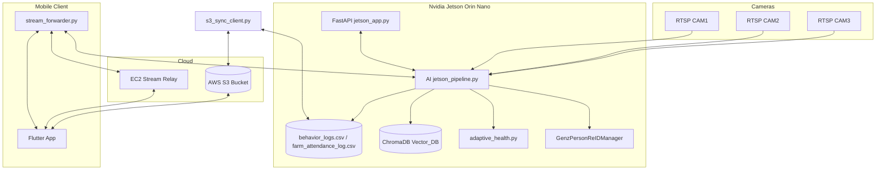
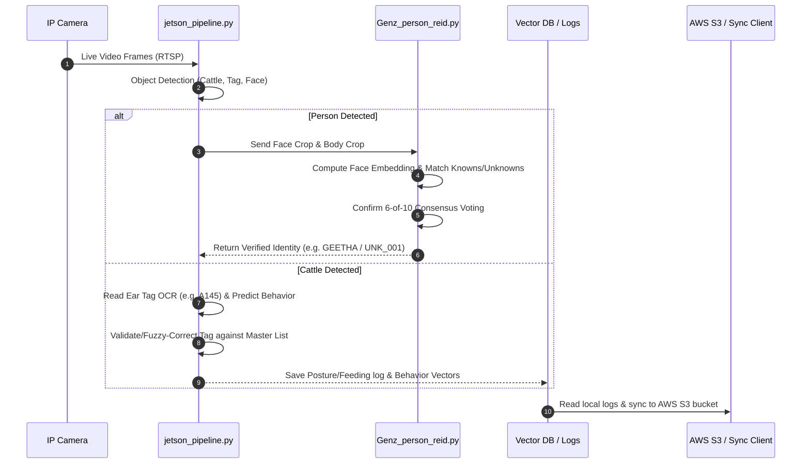

# KisanPro Cattle Behaviour Analysis & Edge AI Tracking Platform: Version 1

This repository contains the source code, Edge AI deployment scripts, training configurations, CAD casings, and user manuals for the Version 1 implementation of the KisanPro Livestock Behaviour Analysis and Edge Recognition platform.

---

## System Overview

The platform is a real-time computer vision and Edge AI system designed to run on Nvidia Jetson devices deployed at cattle sheds. By consuming live RTSP camera streams, the system monitors cattle posture, flags specific feeding or resting behaviors, reads ear tag numbers using OCR, detects personnel, and synchronizes telemetry logs with AWS cloud systems.

---

## System Architecture

The following diagram illustrates the decoupled architecture between edge processing, cameras, cloud telemetry, and administrative mobile devices:



---

## Technical Data Flow

The sequence of frames ingestion, neural detection, identity verification, and database logging is detailed below:



---

## Component Specifications

* **`Kisan_Jetson` (FastAPI Server)**: Main web API application hosting local configuration dashboards, live stream outputs, and historical logs.
* **`jetson_pipeline.py` (AI Inference Core)**: Orchestrates the computer vision inference loop, combining Ultralytics YOLOv8 for detection, ByteTrack for ID persistence, and custom classifier heads for posture.
* **`GenzPersonReIDManager` (Access Control)**: Matches human faces against known database vectors and resolves classification conflicts using voting algorithms.
* **`ChromaDB` (Postural Embedding Search)**: Local vector database storing cattle posture embeddings to score historical similarity.
* **`s3_sync_client.py` (Cloud Telemetry Daemon)**: Background daemon syncing local CSV logs with AWS S3 and downloading fresh template updates.

---

## Directory Structure

* **`Cattle Behaviour Monitoring/`**:
  * `Cattle Behaviour analysis Jetson version/`: Script modules, FastAPI server configuration, and mobile RTSP forwarders.
  * `Cattle Behaviour Training Code/`: PyTorch models to train behavioral classification networks.
  * `Cattle Ear Tag Training Code/`: Scripts and architectures to train YOLOv8 networks for ear tag detection and EasyOCR processing.
  * `HPC Reinforcement Code/`: Python scripts running batch processors and logging reports.
* **`3D Casing/`**: STL CAD models for protective edge-camera casings.
* **`Documents/`**: Deep system architectural profiles, code structure audits, and API documentation.
* **`Output/`**: Verification logs, training metrics (confusion matrices), and hardware setup guides.
* **`apk/`**: Folder reserved for mobile application binaries.
* **`User Manual/`**: Step-by-step user deployment and setup guide.
* **`requirements.txt`**: Complete list of Python dependencies.

---

## Setup & Deployment Guide

### 1. Python Environment Setup
Install the required dependencies:
```bash
pip install -r requirements.txt
```

### 2. Edge Pipeline Launch
To start RTSP camera ingestion and face/posture processing on the Nvidia Jetson:
```bash
cd "Cattle Behaviour Monitoring/Cattle Behaviour analysis Jetson version"
python jetson_pipeline.py
```

### 3. Edge Dashboard Server Launch
To launch the dashboard server for local monitoring:
```bash
cd "Cattle Behaviour Monitoring/Cattle Behaviour analysis Jetson version"
uvicorn jetson_app:app --host 0.0.0.0 --port 8000
```

---

## Repository Exclusions Notice

To prevent repository bloating and adhere to GitHub's file size limitations, the following folders and files are excluded from direct version control:
* **Pre-compiled APKs**: Built application packages exceeding 100 MB (`kisan_cattlevision_mobile.apk`).
* **Model Checkpoints**: Heavy model checkpoint weights (`.pt` / `.pth` files) exceeding 50 MB (such as `yolov8x.pt` and `standing_lying.pt`).
* **Raw Training Datasets**: Massive image folders (like `dataset/` and `Dataset/`) totaling over 8 GB.
* **Raw Stream Output Logs**: Video recordings and batch processing `.tar.gz` files.

Please retrieve these binary assets from your local backup servers or authorized Google Drive directories when restoring the environment.
