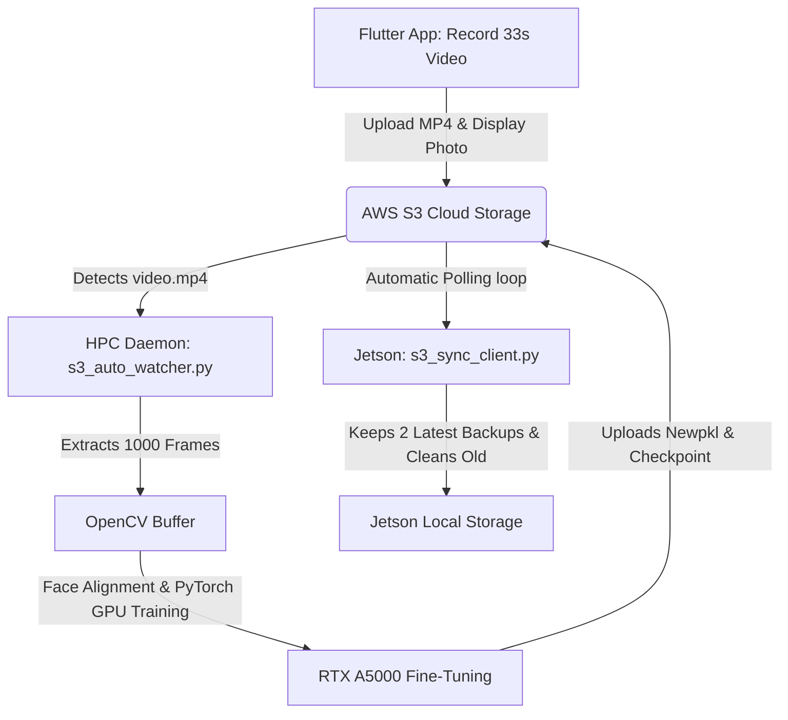

# Kisan Face Recognition System: Detailed E2E Architecture & Implementation Manual

This document provides a detailed breakdown of the optimized Kisan Face Recognition pipeline, covering the Mobile App (Flutter), Cloud Storage (AWS S3), HPC Deep Learning Node (PyTorch/GPU), and the Jetson Edge client.

---

## 1. Directory Structure

```text
E:\App (1)
├── kisan_face_register_app/             # Primary Project Repository
│   ├── 1_phone_deployment/              # Flutter Mobile Application
│   │   ├── lib/
│   │   │   ├── screens/
│   │   │   │   ├── register_screen.dart # Video capturing, progress UI & upload logic
│   │   │   │   └── member_list_screen.dart # Flicker-free caching member monitor screen
│   │   │   └── services/
│   │   │       └── api_service.dart     # S3 Video & JSON API Client
│   │   └── install_app.bat              # Script to build and push APK to phone
│   │
│   ├── 3_hpc_processor/                 # Deep Learning PC GPU Training Server
│   │   ├── Dataset/
│   │   │   └── raw/                     # Folders containing extracted user frames
│   │   ├── s3_auto_watcher.py           # Real-time background MP4 watcher daemon
│   │   ├── hpc_processor.py             # GPU fine-tuning engine (--local-mode enabled)
│   │   └── run_watcher.bat              # Run watcher in background
│   │
│   └── 4_jetson_connection/             # Jetson client reference repository
│       └── s3_sync_client.py            # Automated sync client (with 60s polling)
│
└── Kisan_Jetson/                        # Active Jetson Application Folder
    ├── s3_sync_client.py                # Active sync client (with 60s polling)
    ├── embeddings/                      # Stores active pkl & 2 history backups
    │   ├── known_embeddings.pkl         # Active template file
    │   ├── member_roles.json            # Active database roles
    │   ├── known_embeddings_backup1.pkl # Backup 1
    │   └── known_embeddings_backup2.pkl # Backup 2
    └── models/
        └── best_checkpoint.pth          # PyTorch Model Weight Checkpoint File
```

---

## 2. End-to-End Workflow



---

## 3. Component Details & Code Logic

### 📱 A. Mobile Application (`1_phone_deployment`)
* **Video Capturing Flow (Resolves Out of Memory Crashes & Latency):**
  Instead of taking 1,000 photos (`takePicture`) and writing them sequentially to phone storage, the camera controller initiates a high-FPS video recording:
  ```dart
  await _cameraController!.startVideoRecording();
  ```
  The progress bar increments continuously over a **33-second period** (representing 1,000 frames at 30 FPS).
* **Direct MP4 Upload:**
  On completion, the recording stops and a single, lightweight, hardware-compressed `.mp4` file is generated and uploaded directly to S3.
* **Flicker-Free Member Screen:**
  A smart diff comparison is implemented on background lists to prevent screen flickering:
  ```dart
  if (list[i]['raw_name'] != _members[i]['raw_name'] ||
      list[i]['role'] != _members[i]['role']) {
    hasChanged = true;
  }
  ```
  This skips re-rendering the images if the database list is unchanged, keeping the images loaded and constant.

### ☁️ B. AWS S3 Storage Schema
* **`dataset/{farm_id}/{member_name}/video.mp4`**: Raw video timeline data.
* **`dataset/{farm_id}/{member_name}/profile.jpg`**: Visual avatar photo.
* **`embeddings/{farm_id}/member_roles.json`**: Role configuration.
* **`embeddings/{farm_id}/known_embeddings.pkl`**: Active deep learning face templates.
* **`embeddings/{farm_id}/known_embeddings_*.pkl`**: Timestamped backup files.

### 🤖 C. HPC Training Node (`3_hpc_processor`)
* **OpenCV Frame Extraction:**
  The daemon downloads the `.mp4` video and extracts the frames instantly:
  ```python
  cap = cv2.VideoCapture(local_video_path)
  # Extract frames by stepping evenly across the total video length
  step = max(1, total_frames // 1000)
  ```
* **GPU Fine-Tuning:**
  Aligns face crops using MTCNN and fine-tunes the FaceNet classifier projection head on your **NVIDIA RTX A5000 GPU** for 15 epochs.
* **Backup Replication:**
  Uploads the active templates to S3 and replicates it as a timestamped copy (e.g. `known_embeddings_21_07_2026_10_59_AM.pkl`).

### 🛰️ D. Jetson Client (`Kisan_Jetson`)
* **Auto-Pilot Daemon & 1-Minute Polling:**
  Runs an infinite loop checking the S3 modification tag every **60 seconds**:
  ```python
  meta = s3.head_object(Bucket=AWS_S3_BUCKET, Key=s3_key)
  current_modified = meta['LastModified'].isoformat()
  ```
* **Backup Cleaning Logic:**
  Lists all local backup files in `embeddings/`, sorts them by modification time, and keeps only the **2 most recent backup files**, deleting all older ones:
  ```python
  pattern = os.path.join(directory, "known_embeddings_*.pkl")
  files = glob.glob(pattern)
  if len(files) > 2:
      files.sort(key=os.path.getmtime)
      files_to_delete = files[:-2]
      for f in files_to_delete:
          os.remove(f)
  ```

---

## 4. Operation Instructions

### Running the S3 Auto Watcher on HPC Node
1. Navigate to the `3_hpc_processor` folder.
2. Run the batch script:
   ```cmd
   run_watcher.bat
   ```

### Running the Auto-Sync Client on Jetson
1. Navigate to the `Kisan_Jetson` folder on the Jetson terminal.
2. Run the client in continuous polling mode:
   ```bash
   python s3_sync_client.py
   ```
3. To force a one-time sync immediately:
   ```bash
   python s3_sync_client.py --once
   ```
