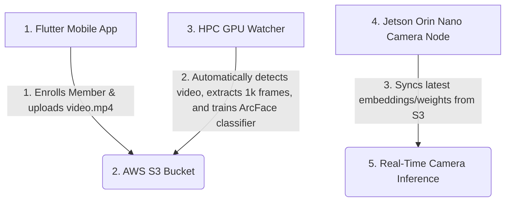

# Kisan Face Register & Recognition System: Run & Command Guide

This repository contains the complete codebase for the **Kisan Face Register & Security Monitoring System**. The system connects a mobile app (for member registration), an AWS S3 bucket (storage), an HPC GPU Server (for model training), and a Jetson Orin Nano Edge Node (for local real-time camera inference).

---

## Architecture Blueprint



---

## General Environment Setup

Ensure the following prerequisites are installed on your hosts:

1. **Python version:** `3.8+` (preferably `3.10` or `3.11`)
2. **Key Python Libraries:**
   ```bash
   pip install torch torchvision torchaudio --index-url https://download.pytorch.org/whl/cu118  # For GPU training
   pip install boto3 opencv-python facenet-pytorch tqdm matplotlib requests fastapi uvicorn
   ```
3. **AWS S3 Configuration:** Ensure that the local `.env` configuration file is placed under both `2_aws_s3_local/` and `4_jetson_connection/`:
   ```env
   AWS_ACCESS_KEY_ID="your_aws_access_key"
   AWS_SECRET_ACCESS_KEY="your_aws_secret_key"
   AWS_S3_BUCKET="kisan-person-registration-bucket"
   AWS_DEFAULT_REGION="us-east-1"
   FARM_ID="farm_8088327803_Samruddhi_Farm"
   ```

---

## Component Execution Commands

### 1. Cloud Server / Local S3 Emulator (`2_aws_s3_local`)
If you are running in local emulation mode (FastAPI S3 mock) instead of live AWS S3, start the local S3 endpoint:
```powershell
cd "2_aws_s3_local"
# Start local emulation server on port 8080
python app.py
```

---

### 2. Mobile Client App (`1_phone_deployment`)
To compile and deploy the Flutter app to a physical Android device via USB:

1. **Prerequisites:** Connect device via USB and ensure ADB debugging is enabled.
2. **Build and Install Release APK:**
   ```powershell
   cd "1_phone_deployment"
   # Clean previous build artifacts
   flutter clean
   
   # Get Flutter packages
   flutter pub get
   
   # Compile Release APK
   flutter build apk --release
   
   # Uninstall old package to prevent signature conflicts
   adb uninstall com.kisanpro.faceregister.kisan_face_register_app
   
   # Install to connected device
   adb install build/app/outputs/flutter-apk/app-release.apk
   ```

---

### 3. HPC GPU Classifier Trainer (`3_hpc_processor`)
The HPC server compiles dataset templates, fine-tunes classification layers, and outputs updated embeddings.

#### A. Running Training Manually
To execute fine-tuning manually on a specific folder or member:
```powershell
cd "3_hpc_processor"
python hpc_processor.py `
  --farm-id "farm_8088327803_Samruddhi_Farm" `
  --member-name "Geetha" `
  --member-role "Worker" `
  --s3-bucket "kisan-person-registration-bucket" `
  --jetson-url "http://192.168.0.131:8080"
```
*Add `--local-mode` to skip downloading raw frames from S3 and use pre-existing local raw frames in `3_hpc_processor/Dataset/raw/`.*

#### B. Running the Automatic Daemon Watcher (Recommended)
This daemon polls S3 every 10 seconds. When a user uploads a new member video from the phone app, the daemon automatically:
1. Downloads the `video.mp4`.
2. Extracts 1,000 frames using OpenCV.
3. Automatically triggers GPU training.
4. Uploads updated embeddings/checkpoints back to S3.
5. Pushes updates to the Jetson Orin Nano camera node.

To start the auto-watcher daemon:
* **Windows (Double-click or run):**
  ```powershell
  cd "3_hpc_processor"
  .\run_watcher.bat
  ```
* **Linux/Terminal:**
  ```bash
  cd 3_hpc_processor
  python -u s3_auto_watcher.py
  ```

---

### 4. Jetson Orin Nano Camera Node (`4_jetson_connection`)
The Jetson node needs to receive the trained embedding files to perform live face-matching.

#### Option A: Pull Synchronization Daemon (Recommended)
This daemon runs on the Jetson Orin Nano, polling S3 every 60 seconds. When it detects a new training timestamp on S3, it automatically downloads the database updates:
```bash
cd 4_jetson_connection
# Starts the background pooling and auto-download daemon
python s3_sync_client.py
```

#### Option B: Trigger One-Time Sync Manually
To force the Jetson to download the latest files from S3 immediately:
```bash
cd 4_jetson_connection
python s3_sync_client.py --once
```

---

## Verification Checklist

To confirm that the training and sync pipeline succeeded:
1. **Model Accuracy Check:** Check the HPC terminal logs during training. You should see Epoch 15 finalize with a high Validation Accuracy (typically `>97%`).
2. **S3 Check:** Run `confirm_s3.py` in your scratch folder to verify that `known_embeddings.pkl` and `best_checkpoint.pth` have updated timestamps:
   ```bash
   python confirm_s3.py
   ```
3. **App Check:** Re-open your Flutter app, perform a pull-to-refresh. You should see all enrolled members listed with their name, role, and correct profile photo!
