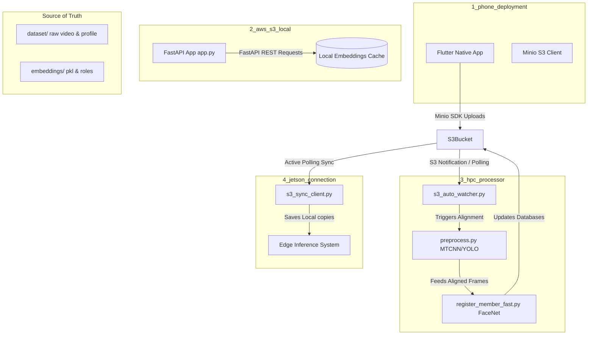
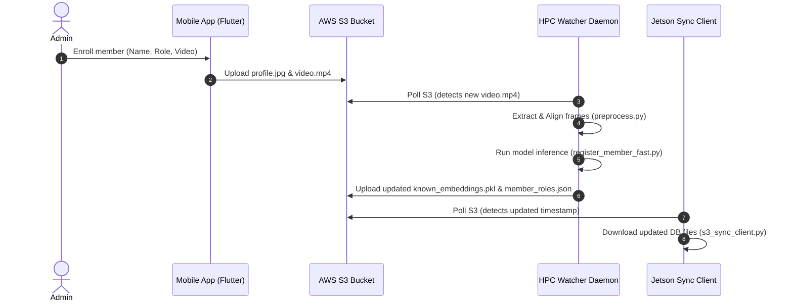

# System Architecture

## System Overview
The system is divided into four primary software components: a mobile registration app (`1_phone_deployment`), a local emulator API server (`2_aws_s3_local`), a cloud/HPC backend worker (`3_hpc_processor`), and an edge-sync gate client (`4_jetson_connection`). Communication is anchored around an AWS S3 bucket that acts as the source-of-truth datastore.

## Architecture Diagram

## Component Descriptions
### 1_phone_deployment
- **Purpose**: Mobile enrollment frontend.
- **Responsibilities**: Allows admins to add details, record enrollment video, and perform direct uploads to S3.
- **Dependencies**: Minio SDK, Camera, Shared Preferences.
- **Type**: Application

### 2_aws_s3_local
- **Purpose**: PC emulator backend.
- **Responsibilities**: Simulates local endpoints for testing, provides back-channel synchronization, and local backups.
- **Dependencies**: FastAPI, Uvicorn, boto3.
- **Type**: Application

### 3_hpc_processor
- **Purpose**: Server-side batch embedding processor.
- **Responsibilities**: Monitors dataset uploads, aligns faces, runs FaceNet inference, updates database templates.
- **Dependencies**: PyTorch, FaceNet, OpenCV, boto3.
- **Type**: Application

### 4_jetson_connection
- **Purpose**: Edge client synchronization client.
- **Responsibilities**: Runs on Jetson gates to poll S3 and download the latest models and embeddings.
- **Dependencies**: boto3, urllib3.
- **Type**: Client

## Data Flow

## Integration Points
- **External APIs**: AWS S3 Simple Storage Service REST API (used by phone app, PC server, HPC, and Jetson).
- **Databases**: AWS S3 Bucket storing `known_embeddings.pkl` and `member_roles.json`.
- **Third-party Services**: Cloudflare Tunnel (used to expose local PC endpoints to the internet).
