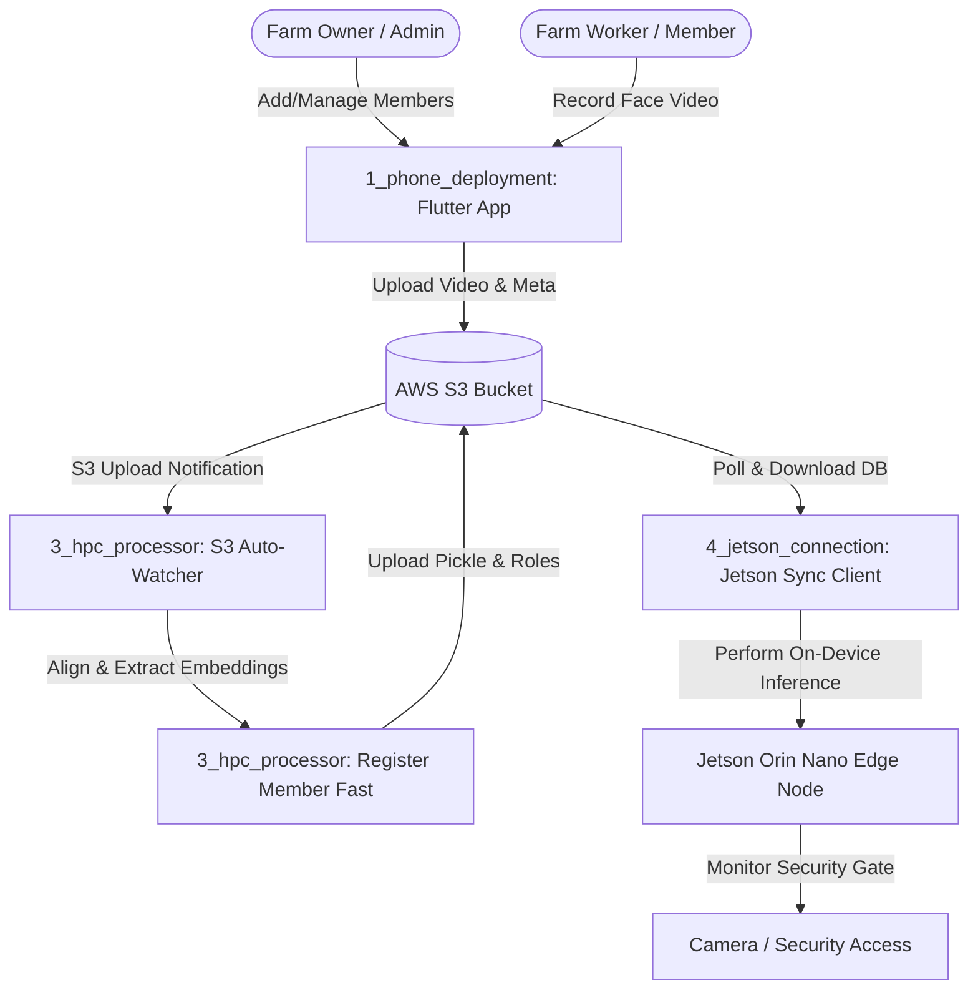

# Business Overview

## Business Context Diagram

## Business Description
- **Business Description**: The Kisan Multi-Farm Face Recognition Member Monitoring system provides secure, automated, and low-latency access control for agricultural farms. By deploying edge-inference cameras at farm security gates, the system automatically detects, identifies, and logs the attendance of authorized farm members, veterinarians, visitors, managers, and owners. The system allows farm administrators to enroll members wirelessly via a mobile phone app, which uploads face registration videos. A cloud/HPC processing server automatically processes the registration files to extract unique face embeddings, updating the shared database on AWS S3, which is then dynamically synced down to Jetson Orin Nano edge devices monitoring farm gates.
- **Business Transactions**:
  1. **Member Enrollment**: An admin inputs the member name, role, and mobile number, then uses the phone camera to record a short face alignment video. The app uploads the video directly to S3.
  2. **Automated Embedding Compilation**: The HPC server monitors S3, downloads the video, aligns the faces, extracts L2-normalized embeddings, and merges them into the farm's S3 database.
  3. **Edge Database Synchronization**: Jetson edge devices poll S3 to download updated face databases, keeping the on-site gates synchronized.
  4. **Access Recognition**: Cameras at the farm gate detect faces, match them against local database embeddings, and log attendance or sound alerts.
- **Business Dictionary**:
  - **Farm ID**: Unique identifier for a farm, constructed as `farm_<mobile_number>_<farm_name>`.
  - **Member Role**: Designation of the registered member (Worker, Manager, Owner, Veterinarian, Visitor).
  - **Face Embedding**: A 512-dimensional numerical representation of a person's facial features extracted using deep learning.
  - **Watcher Daemon**: A background worker that automatically monitors and triggers registration events.

## Component Level Business Descriptions
### 1_phone_deployment (Mobile App)
- **Purpose**: Enrollment interface for farm administrators.
- **Responsibilities**: Registers new member profiles, records face enrollment videos, captures profile photos, and uploads them to AWS S3.

### 2_aws_s3_local (API Server & Fallback Database)
- **Purpose**: Local management API and local S3 backup.
- **Responsibilities**: Acts as a backup local registry and API for managing active farm members and registry paths.

### 3_hpc_processor (Registration Engine)
- **Purpose**: Face alignment and fast feature extraction.
- **Responsibilities**: Automatically processes uploaded enrollment videos, aligns faces, extracts face templates, and updates S3 files.

### 4_jetson_connection (Edge Sync Client)
- **Purpose**: Edge database updater.
- **Responsibilities**: Continuously polls S3 to download the latest model and embeddings updates for local gate access control.
