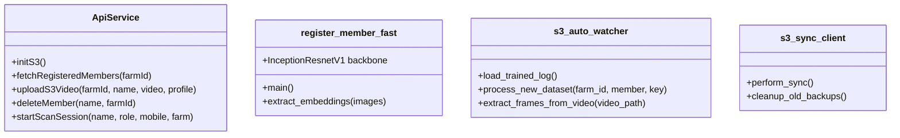

# Code Structure

## Build System
- **Type**: Flutter (for mobile), standard Python Virtual Environment / pip (for local server, HPC, and Jetson).
- **Configuration**:
  - `1_phone_deployment/pubspec.yaml` contains Flutter SDK dependencies, `camera`, `minio`, `shared_preferences`.
  - Python scripts use a requirements-style setup depending on `torch`, `torchvision`, `facenet-pytorch`, `boto3`, `fastapi`, `uvicorn`, `opencv-python`.

## Key Classes/Modules

### Existing Files Inventory
- [`1_phone_deployment/lib/main.dart`](file:///E:/Member%20Monitoring/Farm%20security%20person%20Monitoring/1_phone_deployment/lib/main.dart) - Main entrypoint for Flutter application.
- [`1_phone_deployment/lib/screens/member_list_screen.dart`](file:///E:/Member%20Monitoring/Farm%20security%20person%20Monitoring/1_phone_deployment/lib/screens/member_list_screen.dart) - Screen showing active registered members fetched directly from S3.
- [`1_phone_deployment/lib/screens/register_screen.dart`](file:///E:/Member%20Monitoring/Farm%20security%20person%20Monitoring/1_phone_deployment/lib/screens/register_screen.dart) - Screen capturing name, role, profile image, and enrollment video.
- [`1_phone_deployment/lib/services/api_service.dart`](file:///E:/Member%20Monitoring/Farm%20security%20person%20Monitoring/1_phone_deployment/lib/services/api_service.dart) - Minio/S3 file uploader and S3 database reader helper classes.
- [`2_aws_s3_local/app.py`](file:///E:/Member%20Monitoring/Farm%20security%20person%20Monitoring/2_aws_s3_local/app.py) - FastAPI API server, acts as the mock S3 endpoint router.
- [`2_aws_s3_local/farm_jetson_registry.json`](file:///E:/Member%20Monitoring/Farm%20security%20person%20Monitoring/2_aws_s3_local/farm_jetson_registry.json) - Registry storing farm-to-Jetson IP mappings.
- [`2_aws_s3_local/start_cloudflare_tunnel.bat`](file:///E:/Member%20Monitoring/Farm%20security%20person%20Monitoring/2_aws_s3_local/start_cloudflare_tunnel.bat) - Shell helper script to launch Cloudflare Tunnel.
- [`3_hpc_processor/s3_auto_watcher.py`](file:///E:/Member%20Monitoring/Farm%20security%20person%20Monitoring/3_hpc_processor/s3_auto_watcher.py) - Main automated watcher daemon polling S3 and coordinating extraction.
- [`3_hpc_processor/preprocess.py`](file:///E:/Member%20Monitoring/Farm%20security%20person%20Monitoring/3_hpc_processor/preprocess.py) - Extracts faces and performs MTCNN alignment on frames.
- [`3_hpc_processor/register_member_fast.py`](file:///E:/Member%20Monitoring/Farm%20security%20person%20Monitoring/3_hpc_processor/register_member_fast.py) - Performs fast GPU/CPU embedding extraction and appends to the database.
- [`3_hpc_processor/train.py`](file:///E:/Member%20Monitoring/Farm%20security%20person%20Monitoring/3_hpc_processor/train.py) - ArcFace training network.
- [`3_hpc_processor/database.py`](file:///E:/Member%20Monitoring/Farm%20security%20person%20Monitoring/3_hpc_processor/database.py) - Compiles templates.
- [`3_hpc_processor/arcface_loss.py`](file:///E:/Member%20Monitoring/Farm%20security%20person%20Monitoring/3_hpc_processor/arcface_loss.py) - Custom ArcFace Loss function.
- [`3_hpc_processor/evaluate.py`](file:///E:/Member%20Monitoring/Farm%20security%20person%20Monitoring/3_hpc_processor/evaluate.py) - Evaluates face classifier accuracy.
- [`3_hpc_processor/inference.py`](file:///E:/Member%20Monitoring/Farm%20security%20person%20Monitoring/3_hpc_processor/inference.py) - Performs standalone face identification test.
- [`3_hpc_processor/trained_datasets.json`](file:///E:/Member%20Monitoring/Farm%20security%20person%20Monitoring/3_hpc_processor/trained_datasets.json) - History register of processed member datasets.
- [`4_jetson_connection/s3_sync_client.py`](file:///E:/Member%20Monitoring/Farm%20security%20person%20Monitoring/4_jetson_connection/s3_sync_client.py) - Automated sync client for downloading S3 databases on Jetson devices.

## Design Patterns
### 1. Register-by-Inference (Fast Feature Appending)
- **Location**: `register_member_fast.py`
- **Purpose**: Appends new users by extracting facial embeddings using pre-trained network weights, bypassing slow global retraining loops.
- **Implementation**: Computes a 512-dimensional mean representation of aligned face frames, L2-normalizes, and merges it directly as a new key inside the existing `known_embeddings.pkl` dictionary.

### 2. Polling Daemon (Watcher Pattern)
- **Location**: `s3_auto_watcher.py` & `s3_sync_client.py`
- **Purpose**: Resolves decoupling in event triggers when direct webhooks are unavailable.
- **Implementation**: Periodically lists S3 buckets to check for newly uploaded directories/timestamps, spawning subprocesses when delta-changes are found.

## Critical Dependencies
### 1. `facenet-pytorch`
- **Version**: N/A (Standard PyPI release)
- **Usage**: Used in `register_member_fast.py` to initialize FaceNet's InceptionResnetV1.
- **Purpose**: Feature extractor backbone.

### 2. `minio`
- **Version**: Standard Dart package
- **Usage**: Used inside `api_service.dart`.
- **Purpose**: Used for direct upload/download operations to Amazon S3 bucket.
