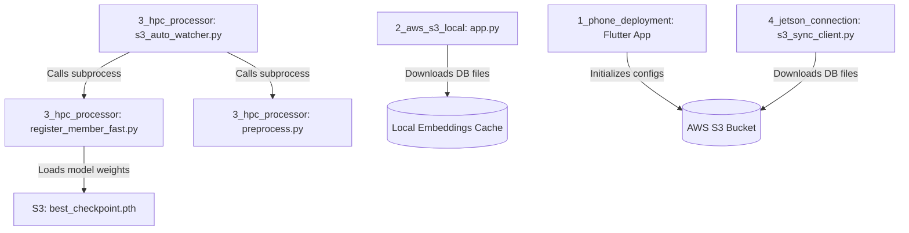

# Dependencies

## Internal Dependencies

### `s3_auto_watcher.py` depends on `register_member_fast.py` & `preprocess.py`
- **Type**: Runtime Subprocess Execution.
- **Reason**: Watcher daemon detects S3 notifications, starts frame alignment (`preprocess.py`), then runs fast feature compilation (`register_member_fast.py`).

### `register_member_fast.py` depends on `best_checkpoint.pth`
- **Type**: Read/Compilation Dependency.
- **Reason**: The fast registration script loads the pre-trained weights to extract exact, un-biased face embeddings.

---

## External Dependencies

### 1. `boto3` / `botocore`
- **Version**: Standard PyPI release.
- **Purpose**: Official AWS SDK for Python, used to download/upload objects to S3.
- **License**: Apache 2.0.

### 2. `facenet-pytorch`
- **Version**: Standard PyPI release.
- **Purpose**: Pre-trained PyTorch FaceNet architecture wrapper (InceptionResnetV1).
- **License**: MIT License.

### 3. `minio`
- **Version**: Standard Dart package.
- **Purpose**: Client SDK for Dart communicating with Amazon S3 endpoint.
- **License**: Apache 2.0.

### 4. `opencv-python` (cv2)
- **Version**: Standard PyPI release.
- **Purpose**: Face cropping, video frame extraction, and decoder logic.
- **License**: Apache 2.0.
