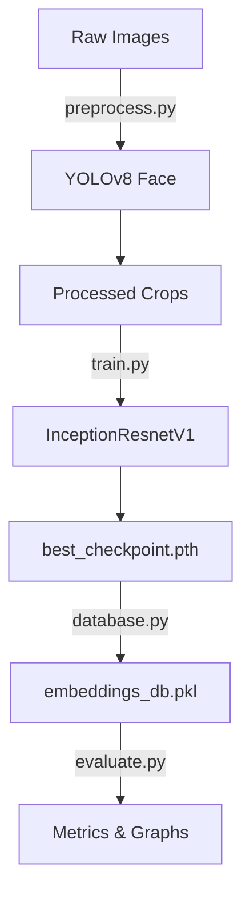
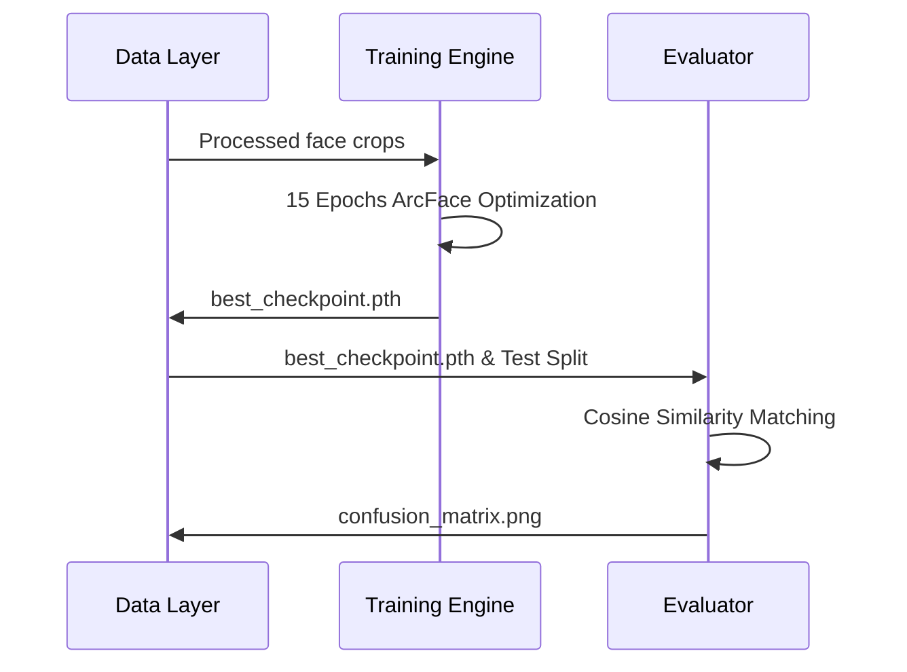

# System Architecture

## System Overview
A PyTorch-based Deep Learning pipeline utilizing YOLOv8 for face detection and InceptionResnetV1 for feature extraction and metric learning (ArcFace).

## Architecture Diagram

## Component Descriptions
### Model Trainer (train.py)
- **Purpose**: Fine-tunes the CNN on the processed dataset.
- **Responsibilities**: Backpropagation, loss calculation, checkpoint saving.
- **Dependencies**: PyTorch, facenet-pytorch.
- **Type**: Application / Model

## Data Flow

## Integration Points
- **External APIs**: None (Offline Edge Training).
- **Databases**: Pickle file (embeddings_db.pkl) acting as a vector store.
