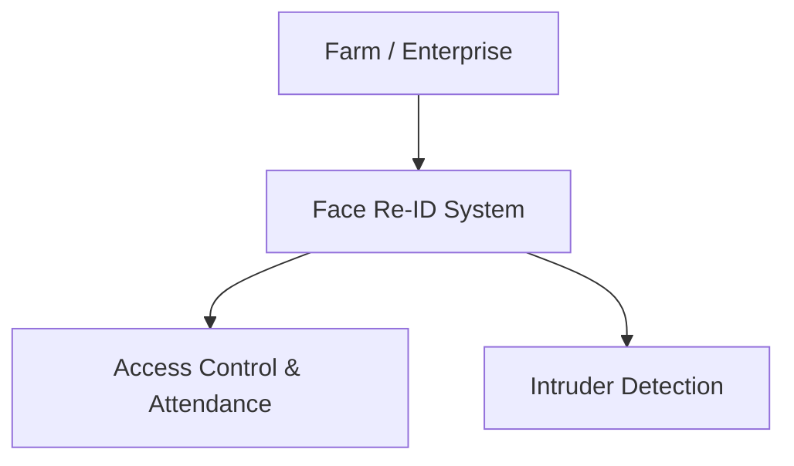

# Business Overview

## Business Context Diagram

## Business Description
- **Business Description**: A deep learning training pipeline designed to mathematically model and recognize the faces of registered farm workers and staff. The trained weights are deployed to an Edge AI system for real-time security and attendance tracking.
- **Business Transactions**: 
  - Train Model: Fine-tunes InceptionResnetV1 on worker face crops.
  - Generate Embeddings: Creates 512-D vector templates for each registered individual.
  - Evaluate Thresholds: Determines the optimal security threshold to balance False Acceptance and False Rejection.
- **Business Dictionary**:
  - **Re-ID (Re-Identification)**: Identifying the same person across different cameras or times.
  - **ArcFace**: The angular margin loss function used to maximize separation between different identities.
  - **Embedding**: A 512-dimensional mathematical array representing a unique face.

## Component Level Business Descriptions
### Training Pipeline
- **Purpose**: To train a neural network on custom human faces.
- **Responsibilities**: Ingests cropped faces, applies ArcFace loss, and outputs `best_checkpoint.pth`.
