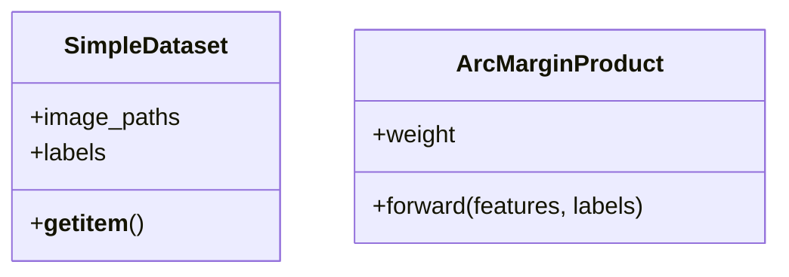

# Code Structure

## Build System
- **Type**: Python / PyTorch
- **Configuration**: requirements.txt (implied environment)

## Key Classes/Modules

### Existing Files Inventory
- `src/preprocess.py` - Crops faces using YOLOv8.
- `src/train.py` - PyTorch training loop.
- `src/arcface_loss.py` - Custom Angular Margin Loss.
- `src/database.py` - Generates vector templates.
- `src/evaluate.py` - Runs test evaluation.

## Design Patterns
### Modular Pipeline
- **Location**: Entire `src/` directory.
- **Purpose**: Separates data prep, training, and evaluation for clean execution.
