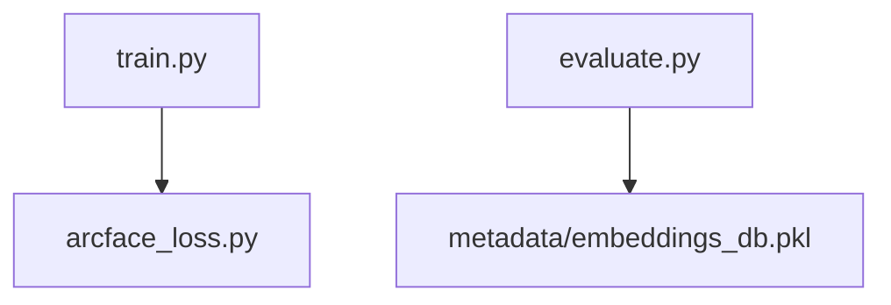

# Dependencies

## Internal Dependencies

```mermaid
graph TD
    train.py --> arcface_loss.py
    evaluate.py --> metadata/embeddings_db.pkl
```

## External Dependencies
### PyTorch
- **Purpose**: GPU Tensor acceleration and backprop.
### Ultralytics YOLO
- **Purpose**: Face cropping and detection.
