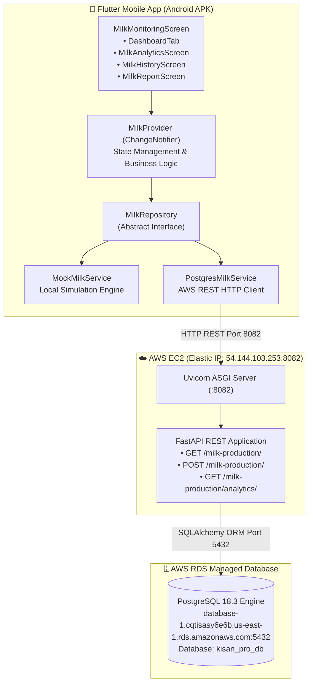
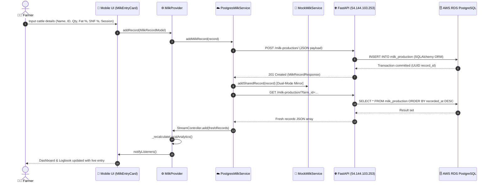
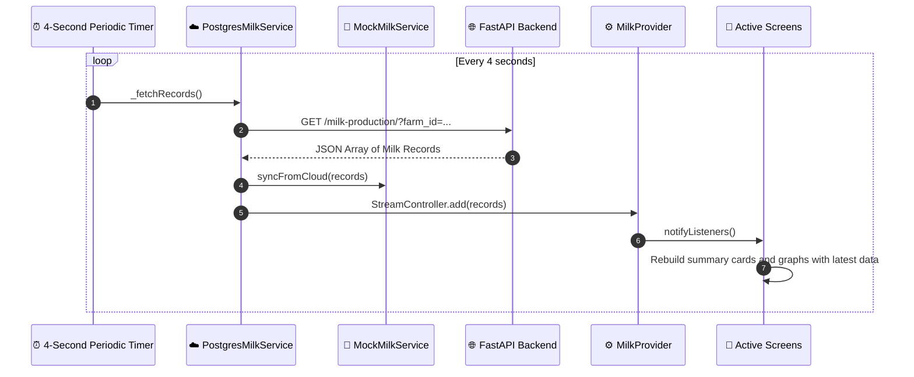

# System Architecture

**Project**: KisanPro — Cattle Milk Monitoring  
**Version**: 1.0 (Production Release — AWS RDS PostgreSQL Edition)  
**Permanent Elastic IP**: `54.144.103.253`  

---

## System Overview

KisanPro Cattle Milk Monitoring implements a robust, three-tier mobile-cloud architecture:
- **Tier 1 (Presentation Layer)**: Flutter Android Application providing a Material 3 UI for dairy farmers.
- **Tier 2 (Application Layer)**: Python FastAPI REST API server hosted on AWS EC2 behind an Elastic IP on port `8082`.
- **Tier 3 (Data Persistence Layer)**: Managed AWS RDS PostgreSQL 18.3 relational database storing all enterprise records.

The architecture provides dual operational capabilities: **Cloud Sync Mode** for live persistent synchronization and **Simulation Mode** for full offline operational support.

---

## Architecture Diagram

---

## Component Descriptions

### 1. `MilkMonitoringScreen` (Flutter Application Layer)
- **Purpose**: Main application shell managing bottom navigation bar (mobile) and NavigationRail (tablet/desktop).
- **Responsibilities**: Tab switching (Dashboard, Analytics, Logbook, PDF Reports), top AppBar status indicators, and Cloud/Simulation mode toggle.
- **Dependencies**: `MilkProvider`, `DashboardTab`, `MilkAnalyticsScreen`, `MilkHistoryScreen`, `MilkReportScreen`.
- **Type**: Application — Presentation Layer.

### 2. `MilkProvider` (Flutter State Management Layer)
- **Purpose**: Centralized ChangeNotifier state management engine encapsulating domain logic and UI state.
- **Responsibilities**: Subscribing to data streams, dynamic quality pricing computation, BMC tank inventory tracking, search/filter execution, and local analytics calculations.
- **Dependencies**: `MilkRepository`, `MilkRecordModel`, `MilkAnalyticsModel`.
- **Type**: Application — Business Logic Layer.

### 3. `MilkRepository` (Domain Interface)
- **Purpose**: Abstract contract decoupling business logic from underlying data sources (Repository Pattern).
- **Responsibilities**: Declares contracts for `addMilkRecord()`, `getMilkRecords()`, `getMilkAnalytics()`, and `updateMilkAnalytics()`.
- **Type**: Domain — Repository Contract.

### 4. `PostgresMilkService` (Cloud Data Implementation)
- **Purpose**: Concrete data service connecting the mobile client to the AWS EC2 FastAPI backend.
- **Responsibilities**: Periodic background polling (4-second interval), broadcast StreamController emission, HTTP POST record serialization, and mirroring new records to the local simulation store.
- **Dependencies**: `dart:io HttpClient`, `dart:async StreamController`.
- **Type**: Data — Cloud Service Client.

### 5. `MockMilkService` (Offline Simulation Implementation)
- **Purpose**: In-memory simulation repository providing instant demo data without network connectivity.
- **Responsibilities**: Pre-loading 80 historical milking records (4 cattle × 2 sessions × 10 days) and maintaining static in-memory records across screen transitions.
- **Type**: Data — Mock Service Implementation.

### 6. `FastAPI Server` (Cloud Application Layer)
- **Purpose**: High-throughput RESTful backend server bridging mobile HTTP requests with PostgreSQL.
- **Responsibilities**: Enforcing Pydantic schema validation, executing transactional SQL inserts/queries via SQLAlchemy, and computing real-time server-side analytics.
- **Dependencies**: `fastapi`, `uvicorn`, `sqlalchemy`, `psycopg2-binary`, `pydantic`.
- **Type**: Application — API Gateway & Application Server.

### 7. `AWS RDS PostgreSQL` (Cloud Data Layer)
- **Purpose**: Managed cloud relational database providing enterprise data durability.
- **Responsibilities**: Storing `milk_production` records with UUID primary keys, indexed `farm_id`, `cattle_id`, and `recorded_at` timestamps.
- **Type**: Infrastructure — Relational Database Management System.

---

## Data Flow

### Flow 1: Add New Milking Entry (Live Cloud Sync)

### Flow 2: Continuous Background Synchronization (4-Second Auto-Polling)

---

## Integration Points

### External REST APIs
| Endpoint | Method | URL | Description |
|:---|:---|:---|:---|
| **Health Check** | `GET` | `http://54.144.103.253:8082/` | Verifies server online status and RDS database connectivity |
| **Get Milk Records** | `GET` | `http://54.144.103.253:8082/milk-production/?farm_id=...` | Fetches historical milk production records for a specific farm |
| **Create Milk Record** | `POST` | `http://54.144.103.253:8082/milk-production/` | Inserts a new milking session record into PostgreSQL |
| **Get Farm Analytics** | `GET` | `http://54.144.103.253:8082/milk-production/analytics/?farm_id=...` | Returns aggregated daily total, morning/evening split, and count |

### Cloud Databases
| Database | Engine | Endpoint | Purpose |
|:---|:---|:---|:---|
| **AWS RDS PostgreSQL** | PostgreSQL 18.3 | `database-1.cqtisasy6e6b.us-east-1.rds.amazonaws.com:5432` | Master ACID-compliant relational data store |

---

## Infrastructure Components

| Component | Specification | Configuration |
|:---|:---|:---|
| **AWS EC2 Instance** | `kisan-milk-server` (t3.micro) | Ubuntu 24.04 LTS, US East (N. Virginia) `us-east-1a` |
| **Permanent Elastic IP** | `54.144.103.253` | Static public IPv4 address associated with EC2 instance |
| **EC2 Security Group** | Inbound Rules | Port 22 (SSH), Port 8082 (Custom TCP, `0.0.0.0/0`) |
| **RDS Security Group** | Inbound Rules | Port 5432 (PostgreSQL, `0.0.0.0/0` with SSL) |
| **ASGI Web Server** | Uvicorn 0.34.0 | Background daemon via `nohup python3 -m uvicorn main:app --host 0.0.0.0 --port 8082` |
