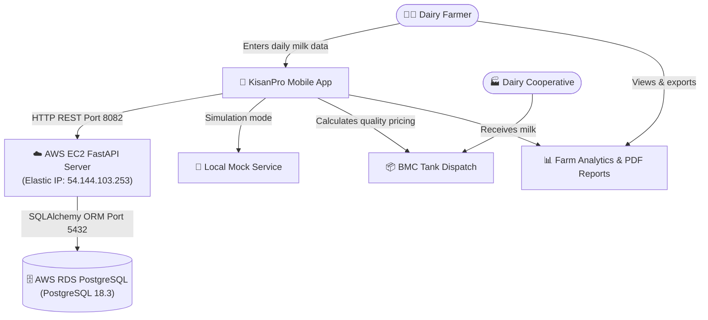

# Business Overview

**Project**: KisanPro — Cattle Milk Monitoring System  
**Analysis Date**: 2026-09-04  
**Version**: 1.0 (Production Release — AWS RDS PostgreSQL Edition)  

---

## Business Context Diagram

---

## Business Description

- **Business Description**: KisanPro is an IoT-enabled precision dairy farm management application designed for Indian smallholder and commercial dairy farmers. The core module — Cattle Milk Monitoring — enables dairy farmers to digitally record, track, and analyze daily morning and evening milk production for individual cattle. The system automates quality-based milk valuation (using Fat % and SNF % parameters aligned with Indian dairy cooperative pricing standards), tracks farm economics (gross revenue, cattle feed cost, and net profit), manages Bulk Milk Cooler (BMC) tank operations, and synchronizes all data in real-time with an AWS RDS PostgreSQL cloud backend.

- **Business Transactions**:

| Transaction | Description |
|:------------|:------------|
| **Record Morning Milking** | Farmer inputs quantity (liters), Fat percentage, and SNF percentage for the morning milking session per cattle. |
| **Record Evening Milking** | Farmer inputs quantity (liters), Fat percentage, and SNF percentage for the evening milking session per cattle. |
| **Compute Quality-Based Milk Rate** | Automatically computes the per-liter milk rate using the cooperative formula: `Rate = BasePrice × ((Fat×0.6/4.0) + (SNF×0.4/8.5))`. |
| **View Today's Farm Summary** | Real-time display of today's total milk yield, morning/evening volume distribution, and live farm economics. |
| **Analyze Farm Economics & Profit** | Dynamic calculation of daily gross revenue, estimated cattle feed costs (₹18.5/L ratio), and net farmer profit. |
| **Explore Milking History & Logbook** | Historical records queryable and filterable by date range, cattle name, and tag ID. |
| **Generate & Export PDF Reports** | Generation of printable audit and performance reports per cattle or for the entire farm. |
| **Dispatch BMC Storage Tank** | Records the dispatch of accumulated milk to dairy cooperatives; resets tank volume and logs timestamped dispatch telemetry. |
| **Live Cloud Synchronization** | Real-time transmission of local milk production entries to AWS RDS PostgreSQL via FastAPI REST services. |
| **Toggle Dual-Mode Simulation** | Seamless toggle between offline local simulation mode (with realistic demo data) and live AWS cloud synchronization. |

- **Business Dictionary**:

| Term | Meaning |
|:-----|:--------|
| **BMC** | Bulk Milk Cooler — a refrigerated on-farm storage tank used to collect, cool, and preserve milk prior to dairy cooperative dispatch. |
| **Fat %** | Percentage of butterfat content in milk; a primary determinant of milk grade and price per liter in Indian dairy pricing. |
| **SNF %** | Solids-Not-Fat percentage — comprises proteins, lactose, and minerals; essential milk quality metric. |
| **Grade A Milk** | High-quality milk standard defined by Fat ≥ 4.0% and SNF ≥ 8.5%. |
| **Milking Session** | Individual milking window, classified as either Morning (AM) or Evening (PM). |
| **Dairy Coop** | Dairy Cooperative Society (e.g., Amul, Nandini) that collects and processes milk from farmers. |
| **Cattle Tag (KP-XXX)** | Unique visual identification tag assigned to each cattle (e.g., KP-101, KP-102). |
| **Quality Pricing** | Formula-based dynamic pricing where the rate per liter scales with Fat % and SNF % quality parameters. |
| **Simulation Mode** | Offline sandbox mode with pre-seeded realistic historical records for field demonstration without internet. |
| **Cloud Sync Mode** | Production operating mode directly communicating with AWS EC2 and AWS RDS PostgreSQL backend. |

---

## Component Level Business Descriptions

### 1. Flutter Mobile Application (`com.kisanpro.kisan_pro_milk_monitoring`)
- **Purpose**: Primary farmer-facing mobile interface for digital milk recording, farm analytics visualization, and reporting.
- **Responsibilities**: Interactive data entry, local state management, offline simulation data generation, PDF report compilation, and AWS cloud synchronization.

### 2. FastAPI Cloud Backend (`AWS EC2: 54.144.103.253:8082`)
- **Purpose**: High-performance RESTful API gateway connecting the mobile client to the cloud database.
- **Responsibilities**: Request validation via Pydantic schemas, data persistence via SQLAlchemy ORM, and farm-level aggregation analytics computation.

### 3. AWS RDS PostgreSQL Database (`kisan_pro_db`)
- **Purpose**: Centralized, secure, ACID-compliant relational cloud database for persistent farm data storage.
- **Responsibilities**: Durable persistence of all milk production records, relational integrity, multi-device concurrency, and audit logging.

### 4. Mock Milk Service (`MockMilkService`)
- **Purpose**: Standalone offline simulation engine enabling field demonstrations and uninterrupted usage during network outages.
- **Responsibilities**: Generating realistic 10-day historical milking records across 4 default cattle profiles (80 pre-loaded records) and cross-syncing with cloud additions.

### 5. Analytics & Quality Pricing Engine (`MilkProvider`)
- **Purpose**: Core business logic and computational state manager for farm operational insights.
- **Responsibilities**: Calculating quality pricing, computing daily/weekly/monthly production aggregations, monitoring BMC tank capacity, and broadcasting live UI updates.
