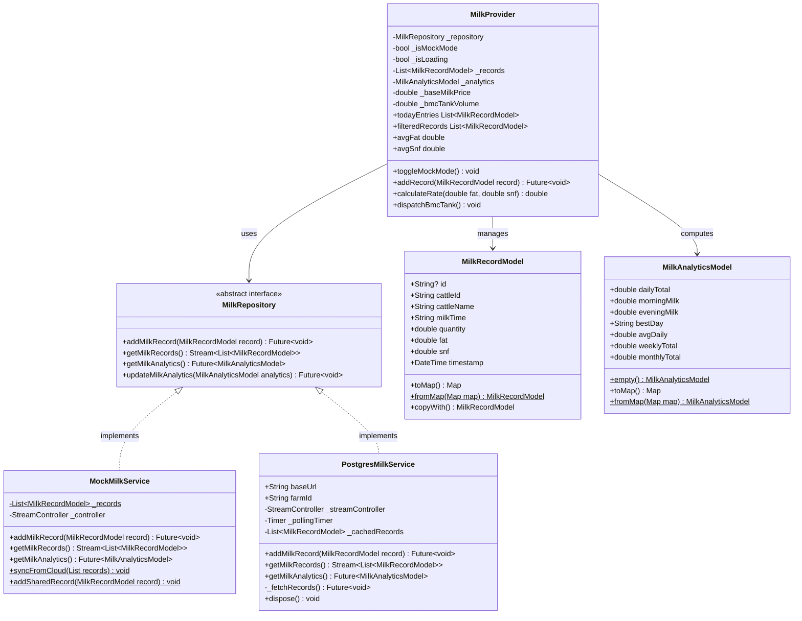

# Code Structure

**Project**: KisanPro — Cattle Milk Monitoring  
**Version**: 1.0 (Production Release)  

---

## Build System

### 1. Flutter Mobile Application
- **Build System**: Gradle 8.x + Dart SDK (`>=3.4.0 <4.0.0`) + Flutter 3.x
- **Configuration Files**:
  - `pubspec.yaml`: Declares dependencies (`provider`, `fl_chart`, `pdf`, `printing`, `intl`, `google_fonts`).
  - `android/app/build.gradle`: Android SDK settings (compileSdk 34, minSdk 21, targetSdk 34).
  - `android/app/src/main/AndroidManifest.xml`: Configures `android.permission.INTERNET`, `ACCESS_NETWORK_STATE`, and `usesCleartextTraffic="true"`.
- **Production Build Command**: `flutter build apk --release` (or `gradlew assembleRelease --offline`)
- **Output Artifact**: `build/app/outputs/flutter-apk/app-release.apk` (49 MB)

### 2. Python Backend Microservice
- **Runtime Environment**: Python 3.11 / Python 3.14 on Ubuntu 24.04 LTS
- **Package Manager**: `pip` (via `requirements.txt`)
- **Key Packages**: `fastapi`, `uvicorn`, `sqlalchemy`, `psycopg2-binary`, `pydantic`
- **Daemon Execution Command**: `nohup python3 -m uvicorn main:app --host 0.0.0.0 --port 8082 > ~/backend.log 2>&1 &`

---

## Key Classes and Modules

---

## Existing Files Inventory

### Backend (`F:\cattle_milk_monitoring\backend\` & `F:\JRF\cattle_milk_monitoring code\backend\`)
- `main.py` — Complete FastAPI application with SQLAlchemy ORM models, Pydantic schemas, and REST endpoints.
- `schema.sql` — PostgreSQL DDL schema definition for `farms`, `cattle`, `milk_production`, and `milk_analytics` tables with B-tree indexes.
- `init_db.py` — Database initialization script that connects to AWS RDS and creates missing tables.
- `seed_cloud_data.py` — Cloud seeder generating 240+ realistic milking records for AWS RDS PostgreSQL.
- `test_connection.py` — Standalone test utility validating TCP/SQLAlchemy connectivity to RDS.
- `requirements.txt` — Python backend dependency specifications.

### Flutter Presentation Layer (`lib/features/milk_monitoring/presentation/`)
- `screens/milk_monitoring_screen.dart` — Main root screen hosting AppBar with mode switcher, responsive layouts, and Tab navigation.
- `screens/milk_analytics_screen.dart` — Production analytics dashboard with trend charts, weekly/monthly KPIs, and quality breakdowns.
- `screens/milk_history_screen.dart` — Milking logbook screen with date-range picker, search filter, and record tiles.
- `screens/milk_report_screen.dart` — PDF report generator creating printable audit documents per cattle and farm.
- `providers/milk_provider.dart` — Central state management provider implementing domain business rules, quality pricing, and stream subscriptions.
- `widgets/milk_entry_card.dart` — Milking form widget for recording quantity, session, fat %, and SNF %.
- `widgets/milk_summary_card.dart` — Dashboard summary card displaying today's total, morning, and evening yields.
- `widgets/recent_entry_tile.dart` — Card widget displaying daily grouped cattle entries with tap-to-report action.
- `widgets/cattle_report_modal.dart` — Bottom sheet modal rendering per-cattle performance summaries.
- `widgets/milk_chart_widget.dart` — Visualization widget for weekly production trends using `fl_chart`.
- `widgets/analytics_card.dart` — Reusable statistical KPI metric card.

### Flutter Data & Domain Layer (`lib/features/milk_monitoring/data/` & `domain/`)
- `domain/repositories/milk_repository.dart` — Abstract interface defining data access contracts (Repository Pattern).
- `data/models/milk_record_model.dart` — Entity model for single milking records with JSON and timestamp serialization.
- `data/models/milk_analytics_model.dart` — Entity model for aggregated farm production metrics.
- `data/services/postgres_milk_service.dart` — Live AWS RDS PostgreSQL HTTP client with 4-second auto-polling stream.
- `data/services/mock_milk_service.dart` — Offline simulation service pre-loaded with realistic demonstration records.

### Core & Application Root
- `main.dart` — Application entry point initializing Provider state hierarchy and Material 3 theme.
- `core/theme/app_theme.dart` — Centralized theme system defining agricultural deep-teal palette, typography, and card decorations.

---

## Design Patterns

### 1. Repository Pattern
- **Location**: `domain/repositories/milk_repository.dart`, `data/services/postgres_milk_service.dart`, `mock_milk_service.dart`
- **Purpose**: Decouples presentation and business logic from the underlying storage mechanism (Cloud REST vs. Offline Mock).
- **Implementation**: The abstract interface `MilkRepository` is implemented by both `PostgresMilkService` and `MockMilkService`.

### 2. Observer & Stream Pattern
- **Location**: `postgres_milk_service.dart` (`StreamController.broadcast()`) ➔ `milk_provider.dart` (`StreamSubscription`)
- **Purpose**: Provides reactive real-time data flow from background server polling to the UI without blocking user interactions.
- **Implementation**: `PostgresMilkService` emits fresh records onto a broadcast stream, which `MilkProvider` consumes to trigger UI updates.

### 3. Provider / ChangeNotifier Pattern
- **Location**: `presentation/providers/milk_provider.dart`
- **Purpose**: Single source of truth for all application state, eliminating prop drilling and maintaining clean state isolation.
- **Implementation**: `MilkProvider` extends `ChangeNotifier` and is consumed across the widget tree via `Consumer<MilkProvider>`.

### 4. Factory & Copy-With Pattern
- **Location**: `data/models/milk_record_model.dart`, `data/models/milk_analytics_model.dart`
- **Purpose**: Immutable model manipulation and safe JSON serialization/deserialization.
- **Implementation**: Implements `fromMap()`, `toMap()`, `copyWith()`, and `empty()` factories.

---

## Critical Dependencies

| Dependency | Version | Location | Purpose |
|:---|:---|:---|:---|
| **provider** | `^6.1.2` | `pubspec.yaml` | Application state management and dependency injection |
| **fl_chart** | `^0.68.0` | `pubspec.yaml` | Production analytics line and bar chart rendering |
| **pdf & printing** | `^3.10.8` / `^5.11.1` | `pubspec.yaml` | On-device PDF document generation and printing engine |
| **intl** | `^0.19.0` | `pubspec.yaml` | Date/time parsing, formatting, and currency localization |
| **google_fonts** | `^6.2.1` | `pubspec.yaml` | Typography subsystem utilizing the Outfit font family |
| **fastapi** | `>=0.111.0` | `requirements.txt` | Asynchronous Python REST API framework |
| **sqlalchemy** | `>=2.0.30` | `requirements.txt` | Python SQL Toolkit and Object-Relational Mapper (ORM) |
| **psycopg2-binary** | `>=2.9.9` | `requirements.txt` | PostgreSQL database adapter for Python |
| **uvicorn** | `>=0.30.0` | `requirements.txt` | Lightning-fast ASGI web server implementation |
