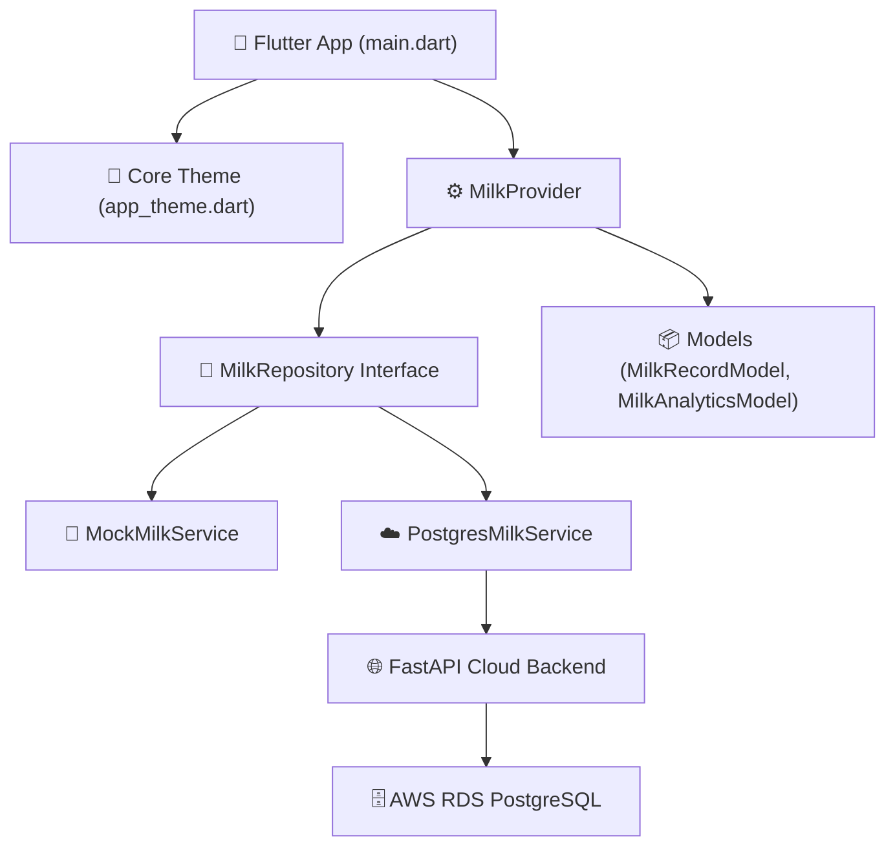

# Dependencies

**Project**: KisanPro — Cattle Milk Monitoring  
**Analysis Date**: 2026-09-04  
**Version**: 1.0 (Production Release)  

---

## Internal Dependencies Diagram

---

## Package Interdependencies

### `presentation` depends on `domain` & `data`
- **Type**: Compile / Runtime
- **Reason**: `MilkProvider` interacts with `MilkRepository` and consumes `MilkRecordModel` to bind UI widgets to live data.

### `data` depends on `domain`
- **Type**: Compile / Runtime
- **Reason**: `PostgresMilkService` and `MockMilkService` implement the abstract `MilkRepository` contract.

### `PostgresMilkService` depends on `AWS EC2 FastAPI`
- **Type**: Runtime (HTTP REST)
- **Reason**: Transmits and polls milk production records across port `8082`.

### `FastAPI Backend` depends on `AWS RDS PostgreSQL`
- **Type**: Runtime (TCP / SQLAlchemy)
- **Reason**: Persists records into `milk_production` table in `kisan_pro_db` on port `5432`.

---

## External Dependencies

### Flutter / Dart Dependencies (`pubspec.yaml`)
| Dependency | Version | Purpose | License |
|:---|:---|:---|:---|
| `provider` | `^6.1.2` | State management & Dependency Injection | MIT |
| `fl_chart` | `^0.68.0` | Production analytics chart rendering | MIT |
| `pdf` | `^3.10.8` | Document creation and styling | Apache-2.0 |
| `printing` | `^5.11.1` | Native Android document printing & preview | Apache-2.0 |
| `intl` | `^0.19.0` | Internationalization & date formatting | BSD-3-Clause |
| `google_fonts` | `^6.2.1` | Typography & dynamic font loading | Apache-2.0 |
| `cupertino_icons` | `^1.0.6` | iOS-styled iconography assets | MIT |

### Python Backend Dependencies (`requirements.txt`)
| Dependency | Version | Purpose | License |
|:---|:---|:---|:---|
| `fastapi` | `>=0.111.0,<=0.115.8` | Modern asynchronous web framework | MIT |
| `uvicorn` | `>=0.30.0,<=0.34.0` | High-throughput ASGI server | BSD-3-Clause |
| `sqlalchemy` | `>=2.0.30,<=2.0.38` | ORM & database connectivity | MIT |
| `psycopg2-binary` | `>=2.9.9,<=2.9.10` | PostgreSQL binary database driver | LGPL-3.0 |
| `pydantic` | `>=2.7.0,<=2.10.6` | Data validation and parsing | MIT |
