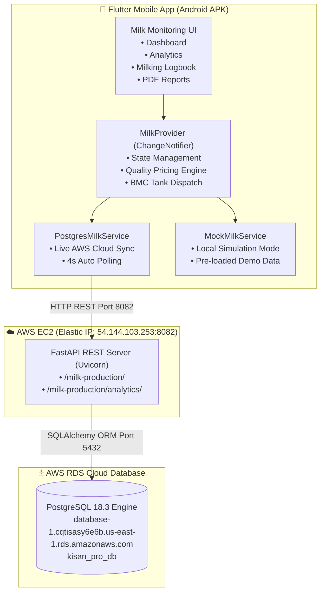

# KisanPro — Cattle Milk Monitoring System

**Version**: 1.0 (Production Release — AWS RDS PostgreSQL Edition)  
**Target Platform**: Android (Flutter 3.x), Linux / Cloud (Python FastAPI), AWS RDS (PostgreSQL 18.3)  
**Permanent Elastic IP**: `http://54.144.103.253:8082`  

---

## 📖 System Overview

**KisanPro Cattle Milk Monitoring** is an IoT-enabled precision dairy farm management application designed for Indian dairy farmers. It allows farmers to digitally record morning and evening milking sessions per cattle, computes automated quality pricing based on Fat % and SNF %, tracks farm economics (revenue, feed costs, net profit), and synchronizes data with AWS RDS PostgreSQL via FastAPI REST services.

---

## 🏛️ System Architecture



---

## 📁 Repository Structure

```
cattle_milk_monitoring/
├── README.md                           # Master production documentation
├── requirements.txt                    # Python dependencies
├── apks/
│   └── Milk_Monitoring_AWS_PostgreSQL_v1.0.apk   # Ready-to-install Android Release APK (49 MB)
├── backend/
│   ├── main.py                         # FastAPI REST application & SQLAlchemy models
│   ├── schema.sql                      # PostgreSQL DDL schema & indexes
│   ├── init_db.py                      # Database table initialization script
│   ├── seed_cloud_data.py              # AWS RDS realistic data seeder
│   ├── test_connection.py              # RDS connectivity test utility
│   └── requirements.txt                # Backend dependencies
├── integrated_feature_module/          # Modular package for embedding into host apps
│   ├── data/
│   │   ├── models/                     # MilkRecordModel, MilkAnalyticsModel
│   │   └── services/                   # PostgresMilkService, MockMilkService
│   ├── domain/repositories/            # MilkRepository abstract contract
│   ├── presentation/
│   │   ├── providers/                  # MilkProvider state manager
│   │   ├── screens/                    # Dashboard, Analytics, History, PDF Reports
│   │   └── widgets/                    # Form cards, metric cards, charts, modals
│   └── core/theme/                     # Material 3 agricultural green theme
└── standalone_source_lib/              # Standalone Flutter application source code
```

---

## 🚀 Key Features

1. **Dual-Mode Data Synchronisation**:
   - **Cloud Sync Mode**: Connects live to AWS EC2 + RDS PostgreSQL for permanent cloud storage.
   - **Simulation Mode**: Works completely offline with realistic simulated cattle data.
   - **Cross-Sync Mirroring**: Adding an entry in Cloud Sync mode instantly mirrors to the simulation store so toggling between modes never loses data.

2. **Quality-Based Pricing Calculator**:
   - Computes real-time milk value using the Indian cooperative milk formula:
     $$\text{Rate} = \text{Base Price} \times \left( \frac{\text{Fat} \times 0.6}{4.0} + \frac{\text{SNF} \times 0.4}{8.5} \right)$$

3. **Farm Economics & Analytics**:
   - Tracks daily gross revenue, estimated cattle feed cost, and net farm profit.
   - Interactive weekly and monthly production trend graphs.
   - Bulk Milk Cooler (BMC) tank level monitoring and dispatch logging.

4. **Milking Logbook & PDF Reports**:
   - Searchable, date-filterable historical milking logs.
   - Generates and exports printable PDF audit reports per cattle or for the entire farm.

---

## ⚙️ Backend Deployment & Configuration

### AWS Infrastructure Details
| Resource | Value |
|:---|:---|
| **EC2 Server** | `kisan-milk-server` (t3.micro, Ubuntu 24.04 LTS) |
| **Elastic IP** | `54.144.103.253` (Permanent Static IPv4) |
| **FastAPI Port** | `8082` |
| **RDS Engine** | PostgreSQL 18.3 (`kisan_pro_db`) |
| **RDS Endpoint** | `database-1.cqtisasy6e6b.us-east-1.rds.amazonaws.com:5432` |

### Starting the Backend Daemon
```bash
# On AWS EC2
nohup python3 -m uvicorn main:app --host 0.0.0.0 --port 8082 > ~/backend.log 2>&1 &
```

---

## 📱 Mobile App Build & Installation

### Option 1: Direct USB Installation via ADB
```bash
adb install -r apks/Milk_Monitoring_AWS_PostgreSQL_v1.0.apk
adb shell monkey -p com.kisanpro.kisan_pro_milk_monitoring -c android.intent.category.LAUNCHER 1
```

### Option 2: Build from Source
```bash
flutter pub get
flutter build apk --release
```
Output location: `build/app/outputs/flutter-apk/app-release.apk`

---

## 🔒 Security & Android Permissions
- `android.permission.INTERNET`: Enabled for cloud communication.
- `android.permission.ACCESS_NETWORK_STATE`: Enabled for network diagnostics.
- `usesCleartextTraffic="true"`: Configured for HTTP REST communication.
