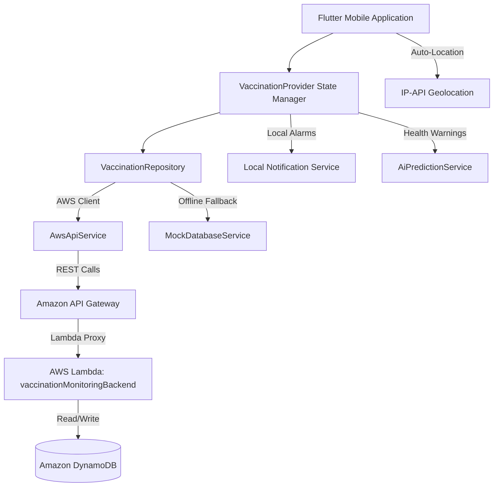
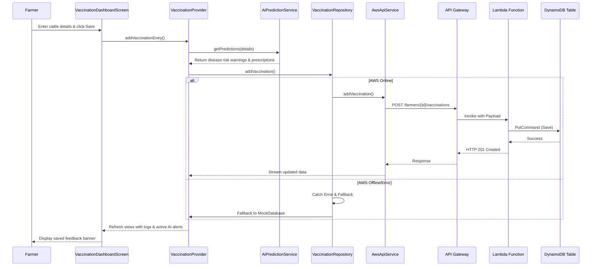

# System Architecture

## System Overview
The KisanPro Vaccination Monitoring system follows a decoupled, client-server mobile architecture utilizing a serverless cloud backend. The client is a cross-platform Flutter mobile app that coordinates data management through a Repository pattern, syncing with an AWS REST API when online and falling back to a mock local memory cache when offline. The cloud infrastructure uses Amazon API Gateway, AWS Lambda functions, and Amazon DynamoDB tables for zero-maintenance persistent storage.

## Architecture Diagram

## Component Descriptions

### Mobile Client Application (`lib/main.dart`)
- **Purpose**: App bootstrap and service provider initialization.
- **Responsibilities**: Registers state providers, manages UI themes, and runs app widget trees.
- **Dependencies**: Provider, Google Fonts.
- **Type**: Application.

### Vaccination Repository (`lib/features/vaccination_monitoring/data/repositories/vaccination_repository.dart`)
- **Purpose**: Unified data access point for the presentation layer.
- **Responsibilities**: Evaluates AWS connectivity and routes database operations to the active service provider (AWS or Mock database).
- **Dependencies**: `AwsApiService`, `MockDatabaseService`.
- **Type**: Shared / Bridge Layer.

### AWS API Client Service (`lib/features/vaccination_monitoring/data/services/aws_api_service.dart`)
- **Purpose**: REST interface wrapper for AWS API Gateway.
- **Responsibilities**: Sends HTTP requests (GET/POST/PUT) to AWS, serializes data models, and feeds real-time broadcast stream controllers.
- **Dependencies**: Http Package.
- **Type**: Network client.

### AI Prediction Service (`lib/features/vaccination_monitoring/data/services/ai_prediction_service.dart`)
- **Purpose**: Indian Veterinary Epidemiological Prediction Engine.
- **Responsibilities**: Evaluates cattle physical parameters (age, weight, breed, and location) against regional disease markers to compile risk reports and drug prescriptions.
- **Dependencies**: None (Pure Dart business logic).
- **Type**: Domain Service.

### Amazon API Gateway (`VaccinationMonitoringAPI`)
- **Purpose**: Exposes secure cloud API endpoints.
- **Responsibilities**: Routes paths `/farmers/{farmerId}/vaccinations` and `/farmers/{farmerId}/reminders/{reminderId}` to the Lambda backend, manages CORS headers, and handles HTTP routing.
- **Dependencies**: AWS Lambda.
- **Type**: Infrastructure.

### AWS Lambda Handler (`vaccinationMonitoringBackend`)
- **Purpose**: Serverless business logic executor.
- **Responsibilities**: Parses API Gateway proxy events, routes endpoints to DynamoDB operations, and returns standard HTTP responses.
- **Dependencies**: AWS SDK v3.
- **Type**: Infrastructure / Application.

### Amazon DynamoDB (`Vaccinations` & `Reminders` Tables)
- **Purpose**: NoSQL persistent database.
- **Responsibilities**: Stores vaccination records and reminders.
- **Dependencies**: None.
- **Type**: Data Store.

---

## Data Flow
The sequence diagram below shows the flow for recording a new vaccination:

---

## Integration Points
- **External API (AWS REST Gateway)**: Deployed endpoint at `https://sdq2lyv15a.execute-api.us-east-1.amazonaws.com/v1`. Acts as the primary write/read target for vaccination and reminder data.
- **IP-API Geolocation service**: Used via standard HTTPS GET requests to `https://ipapi.co/json` to automatically detect the farmer's current Indian state.
- **DynamoDB Database**: Deployed inside AWS `us-east-1` region. Consists of `Vaccinations` (primary schema) and `Reminders` (scheduled alerts schema) tables.
- **Notification Service**: Uses `flutter_local_notifications` for local device task/reminder alerts.
