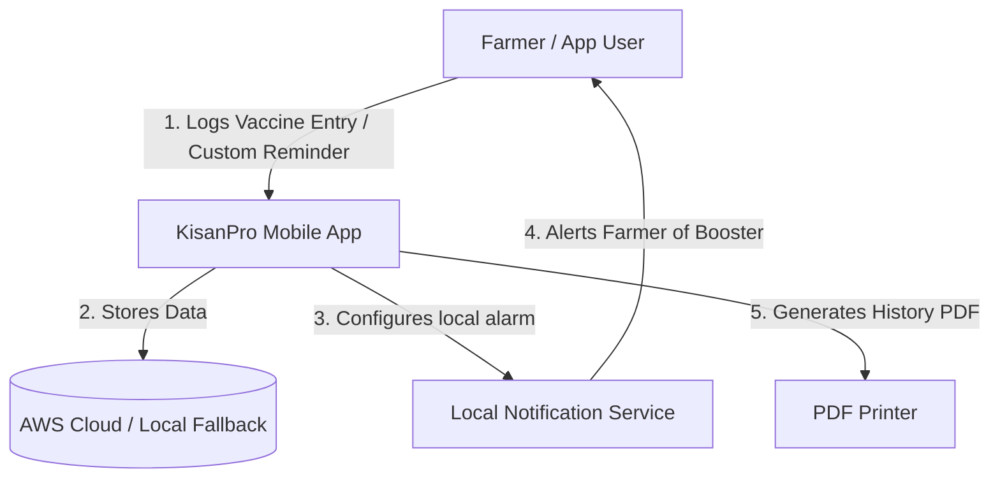

# Business Overview

## Business Context Diagram

## Business Description
- **Business Description**: The KisanPro Vaccination Monitoring system is designed to help farmers manage livestock health by tracking vaccination histories and scheduling booster reminders. It automates the calculation of booster intervals based on veterinary standards (e.g., FMD, Anthrax, and Hemorrhagic Septicemia) and triggers localized alerts to ensure timely vaccine administration, thereby improving overall livestock compliance rates and health monitoring.
- **Business Transactions**: 
  - **Log Livestock Vaccination:** The farmer inputs the cattle's name, ID, administered vaccine name, and date. The system automatically computes the next booster date based on the vaccine type, writes the history record, and schedules a push notification alert.
  - **Schedule Custom Reminders:** The user creates standalone alerts for general tasks (e.g., vet visits, general checkups) with specific custom descriptions.
  - **Review Compliance Analytics:** The dashboard calculates the proportion of completed versus overdue vaccinations to show a compliance index, along with interactive weekly/monthly metrics.
  - **Generate History PDF Reports:** Exports a formatted PDF report showing all administered doses and upcoming reminders for a specific animal, ready to print or share.
  - **Complete Pending Reminders:** Marks scheduled reminders as completed once the booster is successfully administered.
- **Business Dictionary**: 
  - **Cattle ID:** Unique tag identifier (e.g., `KP-204`) assigned to an individual animal.
  - **Booster Interval:** The period before an animal requires a follow-up dose. Varies by vaccine: 30 days for FMD (Foot & Mouth Disease), 180 days for HS (Hemorrhagic Septicemia), and 365 days for Anthrax/Brucellosis.
  - **Compliance Rate:** The metric representing the proportion of completed vaccinations over the total required vaccinations (Completed / (Completed + Overdue)).

## Component Level Business Descriptions
### Mobile Application (`lib/`)
- **Purpose**: Provides the visual front-end dashboard, data forms, charts, and local alerts management interface for the farmer.
- **Responsibilities**: Validates user inputs, manages local notifications scheduling, calculates booster dates, compiles report charts, and formats printable PDF documents.

### AWS Cloud Backend (`Lambda & DynamoDB`)
- **Purpose**: Persistently stores vaccination records and scheduled alerts securely in the cloud.
- **Responsibilities**: Exposes REST interfaces via API Gateway, executes database writes/reads via Lambda functions, and maintains data records inside DynamoDB tables.
