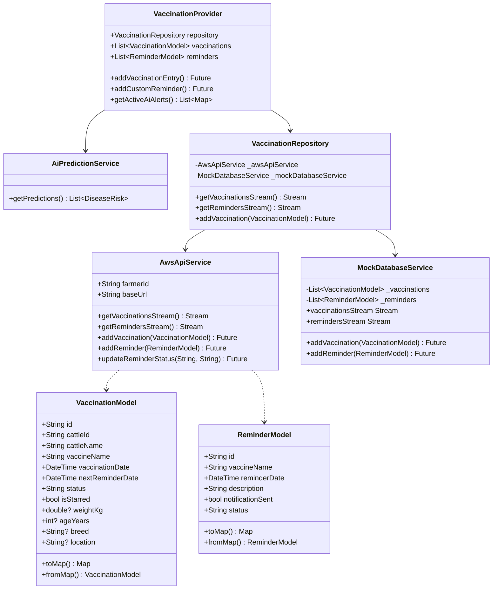

# Code Structure

## Build System
- **Type**: Gradle (for Android), CocoaPods (for iOS), and pub (for Dart package management).
- **Configuration**:
  - `pubspec.yaml`: Declares third-party packages, asset assets, and font configurations.
  - `android/app/build.gradle`: Android SDK compiles and builds options (minSdk 23, compileSdk 35).

---

## Key Classes/Modules
The relationship and structure of the core classes in the codebase are shown below:

---

## Existing Files Inventory
- **[`lib/main.dart`](file:///f:/Vaccination%20Monitoring/Vaccination%20Monitoring%20Code/lib/main.dart)** - App bootstrap that configures Provider states.
- **[`lib/core/theme/app_theme.dart`](file:///f:/Vaccination%20Monitoring/Vaccination%20Monitoring%20Code/lib/core/theme/app_theme.dart)** - Defines themes, fonts, gradients, and custom input borders.
- **[`lib/core/utils/pdf_generator.dart`](file:///f:/Vaccination%20Monitoring/Vaccination%20Monitoring%20Code/lib/core/utils/pdf_generator.dart)** - Compiles and generates printable vaccination records into formatted PDFs.
- **[`lib/features/vaccination_monitoring/data/models/vaccination_model.dart`](file:///f:/Vaccination%20Monitoring/Vaccination%20Monitoring%20Code/lib/features/vaccination_monitoring/data/models/vaccination_model.dart)** - Datamodel containing serialization for vaccination events, expanded with age, weight, breed, and location parameters.
- **[`lib/features/vaccination_monitoring/data/models/reminder_model.dart`](file:///f:/Vaccination%20Monitoring/Vaccination%20Monitoring%20Code/lib/features/vaccination_monitoring/data/models/reminder_model.dart)** - Datamodel containing serialization for scheduling booster/tasks alerts.
- **[`lib/features/vaccination_monitoring/data/services/aws_api_service.dart`](file:///f:/Vaccination%20Monitoring/Vaccination%20Monitoring%20Code/lib/features/vaccination_monitoring/data/services/aws_api_service.dart)** - Handles HTTP REST API integrations connecting with AWS Gateway endpoints.
- **[`lib/features/vaccination_monitoring/data/services/ai_prediction_service.dart`](file:///f:/Vaccination%20Monitoring/Vaccination%20Monitoring%20Code/lib/features/vaccination_monitoring/data/services/ai_prediction_service.dart)** - Indian Veterinary Epidemiological Prediction Engine containing regional and weight-based disease guidelines.
- **[`lib/features/vaccination_monitoring/data/services/mock_database_service.dart`](file:///f:/Vaccination%20Monitoring/Vaccination%20Monitoring%20Code/lib/features/vaccination_monitoring/data/services/mock_database_service.dart)** - Local mock database service with preset history for offline mode.
- **[`lib/features/vaccination_monitoring/data/services/notification_service.dart`](file:///f:/Vaccination%20Monitoring/Vaccination%20Monitoring%20Code/lib/features/vaccination_monitoring/data/services/notification_service.dart)** - Wrapper scheduling push notifications on the local Android/iOS alarm manager.
- **[`lib/features/vaccination_monitoring/data/repositories/vaccination_repository.dart`](file:///f:/Vaccination%20Monitoring/Vaccination%20Monitoring%20Code/lib/features/vaccination_monitoring/data/repositories/vaccination_repository.dart)** - Integrates the AWS Client and coordinates fallback routing.
- **[`lib/features/vaccination_monitoring/presentation/providers/vaccination_provider.dart`](file:///f:/Vaccination%20Monitoring/Vaccination%20Monitoring%20Code/lib/features/vaccination_monitoring/presentation/providers/vaccination_provider.dart)** - State management controller that computes analytics and exposes list changes, calculating AI predictions with robust fallbacks.
- **[`lib/features/vaccination_monitoring/presentation/screens/vaccination_dashboard_screen.dart`](file:///f:/Vaccination%20Monitoring/Vaccination%20Monitoring%20Code/lib/features/vaccination_monitoring/presentation/screens/vaccination_dashboard_screen.dart)** - Core home view rendering data logging forms (with auto-detect location and auto-fill bindings) and cattle indexes.
- **[`lib/features/vaccination_monitoring/presentation/screens/ai_alerts_screen.dart`](file:///f:/Vaccination%20Monitoring/Vaccination%20Monitoring%20Code/lib/features/vaccination_monitoring/presentation/screens/ai_alerts_screen.dart)** - Sub-section screen displaying active health warnings and vet advice.
- **[`lib/features/vaccination_monitoring/presentation/screens/vaccination_report_screen.dart`](file:///f:/Vaccination%20Monitoring/Vaccination%20Monitoring%20Code/lib/features/vaccination_monitoring/presentation/screens/vaccination_report_screen.dart)** - Popup overlay showcasing weekly/monthly stats and the PDF compilation trigger.

---

## Design Patterns

### Repository Pattern
- **Location**: `vaccination_repository.dart`
- **Purpose**: Abstracting the source database away from the UI.
- **Implementation**: Routes data request payloads dynamically to either the `AwsApiService` (online) or `MockDatabaseService` (offline) dynamically.

### Observer / Provider Pattern
- **Location**: `vaccination_provider.dart`
- **Purpose**: Decoupling visual rendering from business logic and state updates.
- **Implementation**: Listens to active repository data streams and calls `notifyListeners()` to rebuild widget trees.

### Singleton Pattern
- **Location**: `mock_database_service.dart` and `notification_service.dart`
- **Purpose**: Preventing multiple instances of database tables or alert managers from executing.
- **Implementation**: Implemented using private constructors (`_internal()`) and static instances.

---

## Critical Dependencies
- **`http: ^1.2.1`**: Handles REST requests to API Gateway.
- **`provider: ^6.1.5+1`**: Coordinates dependency injections and reactive data state binding.
- **`fl_chart: ^0.68.0`**: Visualizes history rates through customizable bar charts.
- **`pdf: ^3.11.3`**: Renders PDF layouts and vector assets.
- **`printing: ^5.14.3`**: Generates and prints PDFs.
- **`flutter_local_notifications: ^19.5.0`**: Schedules offline alerts on the Android/iOS task manager.
