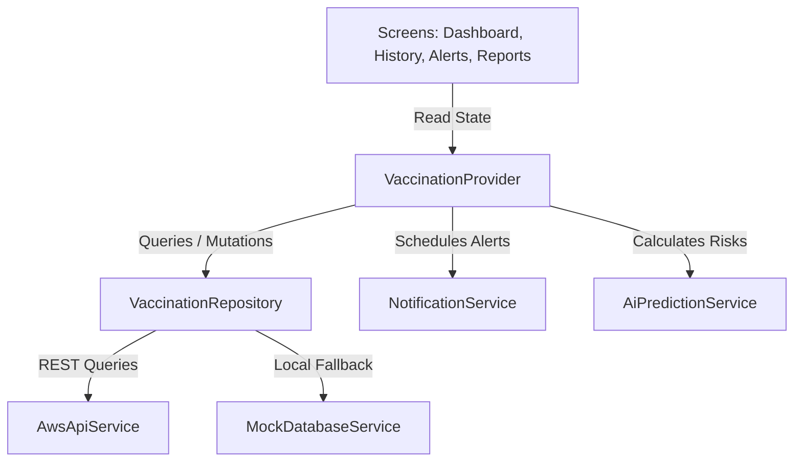

# Dependencies

## Internal Dependencies
The class level dependency tree below illustrates the internal architecture bindings:

### `VaccinationProvider` depends on `VaccinationRepository`
- **Type**: Runtime & Compile
- **Reason**: The provider coordinates UI refreshes and queries database streams by calling the repository layer directly.

### `VaccinationRepository` depends on `AwsApiService` & `MockDatabaseService`
- **Type**: Compile
- **Reason**: The repository encapsulates network states and switches operations dynamically between the cloud and memory storage.

### `VaccinationProvider` depends on `NotificationService`
- **Type**: Runtime
- **Reason**: Automatically schedules task events and notifications on the device calendar once a new vaccine is successfully saved.

### `VaccinationProvider` depends on `AiPredictionService`
- **Type**: Runtime
- **Reason**: Calculates regional livestock health warnings and dynamic veterinarian prescriptions based on cattle age, weight, breed, and location parameters.

---

## External Dependencies

### `http` (v1.2.1)
- **Version**: `^1.2.1`
- **Purpose**: Sends requests to AWS API Gateway endpoints and retrieves geolocator JSON profiles from `https://ipapi.co/json`.
- **License**: BSD-3-Clause

### `provider` (v6.1.5+1)
- **Version**: `^6.1.5+1`
- **Purpose**: Controls dependency injections and binds data changes to screen elements.
- **License**: MIT

### `fl_chart` (v0.68.0)
- **Version**: `^0.68.0`
- **Purpose**: Renders the analytical graphs showing monthly performance metrics.
- **License**: MIT

### `pdf` (v3.11.3)
- **Version**: `^3.11.3`
- **Purpose**: Generates vector files formatting the livestock vaccination lists.
- **License**: MIT

### `flutter_local_notifications` (v19.5.0)
- **Version**: `^19.5.0`
- **Purpose**: Implements push alert rings on the local device alert manager.
- **License**: BSD-3-Clause
