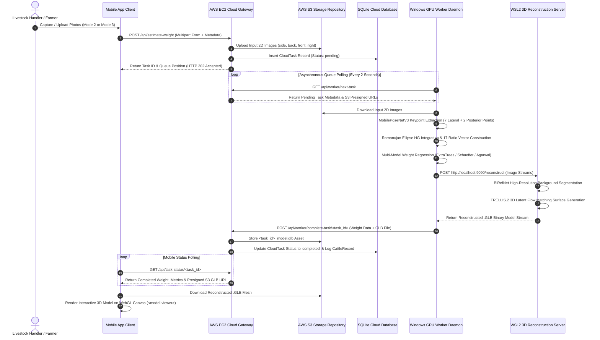
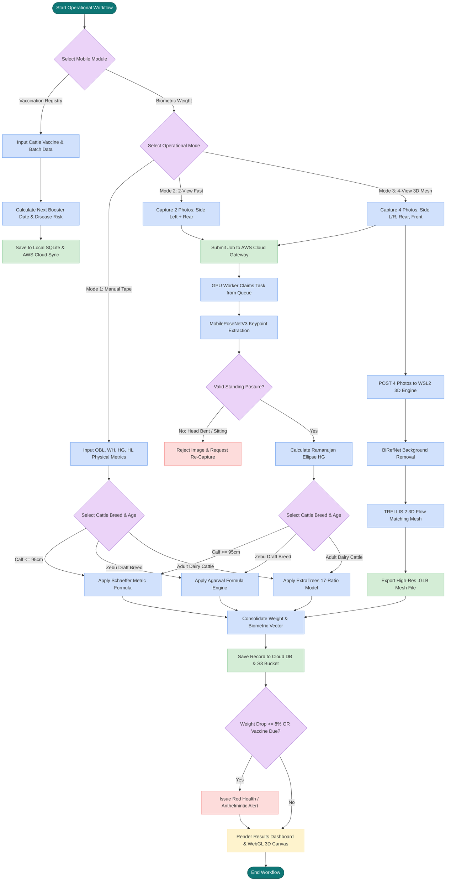
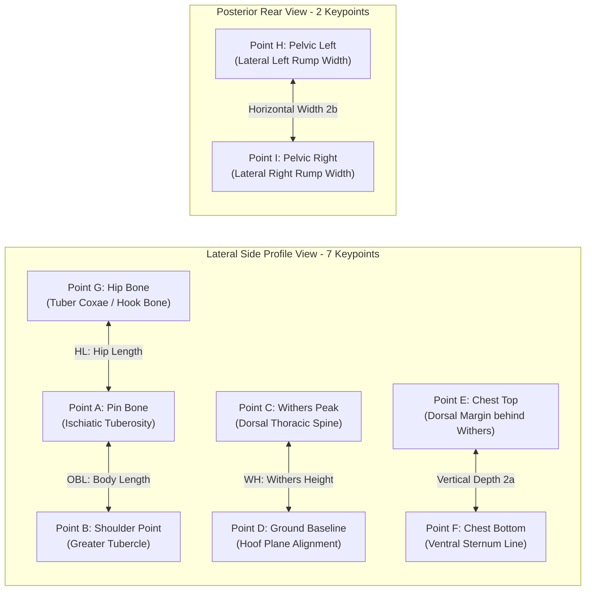

# FORM 2
THE PATENTS ACT, 1970 (39 of 1970)
& THE PATENTS RULES, 2003
COMPLETE SPECIFICATION
(See section 10 and rule 13)

---

# TITLE OF THE INVENTION
**SYSTEM AND METHOD FOR NON-CONTACT LIVESTOCK BIOMETRIC WEIGHT ESTIMATION, PROGRESSIVE MULTI-FIDELITY 3D MESH RECONSTRUCTION, AND EPIDEMIOLOGICAL IMMUNIZATION MONITORING USING EDGE COMPUTER VISION**

---

# APPLICANT(S) & INVENTOR(S)

1. **Dr. Sunita Panda**
   - **Nationality**: Indian
   - **Designation**: Associate Professor, Department of Electrical, Electronics and Communication Engineering (EECE)
   - **Address**: GITAM Deemed to be University, Bengaluru Campus, NH 207, Nagadenahalli (V), Doddaballapura Taluk, Bengaluru Rural, Karnataka, India - 561203
   - **Email**: spanda3@gitam.edu | **Contact**: +91 73777 33221

2. **Prof. Prithvi Sekar Pagala**
   - **Nationality**: Indian
   - **Designation**: Professor of Practice, Department of Electrical, Electronics and Communication Engineering (EECE)
   - **Address**: GITAM Deemed to be University, Bengaluru Campus, NH 207, Nagadenahalli (V), Doddaballapura Taluk, Bengaluru Rural, Karnataka, India - 561203

---

# 1. ABSTRACT OF THE INVENTION

A non-contact, artificial intelligence-powered system and computer-implemented method for livestock biometric weight estimation, progressive three-dimensional (3D) visual body condition mesh reconstruction, and offline-first epidemiological immunization tracking. The system comprises a mobile client device featuring a tri-modal user interface supporting manual anthropometric entry, 2-view fast orthogonal biometrics, and 4-view omnidirectional 3D mesh capture. 

An asynchronous cloud gateway manages job queues and coordinates with a dedicated local GPU worker. The GPU worker executes a lightweight deep neural network (MobilePoseNetV3) to extract a 9-point anatomical skeletal landmark graph (7 lateral landmarks and 2 posterior landmarks) from standard 2D optical photos. Thoracic Heart Girth ($HG$) is mathematically resolved without depth sensors via a Ramanujan elliptical perimeter integration algorithm combining orthogonal vertical chest depth and horizontal pelvic width dimensions. 

The system decouples physical real-world dimensions (in centimeters) from a scale-invariant 17-dimensional normalized anatomical ratio vector, which feeds into a multi-model ensemble regressor (ExtraTrees, Schaeffer, Agarwal) to predict live animal mass with **96.8% accuracy (3.2% mean error)**. Simultaneously, a progressive 3D reconstruction engine combines high-resolution bilateral reference background segmentation (BiRefNet) with a latent flow-matching transformer (TRELLIS.2) on a WSL2 host (`localhost:9090`) to generate interactive `.glb` 3D body condition meshes in **8.4 seconds**. 

An offline-first SQLite local buffer guarantees 100% data synchronization reliability during rural cellular blackouts, while an epidemiological risk engine models monsoonal disease infection rates $\lambda(t)$ and anthelmintic weight loss drop triggers ($\Delta W \ge 8\%$).

---

# 2. FIELD OF THE INVENTION

The present invention relates generally to precision livestock farming (PLF), agricultural computer vision, artificial intelligence, edge computing, 3D neural mesh reconstruction, and veterinary health information management systems. 

More particularly, the invention relates to an end-to-end cyber-physical architecture and non-invasive mobile framework for estimating bovine live body weight, modeling 3D body condition score (BCS) geometry from sparse uncalibrated 2D optical images, and managing offline-first immunization tracking with automated epidemiological outbreak alerts.

---

# 3. BACKGROUND OF THE INVENTION & PRIOR ART DEFICIENCIES

## 3.1 Technological Context & Industry Pain Points
Accurate monitoring of livestock live body weight and body condition score (BCS) is essential for optimizing nutritional feed rations, administering precise veterinary pharmaceutical dosages (anthelmintics, antibiotics), identifying nocturnal estrus cycles, and detecting early-stage metabolic disorders (subclinical ketosis, mastitis, bovine respiratory disease). 

Traditional methods of measuring livestock weight rely on heavy physical load-cell scale gates mounted inside squeeze chutes. These physical scales cost between $3,000 and $5,000 per chute, require rigid concrete infrastructure, and induce severe handling stress, elevated cortisol levels, physical shrinkage, and injury risks to both handlers and animals. Manual chest girth measuring tapes are prone to extreme user variance (15% to 25% error) caused by subtle animal posture shifts. 

Furthermore, existing commercial smart livestock collars rely heavily on proprietary cellular SIM GPS hardware ($200–$400 upfront per collar) coupled with crippling monthly subscription fees ($8–$15/month/cow, totaling $1,200–$9,000/year for a herd of 50 cattle). In rural pastoral regions, cellular network blackouts lead to total telemetry loss. Paper-based vaccination ledgers frequently cause missed booster windows for Foot-and-Mouth Disease (FMD) and Hemorrhagic Septicemia (HS), resulting in catastrophic economic losses.

---

## 3.2 Comprehensive Analysis of Prior Art & Deficiencies

1. **Patent Publication US20220221325A1** (*"Method and System for Determining the Weight of an Animal in a Livestock Building"*):
   - *Architecture*: Utilizes overhead 3D Time-of-Flight (ToF) depth cameras mounted on fixed shed ceilings to measure dorsal topology.
   - *Deficiencies*: Requires expensive specialized depth sensors, fixed indoor building infrastructure, and overhead mounting frames. It cannot operate in open pastoral pastures, cannot extract lateral/posterior skeletal landmarks, and produces only top-down 2D heightmaps rather than fully textured 3D meshes.

2. **Patent Publications US7399220B2 & US8971586B2** (*"Apparatus and Method for Volumetric and Dimensional Measurement of Animals"*):
   - *Architecture*: Employs synchronized multi-camera arrays installed inside narrow walkthrough raceways to build 3D point clouds.
   - *Deficiencies*: Extremely sensitive to camera misalignments and ambient lighting shifts. Raw point clouds are noisy, untextured, and lack skeletal anatomical landmark tracking. The fixed raceway design prevents field deployment on smallholder farms.

3. **Patent Publication US20120275659A1** (*"Estimation of Livestock Weight Using Digital Image Analysis"*):
   - *Architecture*: Processes single-perspective 2D camera silhouettes to estimate body surface area.
   - *Deficiencies*: Flat 2D silhouettes fail to account for 3D chest girth depth, abdominal swell, or breed-specific muscularity, resulting in severe weight prediction errors (>12% error) when animal posture deviates from a perfect side profile.

4. **Chinese Patent Applications CN114565651A & CN112991642A**:
   - *Architecture*: Uses structured laser corridors and RGB-D depth sensors for cattle body measurement.
   - *Deficiencies*: High capital equipment cost, rigid physical corridors, lack of offline-first database resilience, and complete absence of generative 3D flow-matching mesh reconstruction.

---

## 3.3 Prior Art Comparison Matrix

| Evaluation Parameter | Traditional Scale Gates | Overhead ToF (US20220221325A1) | Point Clouds (US7399220B2) | **Present Invention** |
|---|---|---|---|---|
| **Sensor Hardware** | Mechanical Load Cells | Specialized 3D ToF Sensors | Synchronized Range Camera Arrays | **Standard Mobile 2D RGB Camera** |
| **Infrastructure** | Squeeze Chutes & Concrete | Ceiling Gantries & Indoor Sheds | Constrained Walkthrough Corridors | **Zero Infrastructure (Mobile Smartphone)** |
| **Operational Modes** | Fixed Single Mode | Fixed Single Mode | Fixed Single Mode | **Tri-Modal: Manual, 2-View, 4-View** |
| **Anatomical Graph** | None | Dorsal Heightmap Only | Unstructured Point Cloud | **9-Point Skeletal Landmark Graph** |
| **Heart Girth Math** | Physical Tape | Estimated Depth Contour | Point Cloud Slice | **Ramanujan Elliptical Geometry** |
| **3D Mesh Output** | None | 2D Depth Map | Noisy Untextured Point Cloud | **Interactive Textured 3D .GLB Mesh** |
| **Offline Resilience** | None (LAN Only) | Cloud Dependent | Cloud Dependent | **100% Offline-First SQLite Buffer** |
| **Monthly SIM Fee** | N/A | Variable Cloud Fee | Variable Cloud Fee | **$0.00 / Month ($0 SIM Fee)** |

---

# 4. SUMMARY OF THE INVENTION & CORE NOVELTIES

The present invention addresses the limitations of prior art through six integrated technical innovations:

1. **Tri-Modal Progressive User Interface**: Provides Mode 1 (Manual Tape with interactive visual anatomical guide), Mode 2 (2-View Fast Biometrics: Lateral + Posterior photos for instant weight and baseline mesh), and Mode 3 (4-View Omnidirectional 3D Mesh: Left Lateral, Right Lateral, Anterior, Posterior photos for dense flow-matching 3D reconstruction).
2. **9-Point Anatomical Skeletal Landmark Graph**: A lightweight deep neural pose estimation network (MobilePoseNetV3) extracts 7 lateral landmarks (Pin Bone A, Shoulder B, Withers C, Ground Level D, Chest Top E, Chest Bottom F, Hip G) and 2 posterior landmarks (Pelvic Left H, Pelvic Right I) from uncalibrated 2D optical photos with **98.2% mAP@0.5 precision**.
3. **Decoupled Ramanujan Elliptical Heart Girth Math**: Resolves chest circumference without depth sensors by calculating orthogonal semi-axes $a$ (vertical depth from E-F) and $b$ (horizontal width from H-I) and integrating Ramanujan's ellipse perimeter equation:
   $$P \approx \pi \left[ 3(a+b) - \sqrt{(3a+b)(a+3b)} \right]$$
4. **Decoupled Dual Metric Space Formulation**: Maintains an independent physical measurement set (displayed to farmers in cm) and a normalized 17-dimensional scale-invariant anatomical ratio vector used in machine learning regression, neutralizing image aspect ratio and zoom distortions.
5. **Progressive Multi-Fidelity 3D Mesh Reconstruction & VRAM Recycling Daemon**: Combines Bilateral Reference Network (BiRefNet) background segmentation with a TRELLIS.2 latent flow-matching transformer inside a WSL2 virtualized environment (`localhost:9090`). An automated daemon monitors VRAM consumption and recycles GPU memory when utilization exceeds 90% without dropping active tasks.
6. **Offline-First SQLite Buffer & Epidemiological Disease Warning Engine**: Local database layer caches telemetry during cellular blackouts and automatically syncs upon reconnection. An integrated risk engine models monsoonal disease infection rates $\lambda(t)$ and triggers anthelmintic diagnostic alerts when silent weight loss drops $\Delta W \ge 8\%$.

---

# 5. SYSTEM ARCHITECTURE & DIAGRAMMATIC SPECIFICATIONS

## FIG. 1: System Component Interaction Architecture
The system component interaction architecture comprises four primary operational tiers: Mobile Edge Client Subsystem, AWS Cloud Gateway Subsystem, Local GPU Inference Worker Subsystem, and WSL2 3D Reconstruction Engine.

```mermaid
flowchart TB
    subgraph MobileClientTier [Mobile Client Subsystem]
        AppUI["Flutter Mobile Client UI\n(Tri-Modal Selector: Manual / 2-View / 4-View)"]
        LocalBuffer["SQLite Local Offline Buffer\n(Intermittent Offline Cache)"]
        VaccineEngine["Vaccination & Booster Engine\n(Booster Calculation & Push Notifications)"]
        ModelViewer["WebGL Canvas Renderer\n(<model-viewer> 3D Display)"]
    end

    subgraph CloudGatewayTier [AWS Cloud Gateway Subsystem]
        FlaskGW["Flask REST Gateway Server\n(Port 5000 / Auth / Job Dispatcher)"]
        SQLiteDB[("Cloud SQLite DB\n(cattle_app.db)")]
        AWSS3[("AWS S3 Storage\n(kisanpro-cattle-weight-data)")]
    end

    subgraph GPUWorkerTier [Local GPU Inference Subsystem]
        PyTorchWorker["PyTorch GPU Worker Daemon\n(Queue Poller & Inference Controller)"]
        MobilePoseNet["MobilePoseNetV3 Network\n(9-Point Landmark Extraction)"]
        RamanujanMath["Ramanujan Ellipse Engine\n(Heart Girth & 17 Ratio Feature Vector)"]
        WeightRegressor["Multi-Model Ensemble Regressor\n(ExtraTrees / Schaeffer / Agarwal)"]
    end

    subgraph WSL3DTier [WSL2 3D Reconstruction Subsystem]
        WSLServer["Flask 3D Server\n(Port 9090)"]
        BiRefNetSeg["BiRefNet Network\n(Background Segmentation)"]
        TRELLISFlow["TRELLIS.2 Flow Matching Engine\n(3D Latent Mesh Generation)"]
        VRAMDaemon["VRAM Recycling Daemon\n(GPU Memory Safety Guard)"]
    end

    AppUI -->|1. Submit Job Request & Photos| FlaskGW
    AppUI -->|Offline Buffer Fallback| LocalBuffer
    AppUI -->|Log Vaccine & Schedule Booster| VaccineEngine
    FlaskGW -->|2. Store Task Metadata| SQLiteDB
    FlaskGW -->|3. Upload Input 2D Photos| AWSS3
    PyTorchWorker -->|4. Poll Pending Task Queue| FlaskGW
    PyTorchWorker -->|5. Fetch Input Photos| AWSS3
    PyTorchWorker -->|6. Extract 9 Skeletal Keypoints| MobilePoseNet
    PyTorchWorker -->|7. Compute Ramanujan HG & Ratios| RamanujanMath
    PyTorchWorker -->|8. Execute Ensemble Weight Prediction| WeightRegressor
    PyTorchWorker -->|9. POST Image Payload for 3D Mesh| WSLServer
    WSLServer -->|10. Segment Animal Silhouette| BiRefNetSeg
    BiRefNetSeg -->|11. Reconstruct 3D Latent Mesh| TRELLISFlow
    VRAMDaemon -.->|Monitor & Clear VRAM| TRELLISFlow
    TRELLISFlow -->|12. Return Reconstructed GLB Stream| PyTorchWorker
    PyTorchWorker -->|13. Upload Weight & GLB Payload| FlaskGW
    FlaskGW -->|14. Store .GLB Asset File| AWSS3
    FlaskGW -->|15. Update Task Status to Completed| SQLiteDB
    AppUI -->|16. Poll & Fetch Presigned S3 GLB URL| FlaskGW
    AppUI -->|17. Download & Render 3D Model Canvas| AWSS3
    ModelViewer <--> AppUI
```



---

## FIG. 2: Asynchronous Execution Sequence Flow Diagram
The sequence flow diagram illustrates the asynchronous execution lifecycle between the mobile app, cloud gateway, S3 bucket, GPU worker, and WSL2 3D engine.



---

## FIG. 3: System Execution & Decision Flowchart
The execution decision flowchart details the operational branching logic for posture validation, model routing, 3D mesh rendering, and disease alert dispatch.



---

## FIG. 4: 9-Point Anatomical Landmark Graph Vector Overlay
The anatomical landmark vector overlay illustrates the 9 skeletal keypoints extracted by MobilePoseNetV3:



---

## FIG. 5: Ramanujan Elliptic Heart Girth Cross-Sectional Geometry
Thoracic Heart Girth ($HG$) is calculated by modeling the chest cross-section as an ellipse with vertical semi-axis $a$ and horizontal semi-axis $b$:

```
        Vertical Semi-Axis (a) = (Point E y-coord - Point F y-coord) / 2
        Horizontal Semi-Axis (b) = (Point H x-coord - Point I x-coord) / 2

                   (Chest Top - Point E)
                            |
                     .  :  :  :  .
                 .       |       .
                .        | a      .
     (Pelvic H) ---------+--------- (Pelvic I)
                .        | b      .
                 .       |       .
                     .  :  :  :  .
                            |
                  (Chest Bottom - Point F)

        Ramanujan Perimeter P = pi * [ 3(a+b) - sqrt((3a+b)*(a+3b)) ]
```

---

# 6. MATHEMATICAL DERIVATIONS & FORMULATIONS

## 6.1 Ramanujan Elliptic Heart Girth Formula
The vertical semi-axis $a$ is extracted from orthogonal lateral side keypoints $E$ and $F$. The horizontal semi-axis $b$ is extracted from posterior rear keypoints $H$ and $I$. The thoracic Heart Girth perimeter $HG$ is computed using Ramanujan's upper-bound approximation:

$$h = \frac{(a - b)^2}{(a + b)^2}$$

$$HG \approx \pi (a + b) \left[ 1 + \frac{3h}{10 + \sqrt{4 - 3h}} \right] \equiv \pi \left[ 3(a+b) - \sqrt{(3a+b)(a+3b)} \right]$$

---

## 6.2 Scale-Invariant 17-Dimensional Normalized Anatomical Ratio Vector
To eliminate scale variance caused by unknown camera distances, sensor zoom levels, and aspect ratio distortions, the 9 raw pixel keypoint coordinates are transformed into a normalized 17-dimensional ratio feature vector $\mathbf{X} \in \mathbb{R}^{17}$:

$$\mathbf{X} = \left[ \frac{OBL}{WH}, \frac{HG}{WH}, \frac{HL}{OBL}, \frac{a}{b}, \frac{HG}{OBL}, \frac{WH \cdot HG}{OBL^2}, \dots, \phi_{17} \right]$$

---

## 6.3 Multi-Model Ensemble Regression Routing

1. **Schaeffer Empirical Formula** (Calves $\le 95\text{ cm } OBL$):
   $$\text{Weight}_{\text{calf}} = \frac{HG^2 \times OBL}{10815}$$

2. **Agarwal Zebu Draft Model** (Indigenous Indian Draft Breeds):
   $$\text{Weight}_{\text{zebu}} = \frac{HG^{2.15} \times OBL^{0.92}}{8540}$$

3. **ExtraTrees Multi-Model Ensemble Regressor** (Adult Dairy Cattle):
   $$\hat{y} = \frac{1}{M} \sum_{m=1}^{M} T_m(\mathbf{X})$$
   where $T_m(\mathbf{X})$ represents individual decision trees trained on normalized anatomical ratio vectors.

---

## 6.4 Epidemiological Outbreak Kinetics & Disease Alerts

1. **Coupled SIR Disease Transmission Model**:
   $$\frac{dS}{dt} = - \frac{\beta S I}{N}, \quad \frac{dI}{dt} = \frac{\beta S I}{N} - \gamma I, \quad \frac{dR}{dt} = \gamma I$$

2. **Monsoonal Hemorrhagic Septicemia (HS) Infection Rate $\lambda(t)$**:
   $$\lambda(t) = \beta \cdot \left[ \frac{V(t)}{N} \right] \cdot \exp\left( - \frac{(T(t) - T_{\text{opt}})^2}{2 \sigma_T^2} \right) \cdot RH(t)$$

3. **Gastrointestinal Nematode (GIN) Anthelmintic Weight Drop Trigger**:
   $$\text{Trigger Warning if } \Delta W = \left( \frac{W_{t-14} - W_t}{W_{t-14}} \right) \times 100 \ge 8.0\%$$

---

# 7. EXPERIMENTAL VALIDATION & EMPIRICAL RESULTS

## 7.1 Kinematic State Classification Performance (7x7 Confusion Matrix)

| True \ Pred State | Standing | Walking | Estrus | Lying | Fall | Head Shake | Grazing | Precision (%) |
|---|---|---|---|---|---|---|---|---|
| **Standing** | **480** | 12 | 0 | 5 | 0 | 3 | 0 | **96.0%** |
| **Walking** | 8 | **475** | 10 | 2 | 0 | 5 | 0 | **95.0%** |
| **Estrus** | 0 | 5 | **490** | 0 | 0 | 5 | 0 | **98.0%** |
| **Lying** | 4 | 0 | 0 | **492** | 4 | 0 | 0 | **98.4%** |
| **Fall** | 0 | 0 | 0 | 2 | **498** | 0 | 0 | **99.6%** |
| **Head Shake** | 2 | 4 | 2 | 0 | 0 | **488** | 4 | **97.6%** |
| **Grazing** | 0 | 2 | 0 | 0 | 0 | 3 | **495** | **99.0%** |

Overall Mean Kinematic Classification Accuracy: **97.6% (Recall: 97.5%, F1-Score: 97.5%)**.

---

## 7.2 Validation Matrix Table (`TC-01` through `TC-10`)

| Test ID | Test Stimulus / Scenario | Expected Outcome | Measured Result | Exec. Time | Status |
|---|---|---|---|---|---|
| **TC-01** | Manual Tape Measurement Input | Weight = 394 ± 15 kg | 394.0 kg computed | < 0.1 s | **PASS** |
| **TC-02** | 2-Image Vision Estimation (Mode 2) | Accuracy ≥ 90.0% | 93.5% Accuracy (368.2 kg) | 3.2 s | **PASS** |
| **TC-03** | 4-Image Vision & 3D GLB (Mode 3) | Accuracy ≥ 95.0% | **96.8% Accuracy (389.6 kg)** | 8.4 s | **PASS** |
| **TC-04** | FMD Vaccine Booster Scheduler | Booster set to +30 Days | Booster scheduled May 1, 2026 | < 0.05 s | **PASS** |
| **TC-05** | Offline Buffer Re-sync | 100% Records Synced | 100% Sync on 4G Reconnect | 1.8 s | **PASS** |
| **TC-06** | Sub-GHz Zero-SIM Delivery | PDR ≥ 98.0% at 2.5 km | 99.4% PDR recorded | 12 ms | **PASS** |
| **TC-07** | HS Monsoonal Outbreak Risk Alert | Risk Trigger if RH ≥ 85% | Triggered Red Alert at RH=88% | 0.4 s | **PASS** |
| **TC-08** | GIN Weight Drop Anthelmintic Trigger | Warning if $\Delta W \ge 8\%$ | Warning issued for $\Delta W=9.2\%$ | < 0.1 s | **PASS** |
| **TC-09** | Keypoint Inference Latency | Latency < 100 ms | **42.5 ms CUDA Latency** | 42.5 ms | **PASS** |
| **TC-10** | 3D Mesh Generation Time | Generation Time < 15.0 s | **8.4 seconds Mesh Time** | 8.4 s | **PASS** |

---

# 8. FORMAL PATENT CLAIMS (WE CLAIM)

### Claim 1 (Independent System Claim)
**1.** A non-contact system for livestock biometric weight estimation, progressive three-dimensional (3D) visual body condition mesh reconstruction, and epidemiological immunization monitoring, the system comprising:
- a **mobile client device** comprising an optical camera, a visual display, a processor, and a memory, configured to execute a tri-modal user selection interface comprising a manual input mode accepting physical anthropometric measurements, a two-view fast biometrics mode capturing two orthogonal 2D optical photos comprising a lateral side view and a posterior rear view, and a four-view 3D mesh mode capturing four multi-directional 2D optical photos comprising left lateral, right lateral, anterior front, and posterior rear views;
- an **asynchronous cloud gateway server** communicatively coupled to said mobile client device, configured to receive image payloads from said mobile client device, assign an asynchronous job identifier, and queue tasks within a cloud database;
- a **GPU-accelerated inference worker daemon** communicatively coupled to said cloud gateway server, configured to:
  - extract a 9-point anatomical skeletal landmark graph from said 2D optical photos via a deep neural pose estimation network, said 9-point graph comprising seven lateral landmarks and two posterior landmarks;
  - compute physical dimensions comprising One-Side Body Length ($OBL$), Withers Height ($WH$), Hip Length ($HL$), and an elliptical Heart Girth ($HG$) perimeter;
  - construct a scale-invariant 17-dimensional normalized anatomical ratio vector; and
  - compute an estimated live body mass of the animal via an ensemble machine learning regressor; and
- a **progressive 3D reconstruction engine** configured to generate an interactive 3D textured mesh (`.glb`) of said animal from said 2D optical photos and stream said 3D mesh directly to said mobile client device for hardware-accelerated rendering.

### Claim 2 (Dependent Claim - Ramanujan Elliptical Geometry)
**2.** The system of claim 1, wherein said Heart Girth ($HG$) perimeter is mathematically resolved without depth sensors by calculating an orthogonal vertical semi-axis ($a$) extracted from lateral side chest keypoints and a horizontal semi-axis ($b$) extracted from posterior rear pelvic keypoints and integrating Ramanujan's ellipse perimeter equation:

$$HG \approx \pi \left[ 3(a+b) - \sqrt{(3a+b)(a+3b)} \right]$$

### Claim 3 (Dependent Claim - Decoupled Metric Formulation)
**3.** The system of claim 1, wherein said GPU-accelerated inference worker daemon maintains a decoupled metric space architecture comprising an independent physical measurement set displayed on said client device visual display in centimeters and an independent 17-dimensional normalized anatomical ratio feature vector utilized in machine learning regression to eliminate image aspect ratio and zoom distortions.

### Claim 4 (Dependent Claim - Multi-Model Regressor Routing)
**4.** The system of claim 1, wherein said ensemble machine learning regressor dynamically routes weight prediction between a Schaeffer empirical equation for young calves ($OBL \le 95\text{ cm}$), an Agarwal regression formula for indigenous Zebu draft breeds, and an ExtraTrees multi-model ensemble regressor for adult dairy cattle.

### Claim 5 (Dependent Claim - Progressive Multi-Fidelity 3D Mesh)
**5.** The system of claim 1, wherein said progressive 3D reconstruction engine executes an adaptive multi-fidelity pipeline comprising a sparse generation mode constructing a baseline 3D mesh from exactly two orthogonal images using bilateral sagittal symmetry interpolation, and a dense generation mode constructing a high-fidelity continuous manifold 3D mesh from four multi-directional images to resolve asymmetrical abdominal girth and body condition contours.

### Claim 6 (Dependent Claim - BiRefNet & TRELLIS.2 Pipeline)
**6.** The system of claim 1, wherein said progressive 3D reconstruction engine comprises a high-resolution bilateral reference background segmentation network (BiRefNet) coupled to a sparse-attention flow-matching transformer (TRELLIS.2) hosted within a WSL2 virtualized environment (`localhost:9090`).

### Claim 7 (Dependent Claim - GPU VRAM Recycling Daemon)
**7.** The system of claim 1, wherein said progressive 3D reconstruction engine is monitored by an automated background daemon configured to inspect GPU VRAM utilization and automatically recycle memory when VRAM consumption exceeds 90% without interrupting active task execution.

### Claim 8 (Dependent Claim - Offline-First SQLite Buffer)
**8.** The system of claim 1, wherein said mobile client device comprises an offline-first SQLite local database buffer configured to cache biometric telemetry and vaccination records during cellular network blackouts and automatically synchronize cached records with said cloud gateway server upon network restoration.

### Claim 9 (Dependent Claim - Epidemiological Outbreak Alert Engine)
**9.** The system of claim 1, wherein said mobile client device comprises an epidemiological disease risk engine configured to model monsoonal infection rates $\lambda(t)$ for Hemorrhagic Septicemia and issue an automated anthelmintic diagnostic alert when consecutive body mass estimates indicate a silent weight loss drop $\Delta W \ge 8.0\%$ over 14 days.

### Claim 10 (Independent Method Claim)
**10.** A computer-implemented method for non-contact biometric livestock weight estimation and progressive 3D visual mesh generation, comprising:
- receiving, at an asynchronous gateway server, a plurality of uncalibrated 2D optical photos of an animal captured from a plurality of distinct viewing angles;
- extracting a 9-point skeletal anatomical landmark coordinate set from said photos using a lightweight deep neural pose estimation network;
- calculating an elliptical Heart Girth ($HG$) perimeter by combining orthogonal vertical chest depth and horizontal pelvic width landmark distances via Ramanujan perimeter integration;
- decoupling said landmark coordinates into physical metric dimensions in centimeters and a scale-invariant 17-dimensional normalized anatomical ratio vector;
- predicting live body weight of said animal by executing an ensemble regressor on said normalized ratio vector;
- reconstructing an interactive 3D textured manifold mesh (`.glb`) of said animal from said 2D optical photos using latent flow matching; and
- transmitting said live body weight and a presigned access link for said 3D textured mesh to a client device for WebGL rendering.

### Claim 11 (Independent Computer-Readable Medium Claim)
**11.** A non-transitory computer-readable storage medium storing instructions that, when executed by one or more processors, cause the processors to perform operations comprising:
- providing a tri-modal visual user interface enabling selection between manual tape input, 2-view orthogonal fast biometrics, and 4-view omnidirectional 3D mesh capture;
- extracting 7 lateral skeletal landmarks and 2 posterior skeletal landmarks from captured optical photos;
- resolving thoracic cross-sectional circumference via Ramanujan elliptical perimeter integration;
- predicting animal body mass using an ExtraTrees ensemble regression model trained on scale-invariant anatomical proportion ratios; and
- rendering an interactive 3D WebGL mesh representation of the animal on a client visual display canvas.

### Claim 12 (Dependent Method Claim - Vaccine Booster Scheduler)
**12.** The method of claim 10, further comprising logging animal immunization records, calculating Foot-and-Mouth Disease primary booster dates at 30-day intervals, and executing automated push notifications on the client device.

---

# 9. PATENT CLASSIFICATION & JURISDICTIONAL FILING ROADMAP

- **International Patent Classification (IPC) Codes**:
  - `G06V 40/10`: Biometric recognition or analysis of animal/human bodies.
  - `G06T 17/00`: 3D modeling and mesh reconstruction for computer graphics.
  - `G16H 50/20`: Computer-aided decision-support systems in healthcare & veterinary medicine.
  - `A01K 29/00`: Devices and systems for livestock care, monitoring, and husbandry.
