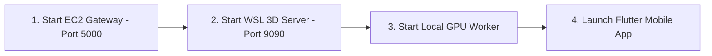

# 📘 Cattle Weight Monitoring & 3D Body Condition Platform — Comprehensive Corporate & Research User Manual

> **Objective**: To provide a complete, step-by-step guide for installation, configuration, operation, troubleshooting, maintenance, and reproduction of the project so that any new user, research group, or engineering team can independently deploy, operate, and maintain the system without depending on the original developer.

---

## 📋 Table of Contents
1. [Project Overview & Problem Statement](#1-project-overview--problem-statement)
2. [Required Hardware & System Specifications](#2-required-hardware--system-specifications)
3. [Hardware & Network Setup](#3-hardware--network-setup)
4. [Software Installation & Environment Setup](#4-software-installation--environment-setup)
5. [System Operation & Step-by-Step Launch Guide](#5-system-operation--step-by-step-launch-guide)
6. [Mobile Application User Guide](#6-mobile-application-user-guide)
7. [System Architecture & Deep Learning Data Flow](#7-system-architecture--deep-learning-data-flow)
8. [Independent Reproduction & Deployment Procedure](#8-independent-reproduction--deployment-procedure)
9. [Troubleshooting Guide](#9-troubleshooting-guide)
10. [Maintenance, Backups & Logging](#10-maintenance-backups--logging)
11. [Version & Metadata Information](#11-version--metadata-information)

---

## 1. Project Overview & Problem Statement

### 1.1 Project Purpose
The **Cattle Weight Monitoring & 3D Body Condition Platform** is a non-contact livestock biometric monitoring system. It replaces physical livestock weighing scales with deep learning computer vision, veterinary anthropometric equations, and 3D generative neural reconstruction.

### 1.2 Problem Being Solved
- **Physical Scale Constraints**: Industrial weighing scales are expensive, stationary, difficult to transport to rural farms, and cause stress, injury, or shrinkage in cattle during handling.
- **Inaccurate Manual Tapes**: Standard tape estimation relies on rigid single-formula assumptions that fail across diverse Indian livestock breeds (such as Hallikar, Gir, Deoni, Ongole, and HF crossbreeds).
- **Body Condition Visual Assessment**: Farmers lack quantitative 3D tools to track muscle mass loss, pregnancy expansion, or illness-induced weight drops over time.

### 1.3 Key Features
- **Dual Weight Estimation Modes**:
  1. **Manual Mode**: Instant weight calculation using physical tape inputs (OBL, WH, HG, HL).
  2. **Image Mode**: Automated computer vision estimation using 4 multi-view cattle photos (Side Left, Side Right, Back, Front).
- **Decoupled Biometric Calibration**: Separates true physical veterinary dimensions from machine learning feature scalings.
- **Multi-Model Weight Engine**:
  - **Schaeffer Metric Model** for Calves ($\le 95\text{ cm } OBL$).
  - **Agarwal Formula** for Indian Draft Breeds (Hallikar, Deoni, Ongole).
  - **ExtraTrees Regressor** (17 Biometric Ratios) for Dairy Cattle (HF, Gir, Sahiwal, Jersey).
- **Automated 3D Reconstruction**: Generates interactive `.glb` 3D body condition meshes using **TRELLIS.2** + **BiRefNet** foreground background segmentation.
- **Herd Health Alerts**: Automatically monitors weight trends across consecutive readings to detect critical weight drops ($\ge 8\%$) or rapid gains ($\ge 10\%$).
- **Permanent Model Validation Benchmarks**: Embedded offline 3D validation cards comparing Tape vs AI predictions for benchmark cattle (*Seethamma HF* & *Ramana Hallikar*).
- **CSV History Export**: Exports complete herd logs to CSV for veterinary records.

---

## 2. Required Hardware & System Specifications

| Component | Minimum Specification | Recommended Specification | Purpose |
|---|---|---|---|
| **Mobile Client** | Android 8.0 (API 26), 3 GB RAM, Camera | Android 12+, 6 GB RAM, 1080p Camera | Runs Flutter client app (`cattle_weight_app`) |
| **Cloud Gateway Server** | AWS EC2 `t3.medium` (2 vCPU, 4 GB RAM) | AWS EC2 `t3.large` (2 vCPU, 8 GB RAM) | Hosts Flask REST API & SQLite DB |
| **GPU Inference Worker** | Windows 10/11, NVIDIA GPU (6 GB VRAM) | Windows 11, NVIDIA RTX 3060/4070 (12+ GB VRAM) | Keypoint detection & weight prediction |
| **3D Reconstruction Engine** | WSL2 Ubuntu 22.04 LTS, CUDA 12.1 | WSL2 Ubuntu 22.04 LTS, CUDA 12.1 + 12 GB VRAM | Runs TRELLIS.2 + BiRefNet 3D engine |
| **Cloud Storage** | AWS S3 Bucket (`kisanpro-cattle-weight-data`) | AWS S3 Bucket | Stores input photos and output `.glb` 3D meshes |
| **Connectivity** | 4G LTE / Wi-Fi | High-speed Broadband | Communication between Mobile App and AWS EC2 |

---

## 3. Hardware & Network Setup

### 3.1 Mobile Device Setup
1. Enable **Developer Options** on the Android device (*Settings -> About Phone -> Tap Build Number 7 times*).
2. Enable **USB Debugging** (*Settings -> System -> Developer Options -> USB Debugging*).
3. Connect the phone to the local Windows PC via a high-speed USB-C data cable.

### 3.2 AWS EC2 Security Group Configuration
Ensure the AWS EC2 Instance Security Group allows the following inbound ports:
- **Port 22 (SSH)**: Allowed from developer IP address.
- **Port 5000 (HTTP/Gunicorn)**: Allowed from anywhere (`0.0.0.0/0`) to receive mobile API requests.

---

## 4. Software Installation & Environment Setup

### 4.1 Cloud Gateway Setup (AWS EC2)
```bash
# SSH into EC2 Instance
ssh -i /path/to/cattle-gateway-key.pem ec2-user@35.153.224.84

# Clone repository and enter folder
cd /home/ec2-user/cloud_gateway

# Initialize Python virtual environment
python3 -m venv venv
source venv/bin/activate

# Install required dependencies
pip install -r requirements_cloud.txt
```

*Requirements file (`requirements_cloud.txt`)*:
```text
Flask==3.0.3
Flask-SQLAlchemy==3.1.1
Flask-JWT-Extended==4.6.0
boto3==1.34.131
gunicorn==21.2.0
werkzeug==3.0.3
```

---

### 4.2 3D Reconstruction Server Setup (WSL2 Linux)
```bash
# Launch WSL2 Linux terminal
wsl

# Navigate to 3D server folder
cd /mnt/e/Weight_monitoring_production_code_without_AWS/wsl_3d_server

# Activate trellis2 conda environment
conda activate trellis2

# Verify PyTorch CUDA availability
python3 -c "import torch; print('CUDA Available:', torch.cuda.is_available())"
```

---

### 4.3 GPU Inference Worker Setup (Windows PC)
```powershell
# Open Windows PowerShell as Administrator
E:
cd E:\Weight_monitoring_production_code_without_AWS

# Install worker dependencies
pip install -r local_pc_worker/requirements_worker.txt
```

*Worker dependencies (`requirements_worker.txt`)*:
```text
torch>=2.0.0
torchvision>=0.15.0
opencv-python>=4.8.0
scikit-learn>=1.4.0
requests>=2.31.0
pillow>=10.0.0
numpy>=1.24.0
```

---

### 4.4 Mobile Application Setup (Flutter Android)
1. Install Flutter SDK (`v3.22.x`) on Windows (`C:\flutter\bin`).
2. Verify installation:
   ```powershell
   flutter doctor
   ```
3. Fetch app pubspec dependencies:
   ```powershell
   cd E:\Weight_monitoring_production_code_without_AWS\cattle_weight_app
   flutter pub get
   ```

---

## 5. System Operation & Step-by-Step Launch Guide

To run the complete system, execute the following 4 services in order:



### Service 1: Cloud Gateway Server (AWS EC2)
```bash
ssh -i /path/to/cattle-gateway-key.pem ec2-user@35.153.224.84
cd /home/ec2-user/cloud_gateway
source venv/bin/activate
gunicorn -D -w 4 -b 0.0.0.0:5000 app_cloud:app
```

### Service 2: 3D Reconstruction Engine (WSL2 Linux)
```powershell
wsl
cd /mnt/e/Weight_monitoring_production_code_without_AWS/wsl_3d_server
bash run_forever.sh
```

### Service 3: GPU Inference Worker (Windows PowerShell)
```powershell
E:
cd E:\Weight_monitoring_production_code_without_AWS
python local_pc_worker/gpu_worker.py
```

### Service 4: Deploy & Install Mobile Client (Android USB)
```powershell
E:
cd E:\Weight_monitoring_production_code_without_AWS\cattle_weight_app
flutter run -d TOOJ6HXOW4NBKVS8 --release
```

---

## 6. Mobile Application User Guide

### 6.1 Authentication Screen
1. Open the app on your mobile device.
2. Enter your **Farm Username** and **Password**.
3. Tap **Login** (or **Register** if creating a new farm account).

### 6.2 Manual Measurement Entry Mode
1. On the Home Dashboard, select **Tape Measurement Mode**.
2. Input cattle metadata: **Cattle ID**, **Name**, **Breed**, and **Category**.
3. Input physical measurements:
   - **One-Side Body Length ($OBL$)** in cm.
   - **Withers Height ($WH$)** in cm.
   - **Heart Girth ($HG$)** in cm.
   - **Hip Length ($HL$)** in cm.
4. Tap **Calculate Weight**. The app immediately computes the weight and displays results.

### 6.3 Automated Image Detection Mode
1. Select **Image Upload Mode**.
2. Input **Cattle ID**, **Name**, and **Breed**.
3. Capture or upload 4 required photos:
   - 📸 **Side Left View**: Full side profile showing shoulder and pin bone.
   - 📸 **Side Right View**: Opposite side profile.
   - 📸 **Back View**: Rear view showing hips and rear posture.
   - 📸 **Front View**: Direct frontal view.
4. Tap **Submit for AI Processing**.
5. The task enters the cloud queue. Once processing finishes, the app navigates to the Result Screen.

### 6.4 Viewing Results & Interactive 3D Model
- **Estimated Weight**: Displays AI predicted weight in kg with $\pm 5\%$ confidence range.
- **Biometric Breakdown**: Displays estimated $OBL, WH, HG, HL$ in cm.
- **3D Canvas**: Interactive WebGL `<model-viewer>` container allows 360-degree rotation, zooming, and pan inspection of the cattle's 3D body condition.

### 6.5 Herd Health Alerts & History
- **Alerts Screen**: Accessible via the bell icon on the top right. Displays critical warnings if a cow drops $\ge 8\%$ of its weight over 3 consecutive readings.
- **History Screen**: Displays all past estimations. Tap **Export to CSV** to launch native share options (Email, WhatsApp, Drive).
- **Model Validation Dashboard**: Displays permanent benchmark comparisons for *Seethamma (HF)* and *Ramana (Hallikar)*.

---

## 7. System Architecture & Deep Learning Data Flow

### 7.1 Keypoint Detection & Ramanujan Girth Formula
1. `MobilePoseNetV3` detects 7 side keypoints ($P_1 \dots P_7$) and 2 back keypoints.
2. Heart Girth ($HG$) is calculated by modeling the chest cross-section as an ellipse with semi-axes $a = \frac{\text{Depth}}{2}$ and $b = \frac{\text{Width}}{2}$.
3. **Ramanujan's First Ellipse Perimeter Approximation**:
   $$h = \frac{(a - b)^2}{(a + b)^2}$$
   $$HG \approx \pi (a + b) \left( 1 + \frac{3h}{10 + \sqrt{4 - 3h}} \right)$$

### 7.2 Multi-Model Weight Engine Matrix
| Category / Breed | Model Applied | Equation / Logic |
|---|---|---|
| **Calves ($\le 95\text{ cm } OBL$)** | Schaeffer Metric Model | $\text{Weight (kg)} = \frac{OBL \times HG^2}{10815}$ |
| **Draft Breeds** (Hallikar, Deoni, Ongole) | Agarwal Formula | $\text{Weight (lbs)} = \frac{Girth \times Length}{Y} \quad (Y \in \{8.0, 8.5, 9.0\})$ |
| **Dairy Cattle** (HF, Gir, Sahiwal, Jersey) | ExtraTrees Regressor | ML Ensemble Regressor trained on 17 biometric ratios |

---

## 8. Independent Reproduction & Deployment Procedure

To reproduce the complete system from scratch on a new machine/server:

1. **Setup AWS EC2**: Provision an EC2 instance, copy `cloud_gateway/` files, install Python requirements, and launch Gunicorn.
2. **Setup AWS S3**: Create S3 bucket `kisanpro-cattle-weight-data`. **Do NOT configure any 2-day expiration lifecycle rules**.
3. **Configure Local GPU Worker**: Copy `local_pc_worker/` and `models/keypoint_model/` to the Windows GPU workstation. Ensure PyTorch CUDA is functioning.
4. **Configure WSL2 3D Server**: Install conda environment `trellis2`, copy `wsl_3d_server/` and `trellis2/` code, and run `bash run_forever.sh`.
5. **Build Mobile APK**: Open `cattle_weight_app/`, run `flutter build apk --release`, and deploy to target Android devices via `adb install -r`.

---

## 9. Troubleshooting Guide

| Issue / Symptom | Root Cause | Solution |
|---|---|---|
| **App error: `Connection Refused` or `Timeout`** | EC2 Port 5000 blocked or Gunicorn crashed | Ensure AWS Security Group allows Port 5000. Restart Gunicorn: `gunicorn -D -w 4 -b 0.0.0.0:5000 app_cloud:app` |
| **No estimation history displayed ("History Empty")** | User ID mismatch or unsynced tasks | Execute history sync script on EC2: `python sync_history_records.py` |
| **3D Model canvas blank / beige** | Network blocked or remote S3 URL expired | App uses bundled local assets (`assets/models/seethamma_model.glb`). Ensure APK is built with updated `pubspec.yaml` |
| **3D Server crashes with VRAM Out of Memory** | TRELLIS.2 memory accumulation | Handled automatically by `run_forever.sh` daemon loop. If manual, run `bash run_forever.sh` |
| **ADB device not detected (`adb devices` empty)** | USB debugging disabled or cable disconnected | Re-plug USB cable, accept "Allow USB Debugging" on phone screen, run `adb kill-server; adb devices` |

---

## 10. Maintenance, Backups & Logging

### 10.1 Database Backup (SQLite)
To back up the SQLite database on AWS EC2:
```bash
cp /home/ec2-user/cloud_gateway/data/cattle_app.db /home/ec2-user/cloud_gateway/data/cattle_app_backup_$(date +%Y%m%d).db
```

### 10.2 Inspecting Log Files
- **AWS EC2 Gateway Logs**: `cat /home/ec2-user/cloud_gateway/gunicorn.log`
- **GPU Worker Logs**: Inspect PowerShell terminal window output.
- **WSL 3D Server Logs**: Inspect WSL terminal output or `wsl_3d_server/server.log`.

---

## 11. Version & Metadata Information

- **Project Title**: Cattle Weight Monitoring & 3D Body Condition Platform
- **Project Version**: `v1.0.0`
- **Release Date**: August 2026
- **Software Stack**:
  - Flutter Client: `v3.22.x` / Dart `v3.4.x`
  - Cloud Backend: Python `v3.10` / Flask `v3.0.3` / Gunicorn `v21.2.0`
  - GPU Inference: PyTorch `v2.x (CUDA 12)` / Scikit-Learn `v1.4.x`
  - 3D Engine: TRELLIS.2 / BiRefNet / WSL2 Ubuntu 22.04 LTS
- **AWS Infrastructure**: EC2 Instance (`35.153.224.84`), S3 Bucket (`kisanpro-cattle-weight-data`).
