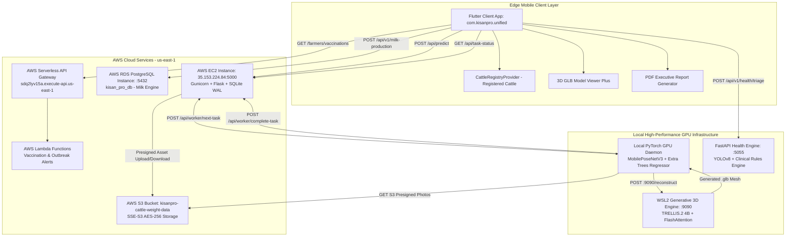
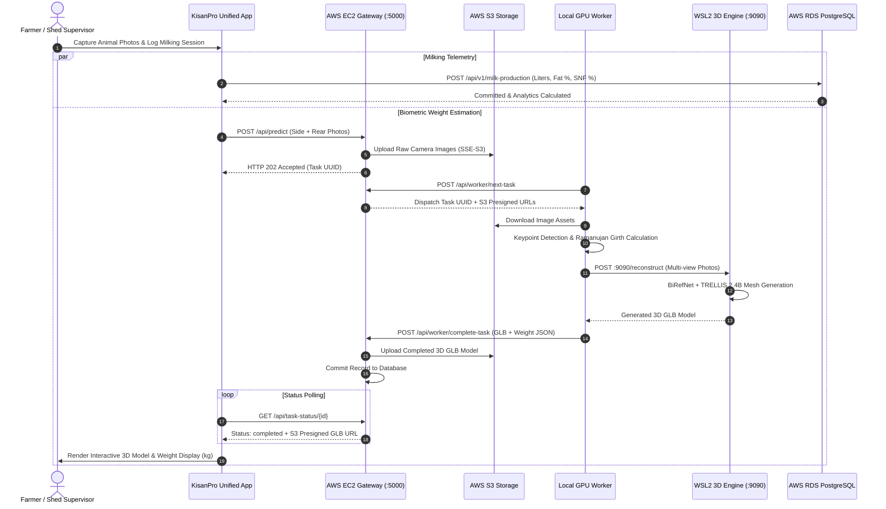

# KisanPro — Integrated Cattle Health Monitoring System

This directory contains the unified codebase, AI/ML inference pipelines, cloud microservices, Flutter multi-platform client applications, documentation manuals, and architectural specifications for the KisanPro Integrated Cattle Health Monitoring platform.

---

## System Overview

The **KisanPro Integrated Cattle Health Monitoring System** is an enterprise-grade precision dairy and livestock intelligence platform. It consolidates four core operational pillars into a unified ecosystem:

1. **3D Biometric Weight Estimation**: Non-invasive body weight calculation using dual-camera multi-view photography (side and rear views), Ramanujan perimeter girth estimation, and generative 3D mesh reconstruction via TRELLIS.2 4B.
2. **Precision Dairy & Milk Telemetry**: Recording of morning and evening milking sessions per animal, automated quality-based pricing using Fat % and SNF %, farm profit modeling, and cloud persistence on AWS RDS PostgreSQL.
3. **Preventative Vaccination & Outbreak Management**: Geo-targeted vaccination tracking, booster schedule monitoring, and automated regional outbreak alerting via AWS Serverless API Gateway and Lambda functions.
4. **Unified Mobile App Experience (`kisanpro_unified_app`)**: Cross-platform Flutter mobile client integrating all health, weight, milk, and vaccination metrics into an executive dashboard.

---

## System Architecture

The following diagram details the multi-tier interaction between edge devices, local GPU workers, cloud microservices, and databases:



---

## End-to-End Processing Workflow



---

## Directory Structure

```text
Integrated cattle Health Monitoring/
├── .gitignore
├── README.md                                  # Unified master documentation
├── requirements.txt                           # Master Python dependency specification
├── COMMANDS_RUN_GUIDE.docx                    # Operational commands guide
├── apk/                                       # Primary mobile app binaries
├── Literature review/                         # Comprehensive academic literature review
├── Output/
│   ├── Consolidated Document/                 # Technical manuals and completion reports
│   └── Testing and Results/                   # Verification logs and demo video links
├── reverse-engineering/                       # Full architectural and dependency audits
├── User Manual/                               # End-user operational manual
└── Integrated Cattle Health Monitoring Codes/
    ├── kisanpro_unified_app/                  # Master Flutter multi-platform mobile application
    ├── Combined_Weight_Monitoring/            # 3D weight estimation pipelines
    │   ├── cloud_gateway/                     # AWS EC2 Flask orchestrator
    │   ├── local_pc_worker/                   # Local PyTorch GPU keypoint & regression daemon
    │   ├── wsl_3d_server/                     # WSL2 TRELLIS.2 4B generative 3D server
    │   ├── cattle_weight_app/                 # Dedicated weight estimation mobile client
    │   └── trellis2/                          # 3D generation neural architectures
    ├── Combined_Milk_Monitoring/              # Precision dairy and milk production engine
    │   ├── backend/                           # FastAPI REST server & SQLAlchemy RDS schemas
    │   └── integrated_feature_module/         # Modular milk telemetry Flutter packages
    ├── Combined_Vaccination_Monitoring/       # Vaccination schedule and outbreak alert system
    └── Integrated_Cattle_Health_Monitoring_System/ # FastAPI clinical triage and health rules engine
```

---

## Setup & Deployment Guide

### 1. Python Environment Installation
Install core dependencies for the backend and compute nodes:
```bash
pip install -r requirements.txt
```

### 2. Cloud Gateway Service (AWS EC2)
Launch the asynchronous compute gateway:
```bash
cd "Integrated Cattle Health Monitoring Codes/Combined_Weight_Monitoring/cloud_gateway"
gunicorn -w 4 -b 0.0.0.0:5000 app:app
```

### 3. Generative 3D Mesh Reconstruction Server (WSL2 Linux)
Start the TRELLIS.2 3D reconstruction engine:
```bash
conda activate trellis2
cd "Integrated Cattle Health Monitoring Codes/Combined_Weight_Monitoring/wsl_3d_server"
python server_3d.py --port 9090
```

### 4. Local GPU Worker Daemon (Windows CUDA)
Run the biometric keypoint detector and regression worker:
```bash
cd "Integrated Cattle Health Monitoring Codes/Combined_Weight_Monitoring/local_pc_worker"
python worker.py
```

### 5. Milk Telemetry & Health API Server
Start the FastAPI microservices:
```bash
cd "Integrated Cattle Health Monitoring Codes/Combined_Milk_Monitoring/cattle_milk_monitoring code/backend"
python -m uvicorn main:app --host 0.0.0.0 --port 8082
```

### 6. Unified Mobile Application
Run or build the unified mobile app:
```bash
cd "Integrated Cattle Health Monitoring Codes/kisanpro_unified_app"
flutter pub get
flutter run --release
```

---

## Repository Exclusions Notice

To ensure smooth version control and comply with GitHub's 100 MB file limit, the following assets are excluded from direct version control:
* **Debug APK Packages (>100MB)**: `KisanPro Unified.apk` (180 MB), `vaccination_monitoring.apk` (454 MB), `app-debug.apk` (168 MB). *(Note: Production release APKs under 50 MB, such as `KisanPro_Unified_Production_v1.0.apk` [28 MB], are committed).*
* **Demonstration Videos (>100MB)**: `Cattle Health Monitoring video.mp4` (297 MB).
* **Build Artifacts**: All Flutter `build/`, `.dart_tool/`, and Android `.gradle/` cache folders.

These large files can be retrieved from your authorized company Google Drive storage or local server backups.
