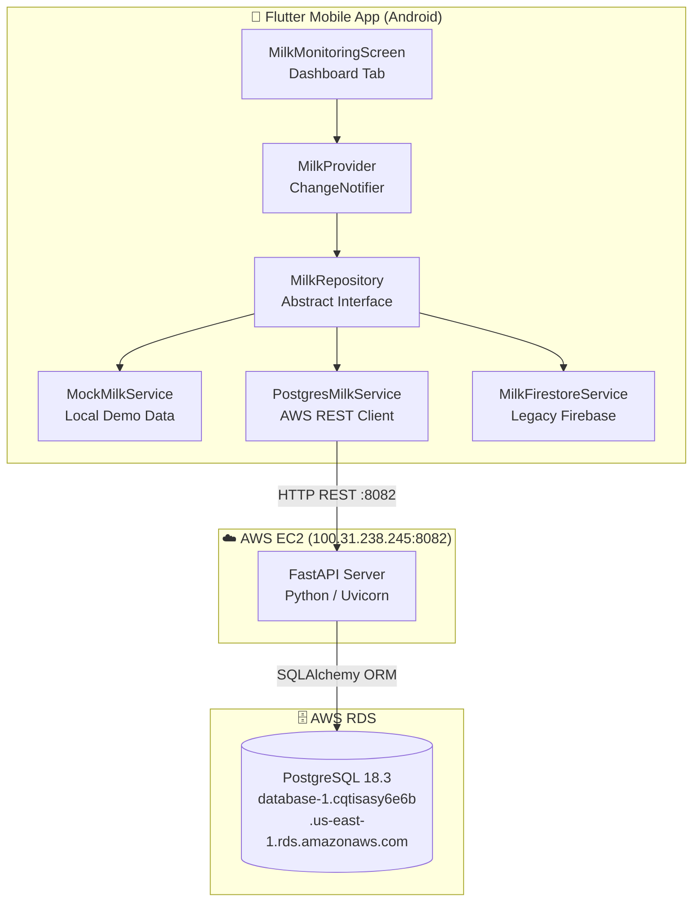
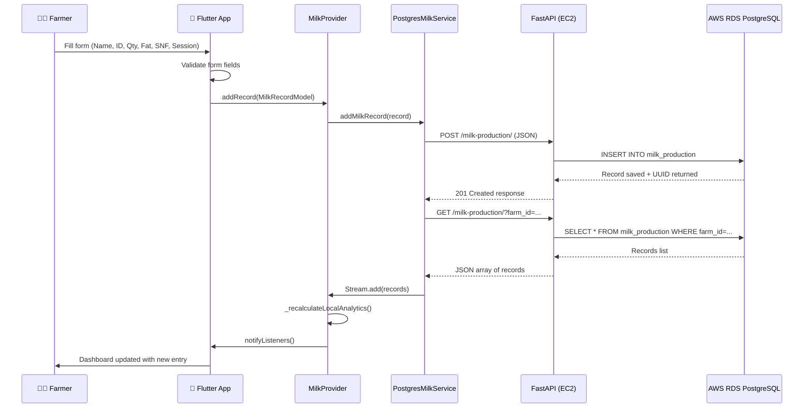
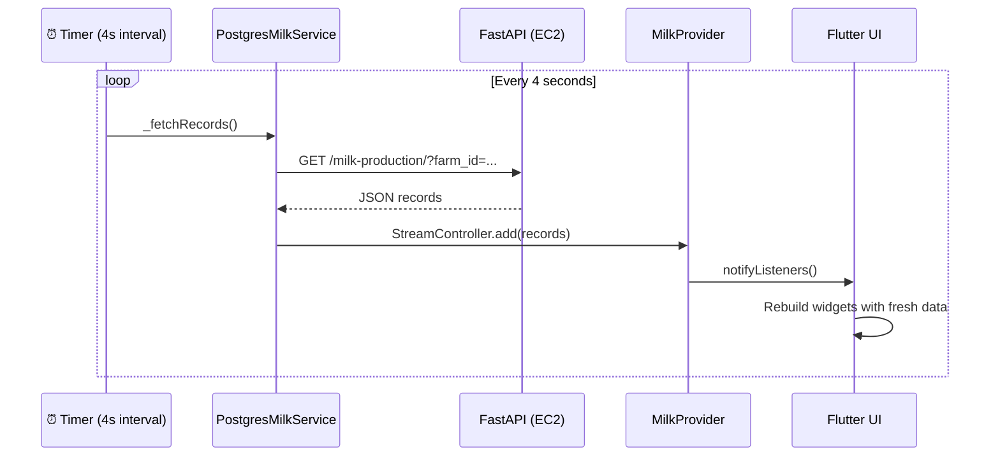

# System Architecture

**Project**: KisanPro — Cattle Milk Monitoring  
**Version**: 1.0 (AWS PostgreSQL Edition)

---

## System Overview

KisanPro Cattle Milk Monitoring is a three-tier mobile-first system:
- **Tier 1 (Presentation)**: Flutter mobile app (Android APK) providing the farmer-facing UI
- **Tier 2 (Application)**: FastAPI Python server running on AWS EC2 providing a REST API
- **Tier 3 (Data)**: AWS RDS PostgreSQL database storing all persistent milk production records

The system supports two operating modes: **Simulation Mode** (offline, local demo data) and **Cloud Sync Mode** (live AWS backend).

---

## Architecture Diagram

---

## Component Descriptions

### MilkMonitoringScreen (Flutter)
- **Purpose**: Main entry screen — hosts tab navigation (Dashboard, Analytics, Logbook, PDF Reports)
- **Responsibilities**: Tab routing, AppBar with mode toggle button, responsive layout
- **Dependencies**: MilkProvider (via Provider package), all 4 tab screen widgets
- **Type**: Application — Presentation Layer

### MilkProvider (Flutter State Management)
- **Purpose**: Central business logic and state management layer
- **Responsibilities**: Repository switching (mock/live), stream subscription, analytics recalculation, BMC dispatch, quality pricing
- **Dependencies**: MilkRepository (interface), MilkRecordModel, MilkAnalyticsModel
- **Type**: Application — Business Logic Layer

### MilkRepository (Abstract Interface)
- **Purpose**: Repository pattern contract defining all data operations
- **Responsibilities**: Declares addMilkRecord, getMilkRecords (Stream), getMilkAnalytics, updateMilkAnalytics
- **Type**: Domain — Repository Interface

### PostgresMilkService (AWS REST Client)
- **Purpose**: Live cloud data service — connects to AWS EC2 FastAPI backend
- **Responsibilities**: Auto-polling every 4 seconds, HTTP GET/POST to REST API, JSON deserialization
- **Dependencies**: dart:io HttpClient, AWS EC2 endpoint
- **Type**: Data — Cloud Service Implementation

### MockMilkService (Local Demo)
- **Purpose**: Offline simulation service — generates realistic 10-day historical data
- **Responsibilities**: Pre-populate 4 cattle x 2 sessions x 10 days = 80 records at startup
- **Type**: Data — Mock Service Implementation

### FastAPI Server (EC2 Backend)
- **Purpose**: REST API backend connecting the Flutter app to PostgreSQL
- **Responsibilities**: Receive milk records, validate with Pydantic, persist via SQLAlchemy ORM
- **Dependencies**: SQLAlchemy, psycopg2-binary, Pydantic, Uvicorn
- **Type**: Application — API Server

### AWS RDS PostgreSQL
- **Purpose**: Persistent cloud database for all production data
- **Responsibilities**: Store milk_production records, support farm/cattle/analytics queries
- **Type**: Infrastructure — Database

---

## Data Flow

### Flow 1: Add New Milk Entry (Cloud Sync Mode)

### Flow 2: Auto-Polling (Background Sync)

---

## Integration Points

### External APIs
| API | URL | Purpose |
|:----|:----|:--------|
| Milk Records GET | `GET http://100.31.238.245:8082/milk-production/` | Fetch all milk records for a farm |
| Milk Records POST | `POST http://100.31.238.245:8082/milk-production/` | Insert a new daily milk entry |
| Analytics GET | `GET http://100.31.238.245:8082/milk-production/analytics/` | Fetch aggregated farm analytics |
| API Health | `GET http://100.31.238.245:8082/` | Server status check |

### Databases
| Database | Host | Purpose |
|:---------|:-----|:--------|
| AWS RDS PostgreSQL 18.3 | `database-1.cqtisasy6e6b.us-east-1.rds.amazonaws.com:5432` | Primary persistent data store |

### Third-Party Services
| Service | Purpose | Status |
|:--------|:--------|:-------|
| Google Fonts | Typography (Outfit font family) | Active |
| Firebase / Cloud Firestore | Legacy data backend | Deprecated — replaced by PostgreSQL |
| Provider (Flutter) | State management | Active |
| intl (Flutter) | Date/number formatting | Active |

---

## Infrastructure Components

| Component | Detail | Purpose |
|:----------|:-------|:--------|
| **AWS EC2** | kisan-milk-server — t3.micro, us-east-1a, IP: 100.31.238.245 | Hosts FastAPI backend on port 8082 |
| **AWS RDS** | PostgreSQL 18.3, db.t3.micro, us-east-1 | Persistent database (kisan_pro_db) |
| **Security Group** | Port 22 (SSH), Port 8082 (Custom TCP, 0.0.0.0/0) | EC2 firewall rules |
| **Security Group** | Port 5432 (PostgreSQL, 0.0.0.0/0) | RDS firewall rules |
| **Uvicorn** | ASGI server, host 0.0.0.0, port 8082 | Runs FastAPI as background daemon via nohup |
| **Deployment** | Manual SCP + SSH | Backend deployed via scp main.py ubuntu@ec2 + nohup uvicorn |
