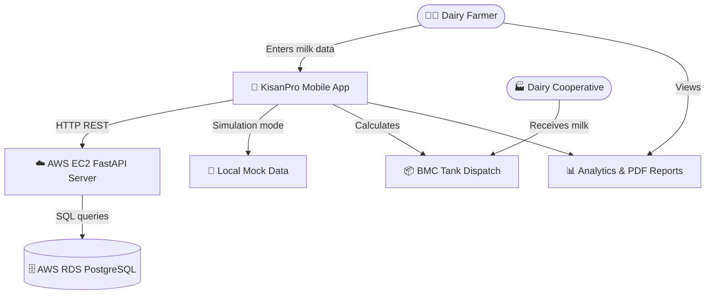

# Business Overview

**Project**: KisanPro — Cattle Milk Monitoring System  
**Analysis Date**: 2026-08-26  
**Version**: 1.0 (Brownfield — Reverse Engineered)

---

## Business Context Diagram

---

## Business Description

**Business Description**: KisanPro is a digital cattle farm management platform designed for Indian dairy farmers. The core module — Cattle Milk Monitoring — enables farmers to digitally record, track, and analyze daily milk production from individual cattle. The system computes quality-based pricing (using Fat % and SNF % parameters per Indian dairy cooperative standards), generates farm economics insights, and synchronizes all data to a live cloud backend (AWS RDS PostgreSQL) for persistence, analytics, and reporting.

**Business Transactions**:

| Transaction | Description |
|:------------|:------------|
| Record Morning Milk | Farmer enters quantity (liters), Fat %, SNF % for the morning milking session per cattle |
| Record Evening Milk | Farmer enters quantity (liters), Fat %, SNF % for the evening milking session per cattle |
| Calculate Milk Rate | System computes per-liter rate using quality-based formula: `Rate = BasePrice × ((Fat×0.6/4.0) + (SNF×0.4/8.5))` |
| View Daily Summary | Dashboard shows today's total milk, morning/evening split, gross revenue, feed cost, and net profit |
| View Farm Analytics | Charts showing daily/weekly/monthly production trends, best-performing day, average yield |
| Browse Milking Logbook | Historical records filterable by date range, cattle name, cattle ID |
| Generate PDF Report | Per-cattle or per-farm PDF report with production and financial summary |
| Dispatch BMC Tank | Records the dispatch of accumulated milk to dairy cooperative; logs dispatch details |
| Cloud Sync | Synchronizes all local data additions to AWS RDS PostgreSQL in real-time |
| Toggle Simulation Mode | Switch between local demo data (offline) and live AWS cloud data |

**Business Dictionary**:

| Term | Meaning |
|:-----|:--------|
| **BMC** | Bulk Milk Cooler — a large refrigerated tank at the farm used to collect, cool, and store milk before dispatch to dairy coop |
| **Fat %** | Percentage of fat content in milk; higher fat = higher milk grade and price per liter |
| **SNF %** | Solids-Not-Fat percentage — includes proteins, lactose, minerals; standard Indian pricing metric |
| **Grade A Milk** | Highest quality milk classification — Fat ≥ 4.0%, SNF ≥ 8.5% |
| **Milking Session** | Either Morning (typically 6:00–7:00 AM) or Evening (typically 6:00–7:00 PM) |
| **Dairy Coop** | Dairy Cooperative — the bulk milk purchaser that collects and processes milk from farmers |
| **KP-XXX** | Kisan Pro cattle tag format (e.g., KP-201, KP-202) used to uniquely identify each cattle |
| **Quality Pricing** | Pricing model where rate per liter varies based on Fat % and SNF % |
| **Mock Mode** | Offline simulation mode with pre-loaded realistic demo data for testing without network |
| **Cloud Sync** | Live mode connecting to AWS EC2 + AWS RDS PostgreSQL for real data persistence |

---

## Component Level Business Descriptions

### 1. Flutter Mobile Application
- **Purpose**: Primary user interface for dairy farmers to record milk entries, view analytics, and generate reports
- **Responsibilities**: Data entry forms, dashboard visualization, PDF report generation, cloud/local mode toggling

### 2. FastAPI Backend (AWS EC2)
- **Purpose**: RESTful API server that receives milk data from the mobile app and persists it to the database
- **Responsibilities**: Validate and store milk records, compute farm-level analytics, serve data to the app

### 3. AWS RDS PostgreSQL Database
- **Purpose**: Persistent cloud database storing all farm, cattle, and milk production records
- **Responsibilities**: Data durability, concurrent multi-device access, historical data retention

### 4. Mock Milk Service
- **Purpose**: Provides realistic demonstration data without requiring network connectivity
- **Responsibilities**: Generate 10-days of historical records for 4 sample cattle at app startup

### 5. Analytics Engine (MilkProvider)
- **Purpose**: Business logic layer computing all farm economic metrics from raw milk records
- **Responsibilities**: Daily/weekly/monthly totals, quality pricing calculations, BMC dispatch tracking
