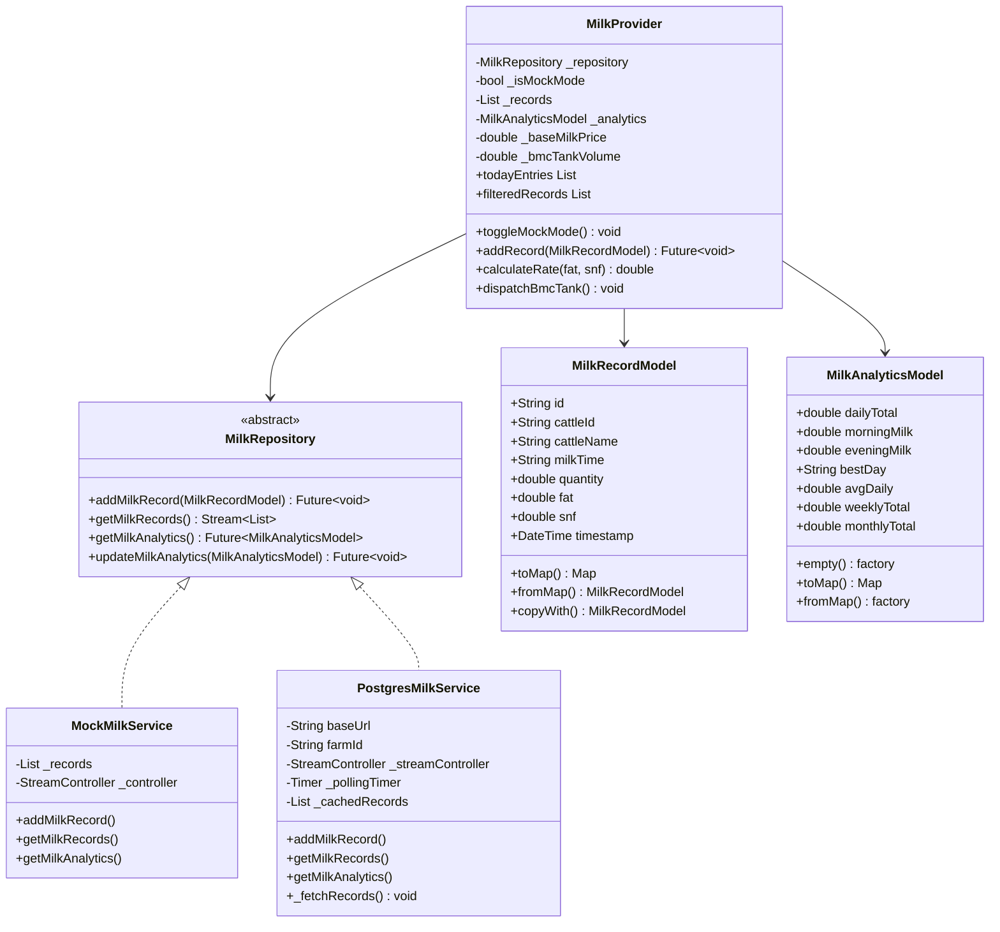

# Code Structure

**Project**: KisanPro — Cattle Milk Monitoring  
**Version**: 1.0

---

## Build System

### Flutter App
- **Type**: Gradle (Android) + Dart pub
- **Min SDK**: Android 5.0+ (API 21)
- **Flutter**: 3.x stable channel
- **Build Command**: `gradlew assembleRelease --offline`
- **Output**: `build/app/outputs/flutter-apk/app-release.apk`

### Python Backend
- **Type**: pip / Python 3.14
- **Run Command**: `nohup python3 -m uvicorn main:app --host 0.0.0.0 --port 8082`
- **Key Packages**: fastapi, uvicorn, sqlalchemy, psycopg2-binary, pydantic

---

## Key Classes/Modules

---

## Existing Files Inventory

### Backend (F:\JRF\cattle_milk_monitoring\backend\)

| File | Purpose |
|:-----|:--------|
| `main.py` | FastAPI application: ORM models, Pydantic schemas, REST endpoints, DB session management |
| `schema.sql` | Raw SQL DDL: farms, cattle, milk_production, milk_analytics tables with indexes |
| `init_db.py` | Script to initialize/create all database tables on a fresh PostgreSQL instance |
| `seed_cloud_data.py` | Seeds 240 realistic records (10 days x 4 cattle x 2 sessions x 3 farm_ids) into AWS RDS |
| `test_connection.py` | Tests TCP/SQLAlchemy connectivity to AWS RDS |

### Flutter — Integrated Module (F:\JRF\cattle_milk_monitoring\integrated_feature_module\)

| File | Purpose |
|:-----|:--------|
| `domain/repositories/milk_repository.dart` | Abstract interface defining the data contract (Repository Pattern) |
| `data/models/milk_record_model.dart` | Core data model for a single milking event; supports Firebase Timestamp + ISO String parsing |
| `data/models/milk_analytics_model.dart` | Aggregated analytics model (daily/weekly/monthly totals, best day, avg) |
| `data/services/mock_milk_service.dart` | Offline simulation service — generates 80 pre-loaded records for 4 cattle over 10 days |
| `data/services/postgres_milk_service.dart` | Live AWS service — HTTP polling every 4s, broadcast stream, GET/POST via dart:io HttpClient |
| `data/services/milk_firestore_service.dart` | Legacy Firebase Firestore service (deprecated, kept for reference) |
| `presentation/providers/milk_provider.dart` | ChangeNotifier state manager — orchestrates mode switching, analytics, BMC dispatch |
| `presentation/screens/milk_monitoring_screen.dart` | Root screen — hosts AppBar with mode toggle + BottomNavigationBar for 4 tabs |
| `presentation/screens/milk_analytics_screen.dart` | Charts and analytics: production trends, quality metrics, weekly/monthly views |
| `presentation/screens/milk_history_screen.dart` | Milking logbook — date-filtered, searchable history of all records |
| `presentation/screens/milk_report_screen.dart` | PDF report generator screen — generates printable cattle/farm production reports |
| `presentation/widgets/milk_entry_card.dart` | Form widget for entering new milk record (cattle name, ID, session, qty, fat, snf) |
| `presentation/widgets/milk_summary_card.dart` | Dashboard card showing morning/evening/daily total production |
| `presentation/widgets/recent_entry_tile.dart` | List tile for grouped recent entries (per cattle per day) with tap-to-report |
| `presentation/widgets/analytics_card.dart` | Single metric analytics card (used in analytics screen) |
| `presentation/widgets/milk_chart_widget.dart` | Line/bar chart visualization of production trends |
| `presentation/widgets/cattle_report_modal.dart` | Bottom modal showing per-cattle detailed report |

### Flutter — Standalone Source (F:\JRF\cattle_milk_monitoring\standalone_source_lib\)

| File | Purpose |
|:-----|:--------|
| `main.dart` | App entry point with Firebase initialization (legacy — still imports firebase_core) |
| `core/theme/app_theme.dart` | App-wide Material3 theme definitions (light/dark), custom color palette, text styles |
| `features/...` | Mirror of integrated_feature_module — complete standalone app source |

---

## Design Patterns

### Repository Pattern
- **Location**: `domain/repositories/milk_repository.dart`, all service implementations
- **Purpose**: Decouple the business logic (MilkProvider) from data source details
- **Implementation**: Abstract class `MilkRepository` implemented by `MockMilkService`, `PostgresMilkService`, `MilkFirestoreService`

### Provider / ChangeNotifier Pattern
- **Location**: `presentation/providers/milk_provider.dart`
- **Purpose**: Flutter state management — single source of truth for all milk data
- **Implementation**: `MilkProvider extends ChangeNotifier`, consumed by all widgets via `Consumer<MilkProvider>`

### Observer / Stream Pattern
- **Location**: `postgres_milk_service.dart` -> `StreamController.broadcast()` -> `MilkProvider._streamSubscription`
- **Purpose**: Real-time reactive data flow from backend polling to UI
- **Implementation**: `PostgresMilkService` emits on `_streamController`, `MilkProvider` subscribes with `listen()`

### Polling Pattern
- **Location**: `postgres_milk_service.dart` -> `Timer.periodic(Duration(seconds: 4))`
- **Purpose**: Simulate near-real-time sync without WebSocket complexity
- **Implementation**: Background timer fires every 4 seconds calling `_fetchRecords()`

### Factory Pattern
- **Location**: `MilkRecordModel.fromMap()`, `MilkAnalyticsModel.fromMap()`, `MilkAnalyticsModel.empty()`
- **Purpose**: Controlled object instantiation from JSON/Map data

---

## Critical Dependencies

### Flutter / Dart
| Dependency | Usage | Purpose |
|:-----------|:------|:--------|
| `provider` | `Consumer<MilkProvider>` in all screens | State management |
| `intl` | `DateFormat('yyyy-MM-dd')` | Date formatting |
| `google_fonts` | `GoogleFonts.outfit(...)` | Typography |
| `dart:io HttpClient` | `PostgresMilkService` | Native HTTP without 3rd party package |
| `dart:convert` | `jsonDecode / jsonEncode` | JSON serialization |

### Python Backend
| Dependency | Version | Purpose |
|:-----------|:--------|:--------|
| `fastapi` | 0.141.1 | REST API framework |
| `uvicorn` | 0.52.4 | ASGI server |
| `sqlalchemy` | 2.0.52 | ORM for PostgreSQL queries |
| `psycopg2-binary` | 2.9.12 | PostgreSQL driver |
| `pydantic` | 2.13.4 | Request/response validation schemas |
