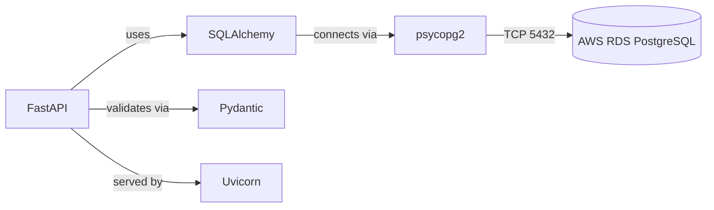

# Dependencies

**Project**: KisanPro — Cattle Milk Monitoring  
**Version**: 1.0

---

## Internal Dependencies

```mermaid
graph TD
    UI[Screens + Widgets]
    Provider[MilkProvider]
    Repo[MilkRepository Interface]
    Mock[MockMilkService]
    PgSvc[PostgresMilkService]
    FireSvc[MilkFirestoreService]
    RecordModel[MilkRecordModel]
    AnalyticsModel[MilkAnalyticsModel]
    Theme[AppTheme]

    UI -->|reads/writes| Provider
    Provider -->|delegates to| Repo
    Repo <|.. Mock
    Repo <|.. PgSvc
    Repo <|.. FireSvc
    Provider --> RecordModel
    Provider --> AnalyticsModel
    Mock --> RecordModel
    Mock --> AnalyticsModel
    PgSvc --> RecordModel
    PgSvc --> AnalyticsModel
    FireSvc --> RecordModel
    FireSvc --> AnalyticsModel
    UI --> Theme
```

### Key Internal Dependency Relationships

#### MilkProvider depends on MilkRepository
- **Type**: Runtime
- **Reason**: MilkProvider delegates all data operations to the repository. At runtime, it is injected with either MockMilkService or PostgresMilkService depending on the current mode.

#### PostgresMilkService depends on MilkRecordModel
- **Type**: Compile
- **Reason**: Deserializes JSON from AWS REST API into MilkRecordModel instances

#### MockMilkService depends on MilkRecordModel
- **Type**: Compile
- **Reason**: Creates pre-populated MilkRecordModel instances for simulation data

#### Screens depend on MilkProvider
- **Type**: Runtime
- **Reason**: All screens consume MilkProvider via `Consumer<MilkProvider>` or `context.watch<MilkProvider>()` for reactive state updates

---

## External Dependencies

### Flutter / Dart

| Dependency | Version | Purpose | License |
|:-----------|:--------|:--------|:--------|
| `flutter` | 3.x stable | UI framework | BSD-3-Clause |
| `provider` | ^6.x | State management (ChangeNotifier) | MIT |
| `google_fonts` | ^6.x | Outfit font family | Apache 2.0 |
| `intl` | ^0.19.x | Date/number formatting, locale | BSD-3-Clause |
| `firebase_core` | ^3.x | Firebase SDK (legacy, still in standalone) | BSD-3-Clause |
| `cloud_firestore` | ^5.x | Firebase Firestore client (legacy, in MilkRecordModel) | BSD-3-Clause |

### Python Backend

| Dependency | Version | Purpose | License |
|:-----------|:--------|:--------|:--------|
| `fastapi` | 0.141.1 | REST API framework | MIT |
| `uvicorn` | 0.52.4 | ASGI server for FastAPI | BSD-3-Clause |
| `sqlalchemy` | 2.0.52 | ORM — model definitions, query builder | MIT |
| `psycopg2-binary` | 2.9.12 | PostgreSQL adapter for Python | LGPL |
| `pydantic` | 2.13.4 | Data validation and serialization | MIT |
| `python-multipart` | — | Multipart form data (FastAPI dependency) | Apache 2.0 |

### AWS Services (Operational Dependencies)

| Service | Dependency Type | Purpose |
|:--------|:----------------|:--------|
| AWS EC2 (t3.micro) | Runtime Infrastructure | Hosts FastAPI server |
| AWS RDS PostgreSQL 18.3 | Runtime Data | Persistent database |
| AWS Security Groups | Runtime Network | Firewall rules for port access |

---

## Dependency Graph — Backend



---

## Legacy / Deprecated Dependencies

| Dependency | Status | Reason | Replacement |
|:-----------|:-------|:-------|:------------|
| `firebase_core` | Deprecated — still in code | Firebase was original backend | AWS RDS PostgreSQL via FastAPI |
| `cloud_firestore` | Deprecated — still in MilkRecordModel | Firebase Firestore was data store | PostgresMilkService + HTTP REST |
| `MilkFirestoreService` | Deprecated — kept for reference | Replaced by PostgresMilkService | PostgresMilkService |

> Note: The `integrated_feature_module/data/models/milk_record_model.dart` still imports `package:cloud_firestore/cloud_firestore.dart` for Timestamp handling. This should be removed and replaced with ISO string parsing in a future cleanup.

---

## Dependency Risks

| Risk | Severity | Details |
|:-----|:---------|:--------|
| Hard-coded EC2 IP | Medium | `PostgresMilkService.baseUrl = 'http://100.31.238.245:8082'` — if EC2 is stopped/replaced, the APK stops working |
| Hard-coded farm_id | Medium | `farmId = 'a1b2c3d4-e5f6-7a8b-9c0d-1e2f3a4b5c6d'` — all records tied to single farm |
| No Elastic IP on EC2 | High | EC2 public IP changes on restart — APK becomes broken |
| Firebase legacy imports | Low | App won't crash (safeguarded try/catch) but unnecessary dependency weight |
| No HTTPS | High | HTTP endpoint exposed — data in transit is unencrypted |
