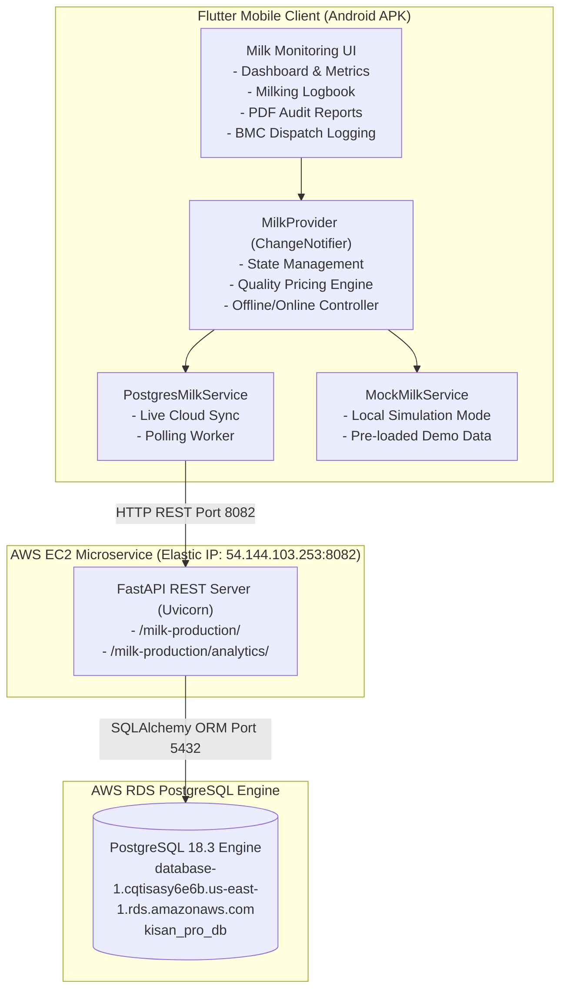

# KisanPro Cattle Milk Monitoring & Precision Dairy System: Version 3

This repository contains the complete source code, FastAPI REST microservices, SQLAlchemy ORM models, Flutter mobile client providers, documentation reports, and user manuals for the Version 3 implementation of the KisanPro Cattle Milk Monitoring and Precision Dairy platform.

---

## System Overview

KisanPro Cattle Milk Monitoring is an IoT-enabled precision dairy farm management system engineered for dairy farmers and herd administrators. It enables digital recording of morning and evening milking sessions per cattle, computes automated quality pricing based on Fat % and Solid-Not-Fat (SNF) %, tracks farm economics (gross revenue, cattle feed costs, net profit), and synchronizes data with an AWS RDS PostgreSQL cloud database via FastAPI REST endpoints.

---

## System Architecture



---

## Key Features

1. **Dual-Mode Data Synchronisation**:
   * **Cloud Sync Mode**: Direct bidirectional synchronization with AWS EC2 FastAPI REST server and AWS RDS PostgreSQL database.
   * **Simulation Mode**: Offline operation with realistic mock records and pre-loaded cattle data.
   * **Cross-Sync Mirroring**: Records entered in Cloud Sync mode automatically mirror to the local simulation store to prevent data loss when toggling modes.

2. **Quality-Based Pricing Calculation**:
   * Computes real-time pricing per liter using the standardized cooperative dairy formula:
     $$\text{Rate} = \text{Base Price} \times \left( \frac{\text{Fat} \times 0.6}{4.0} + \frac{\text{SNF} \times 0.4}{8.5} \right)$$

3. **Farm Economics & Analytics**:
   * Daily gross revenue, feed cost modeling, and net farm profit tracking.
   * Weekly and monthly milk production trends and yield comparisons.
   * Bulk Milk Cooler (BMC) tank level monitoring and dispatch logs.

4. **Milking Logbook & PDF Audits**:
   * Searchable, date-filtered historical milking logs per animal tag and session.
   * Printable PDF audit report generation and export.

---

## Directory Structure

```text
Milk Monitoring version3/
├── .gitignore
├── README.md                           # Version 3 master technical documentation
├── requirements.txt                    # Centralized Python backend dependencies
├── apk/
│   └── Milk_Monitoring_AWS_PostgreSQL_v1.0.apk  # Pre-compiled Android release binary
├── cattle_milk_monitoring code/
│   ├── README.md                       # Backend and module guide
│   ├── requirements.txt                # Python dependencies
│   ├── apks/                           # Compiled binaries
│   ├── backend/                        # FastAPI REST app, SQLAlchemy models, seeders
│   ├── integrated_feature_module/      # Modular Flutter feature components
│   └── standalone_source_lib/          # Standalone Flutter source code
├── Documents/                          # Technical architectures and system audits
├── Output/
│   ├── Consolidation Document/         # Project completion and technical manuals
│   └── Testing and Results/            # Verification logs and APK video walkthroughs
└── user_manual/                        # Operational user manual
```

---

## Backend Deployment & Configuration

### AWS Infrastructure Details
* **EC2 Server**: `kisan-milk-server` (t3.micro, Ubuntu 24.04 LTS)
* **Elastic IP**: `54.144.103.253` (Port 8082)
* **RDS Engine**: PostgreSQL 18.3 (`kisan_pro_db`)
* **RDS Endpoint**: `database-1.cqtisasy6e6b.us-east-1.rds.amazonaws.com:5432`

### Setup and Launch Instructions

1. **Install Dependencies**:
   ```bash
   pip install -r requirements.txt
   ```

2. **Database Initialization & Data Seeding**:
   ```bash
   cd "cattle_milk_monitoring code/backend"
   python init_db.py
   python seed_cloud_data.py
   ```

3. **Run FastAPI Server**:
   ```bash
   cd "cattle_milk_monitoring code/backend"
   python -m uvicorn main:app --host 0.0.0.0 --port 8082
   ```

---

## Mobile Application Installation

Install the release APK directly via ADB:
```bash
adb install -r apk/Milk_Monitoring_AWS_PostgreSQL_v1.0.apk
```
