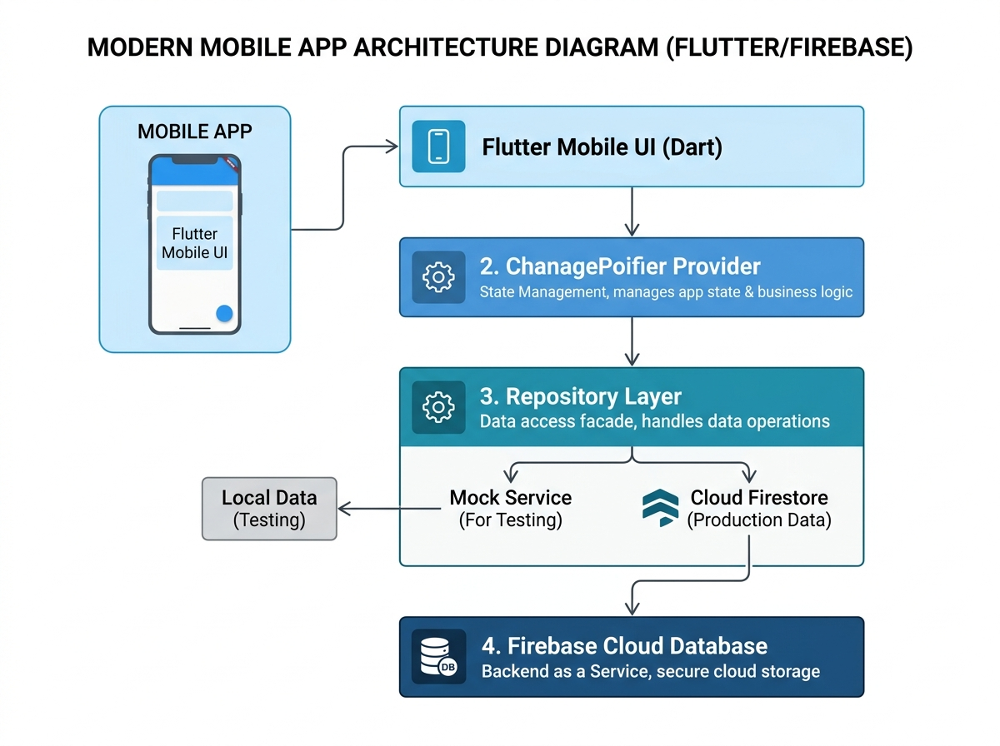
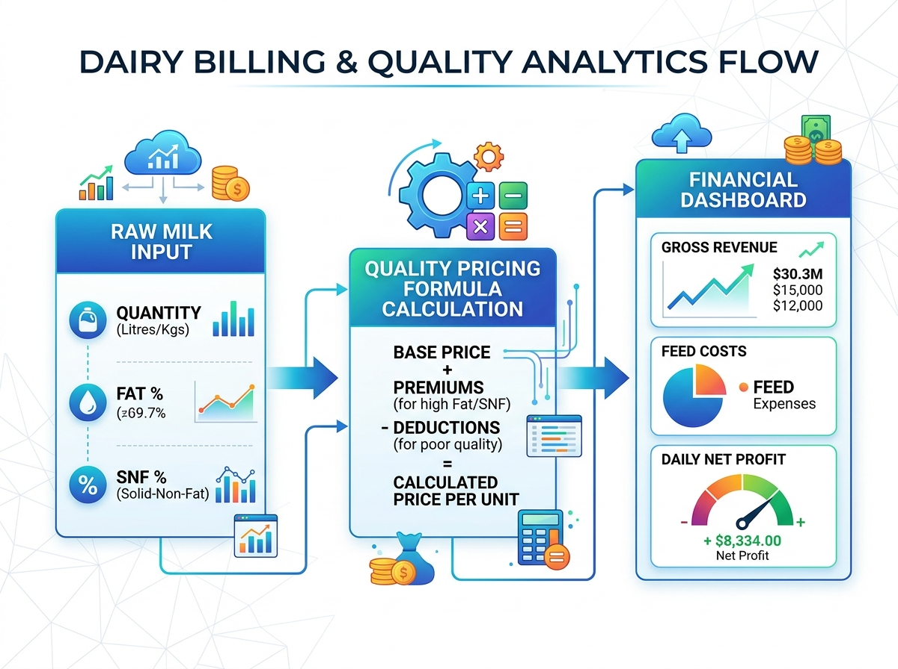

# KisanPro Milk Monitoring: Technical Objectives & Architecture Guide

This document provides detailed documentation for the six core objectives of the KisanPro Milk Monitoring application. It details the implementation parameters, technological frameworks, data flows, and architectural blueprints for each module.

---

## Technical Architecture Overview

The application is built on a clean architectural design to decouple state management, business logic, data models, and local/cloud storage adapters.



### Core Technologies
* **Framework**: Flutter (Dart)
* **State Management**: ChangeNotifier & MultiProvider
* **Cloud Database**: Cloud Firestore (`cloud_firestore`)
* **Local Simulation**: In-memory repository with static sample logs
* **Charts**: FL Chart (`fl_chart`)
* **Reports**: Programmatic PDF compilation (`pdf`, `printing`)

---

## Objective 1: Milking Session Logging & Session-wise Telemetry

### Implementation
Records session-wise milking yields for individual cattle. Each record logs the physical quantity, quality indicators (Fat & SNF percentages), and session details.
* **Component**: `MilkEntryCard` (UI form) and `MilkRecordModel` (Data model)
* **Milking Sessions**: Classified into **Morning** and **Evening** sessions.
* **Biometric Parameters**:
  * `quantity` (Liters)
  * `fat` (Fat percentage)
  * `snf` (Solids-Not-Fat percentage)

### Data Flow
1. **User Input**: The user enters the Cattle ID, name, quantity, fat, and SNF, selecting the milking session on the dashboard.
2. **Model Instantiation**: The inputs are validated and compiled into a `MilkRecordModel` object.
3. **Provider Dispatch**: The UI triggers `MilkProvider.addRecord(MilkRecordModel)`, which notifies observers and queues the entry for database sync.

---

## Objective 2: Farm Economics & Quality-Based Billing

### Implementation
Establishes a real-time economics engine that computes gross revenue, estimated feed cost overheads, and net profits. It includes a dynamic slider to adjust base pricing and a toggle to switch between flat pricing and quality-based pricing (FAT & SNF formula).
* **Component**: `_buildEconomicsTracker` (Dashboard widget) and `MilkProvider.calculateRate`



### Formula & Logic
* **Flat Rate Pricing**: Earns a flat amount equal to `baseMilkPrice` (e.g., ₹52.0 per liter).
* **Quality-Based Billing (FAT & SNF)**: Evaluates quality parameter ratios against default baselines (4.0% for Fat, 8.5% for SNF):
  $$\text{Rate (₹/L)} = \text{baseMilkPrice} \times \left( \frac{\text{fat} \times 0.6}{4.0} + \frac{\text{snf} \times 0.4}{8.5} \right)$$
* **Overhead Estimation**: Automatically computes feed cost overheads based on an average factor of ₹18.5 per liter:
  $$\text{Feed Cost} = \text{Yield} \times 18.5$$
  $$\text{Net Profit} = \text{Gross Revenue} - \text{Feed Cost}$$

---

## Objective 3: Bulk Milk Cooler (BMC) Storage & Dispatch Tracking

### Implementation
Maintains telemetry data for the farm's local Bulk Milk Cooler (BMC) tank. It simulates refrigeration temperature tracking and tracks total stored milk capacity, allowing the farmer to log dispatches to dairy cooperatives.
* **Component**: `MilkProvider` (BMC storage variables and `dispatchBmcTank()` function)

### Operational State
* **Capacity Limit**: 500.0 Liters.
* **Refrigeration Temperature**: Tracks temperature dynamically (simulating cooling between 3.5°C to 4.2°C).
* **Dispatch Logs**: Logs the exact volume dispatched, date/time, and weighted averages of Fat and SNF of the batch.
* **State Reset**: Clears the current tank volume back to 0.0 Liters upon dispatch.

---

## Objective 4: Automated Health & Yield Alerts

### Implementation
Evaluates historical entries to detect anomalies and flag health alerts.
* **Component**: `_buildAIInsightsBar` and `_calculateCattleAlerts` in `milk_monitoring_screen.dart`

### Alert Rules Matrix
1. **Yield Drop (20%+)**: Flags if the latest milk quantity is $\ge 20\%$ lower than the cow's historical average.
2. **Continuous Yield Loss**: Triggered when a cow shows decreasing yields over 3 consecutive milking sessions.
3. **Quality Alert**: Triggered if Fat level drops below 3.5% or SNF level drops below 8.0%, suggesting nutritional imbalance.
4. **Milking Missed**: Alerts if no milk entry has been logged for a registered cow in the last 24 hours.
5. **Peak Yield Milestones**: Celebrates when a cow achieves a new historical high yield.

---

## Objective 5: Dynamic PDF Report Generation & Native Printing

### Implementation
Allows compilation of custom PDF reports directly on mobile devices. Supports filtering by date ranges and specific cattle.
* **Component**: `MilkReportScreen` (PDF compiler) using `pdf` and `printing` packages.

### Report Outputs
* **Summary Tiles**: Programmatically renders Total Yield (L), Total Revenue (INR), Weighted Fat (%), and Weighted SNF (%) for the selected scope.
* **Detailed Logs Table**: Iterates over matching records, displaying timestamps, session type, yield, quality percentages, computed rate per liter, and total earnings.
* **Print / Share Engine**: Integrates natively with the operating system's share sheets and print pools.

---

## Objective 6: Fail-Safe Hybrid Cloud Firestore Synchronization

### Implementation
Ensures offline and local sandbox reliability through a hybrid data sync architecture.
* **Component**: `MilkRepository`, `MilkFirestoreService` and `MockMilkService`.

### Architecture Flow
```text
                       [ MilkProvider ]
                              |
              +---------------+---------------+
              |                               |
        (Cloud Sync)                     (Simulation)
              |                               |
    [ MilkFirestoreService ]            [ MockMilkService ]
              |                               |
     (Cloud Firestore)               (In-Memory Store)
```
* **Simulation Mode**: Uses `MockMilkService` to populate fake data for testing without internet access or Firebase accounts.
* **Cloud Sync Mode**: Uses `MilkFirestoreService` to establish a stream subscription directly to Cloud Firestore. Changes are synced instantly with server-side timestamps.
* **Hot Toggle**: Dynamic database backend swapping at runtime. Swapping immediately cancels old subscriptions, flushes temporary lists, and initializes the new data provider.
