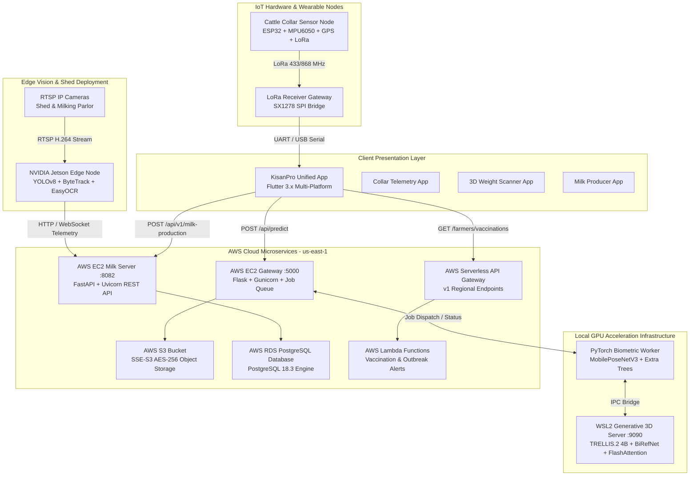
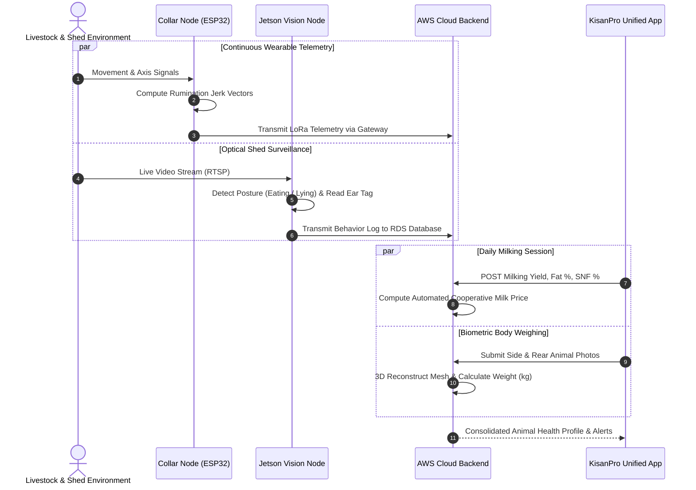

# KisanPro Cattle Monitoring & Livestock Intelligence Ecosystem

An enterprise-grade, distributed multi-tier precision agriculture platform designed for real-time automated livestock biometric tracking, behavior analytics, milk telemetry, non-invasive weight estimation, farm perimeter security, and IoT sensor telemetry.

---

## Executive System Overview

The KisanPro Cattle Monitoring Ecosystem is an end-to-end multi-module engineering platform deployed across edge computing nodes, local GPU acceleration clusters, cloud microservices, and mobile client applications. The system integrates edge computer vision, IoT telemetry, relational cloud databases, generative 3D mesh modeling, and serverless architectures to provide continuous intelligence for dairy farms and livestock operations.

---

## Master Architecture Diagram



---

## Repository Directory Structure

```text
Cattle-Monitoring/
├── Integrated cattle Health Monitoring/                 # Unified umbrella system
│   ├── Integrated Cattle Health Monitoring Codes/
│   │   ├── kisanpro_unified_app/                       # Master Flutter client app
│   │   ├── Combined_Weight_Monitoring/                 # Integrated 3D weight estimation
│   │   ├── Combined_Milk_Monitoring/                   # Integrated precision dairy engine
│   │   ├── Combined_Vaccination_Monitoring/            # Integrated immunization system
│   │   └── Integrated_Cattle_Health_Monitoring_System/ # FastAPI clinical triage engine
│   ├── Output/                                         # Technical manuals and video links
│   ├── Literature review/                              # Consolidated academic bibliography
│   ├── reverse-engineering/                            # Full system audit specifications
│   ├── User Manual/                                    # End-user operational manuals
│   ├── requirements.txt                                # Unified Python backend dependencies
│   └── README.md                                       # Integrated system documentation
│
├── Cattle behaviour Analysis Module/                   # Computer vision behavior & tag tracking
│   ├── Cattle behaviour Analysis version1/             # Production edge pipeline & models
│   │   ├── Cattle Behaviour Monitoring/                # Jetson edge AI, YOLOv8, and OCR
│   │   ├── 3D Casing/                                  # CAD STL/3MF casing models
│   │   ├── Output/                                     # Multi-level evaluation results
│   │   ├── Documents/                                  # Reverse-engineering documentation
│   │   ├── User Manual/                                # Operational deployment guide
│   │   └── requirements.txt                            # Edge dependencies
│   └── Cattle behaviour Analysis version2/             # Version 2 development roadmap
│
├── cattle-weight-monitoring-3d/                        # 3D reconstruction & mass estimation
│   ├── cattle-weight-monitoring-3d version 1/          # Stereo vision & depth mesh pipelines
│   └── cattle-weight-monitoring-3d version 2/          # Dual-view Ramanujan & TRELLIS.2 engine
│
├── Milk Monitoring/                                    # Precision dairy, yield, & pricing
│   ├── Milk monitoring version1/                       # Baseline milking logbook
│   ├── Milk Monitoring version2/                       # FastAPI + AWS RDS PostgreSQL migration
│   └── Milk Monitoring version3/                       # Production release with cooperative pricing
│
├── Farm security management by reidentifying the person/# Personnel recognition & perimeter safety
│   ├── Farm security management version1/              # Baseline facial matching
│   └── Farm security management version2/              # FaceNet + Jetson edge consensus voting
│
├── cattle-collar-sensor-module/                        # IoT wearable collar & firmware
│   ├── cattle-collar-sensor-module version1/           # ESP32, LoRaWAN, MPU6050 firmware
│   └── cattle-collar-sensor-module version2/           # Power-optimized BLE & geofencing
│
├── Vaccination Monitoring/                             # Disease tracking & immunization alerts
│   ├── Vaccination Monitoring version1/                # Local vaccination schedule logs
│   └── Vaccination Monitoring version2/                # AWS Serverless Lambda & regional alerts
│
└── README.md                                           # Master repository documentation
```

---

## Core Operational Modules

### 1. [Integrated Cattle Health Monitoring](./Integrated%20cattle%20Health%20Monitoring/)
* **Mission**: Unify weight estimation, milk monitoring, vaccination management, and automated health triage into an executive mobile interface.
* **Architecture**: Multi-tier architecture coupling AWS EC2 (`35.153.224.84:5000`), AWS RDS PostgreSQL (`database-1.cqtisasy6e6b.us-east-1.rds.amazonaws.com`), AWS S3, and local CUDA inference workers.
* **Core Components**:
  * `kisanpro_unified_app`: Multi-platform Flutter client with embedded 3D GLB model viewer, dynamic milking logbook, and PDF executive report generation.
  * `Integrated_Cattle_Health_Monitoring_System`: FastAPI rule-based clinical diagnostic engine.
  * `Combined_Weight_Monitoring`: Asynchronous job queue bridge linking cloud endpoints to local GPU workers.

### 2. [Cattle Behaviour Analysis Module](./Cattle%20behaviour%20Analysis%20Module/Cattle%20behaviour%20Analysis%20version1/)
* **Mission**: Real-time multi-animal posture classification, ear tag optical character recognition, and abnormal behavior identification.
* **Architecture**: Edge-deployed on NVIDIA Jetson Orin Nano consuming multi-channel RTSP H.264 video streams.
* **Key Technologies**:
  * YOLOv8 / YOLOv11 for bounding-box animal detection and ear tag localization.
  * ByteTrack algorithm for multi-object tracking and cross-frame animal identity persistence.
  * EasyOCR with fuzzy matching against a master herd registry for tag verification.
  * EfficientNetV2-S / MobileNet classification heads for posture detection (standing, lying, eating, drinking, ruminating).
  * ChromaDB vector database for posture similarity scoring and historical profile queries.

### 3. [Cattle Weight Monitoring 3D](./cattle-weight-monitoring-3d/)
* **Mission**: Non-invasive, stress-free live body weight estimation from photographs without physical scale platforms.
* **Architecture**: Asynchronous compute pipeline combining biometric computer vision with generative 3D reconstruction.
* **Key Technologies**:
  * MobilePoseNetV3 for anatomical keypoint detection (wither, point of shoulder, pin bone, hook bone, heart girth).
  * Ramanujan elliptical girth approximation using orthogonal dual-camera inputs (side view and rear view).
  * Extra Trees Regressor and XGBoost estimators mapping biometric girth and body length to live body weight (kg).
  * TRELLIS.2 4B generative diffusion model in WSL2 Linux producing watertight 3D GLB meshes for interactive inspection.

### 4. [Milk Monitoring](./Milk%20Monitoring/Milk%20Monitoring%20version3/)
* **Mission**: Digital milking logbooks, cooperative quality-based milk valuation, and herd yield analytics.
* **Architecture**: Three-tier architecture comprising a Flutter client, FastAPI REST gateway (`54.144.103.253:8082`), and AWS RDS PostgreSQL 18.3 engine.
* **Key Technologies**:
  * Indian cooperative quality pricing formula:
    $$\text{Rate} = \text{Base Price} \times \left( \frac{\text{Fat} \times 0.6}{4.0} + \frac{\text{SNF} \times 0.4}{8.5} \right)$$
  * Dual-mode synchronization supporting offline simulation mode and online cloud sync with automatic cross-mirroring.
  * Bulk Milk Cooler (BMC) storage tank volume tracking and dispatch auditing.

### 5. [Farm Security Management by Reidentifying the Person](./Farm%20security%20management%20by%20reidentifying%20the%20person/Farm%20security%20management%20version2/)
* **Mission**: Automated perimeter monitoring, personnel authentication, and unauthorized trespasser alerting in dairy yards.
* **Architecture**: Edge inference on NVIDIA Jetson nodes with FaceNet feature embeddings and consensus voting.
* **Key Technologies**:
  * MTCNN and YOLOv8-Face for real-time facial localization under variable lighting.
  * Inception-ResNet-V1 (FaceNet) extracting 512-dimensional Euclidean facial embeddings.
  * Temporal consensus voting (6-of-10 verified frames) preventing false-positive intruder alerts.
  * Instant Telegram Bot alerting with photographic intrusion capture for unauthorized personnel.

### 6. [Cattle Collar Sensor Module](./cattle-collar-sensor-module/cattle-collar-sensor-module%20version1/)
* **Mission**: Physical wearable IoT collars for continuous vital telemetry, rumination analysis, and geofencing.
* **Architecture**: Microcontroller firmware on ESP32 paired with sub-GHz LoRa transceiver and receiver gateway.
* **Key Technologies**:
  * MPU6050 6-axis IMU (accelerometer and gyroscope) for head movement and rumination jerk frequency analysis.
  * NEO-6M GPS receiver providing geofenced latitude/longitude perimeter tracking.
  * LoRaWAN (SX1278, 433/868 MHz) long-range telemetry transmission to base gateway nodes.
  * Optimized low-power sleep modes achieving extended battery runtimes on lithium-ion cells.

### 7. [Vaccination Monitoring](./Vaccination%20Monitoring/Vaccination%20Monitoring%20version2/)
* **Mission**: Digital health record management, booster schedules, and regional epidemic alerts.
* **Architecture**: Serverless AWS infrastructure using Amazon API Gateway and AWS Lambda microservices.
* **Key Technologies**:
  * Automated vaccination schedule generation based on animal breed, age, and pregnancy status.
  * Geospatial outbreak notifications for endemic diseases (Foot-and-Mouth Disease, Lumpy Skin Disease, Brucellosis).
  * Automated SMS/Push notifications dispatched to herd supervisors prior to booster deadlines.

---

## Technology Stack Matrix

| Layer | Technologies & Frameworks |
|:---|:---|
| **Edge Vision & AI Inference** | PyTorch, Ultralytics YOLOv8/YOLOv11, ByteTrack, EasyOCR, MobilePoseNetV3, FaceNet (Inception-ResNet-V1), ChromaDB, OpenCV |
| **Generative 3D Modeling** | TRELLIS.2 4B, BiRefNet, FlashAttention, PyTorch 3D, Trimesh, pygltflib |
| **Backend & Microservices** | Python 3.10+, FastAPI, Uvicorn, Flask, Gunicorn, Pydantic, SQLAlchemy ORM |
| **Cloud & Infrastructure** | AWS EC2 (Ubuntu LTS), AWS S3 (AES-256 SSE), AWS RDS PostgreSQL 18.3, AWS API Gateway, AWS Lambda |
| **IoT Hardware & Firmware** | ESP32, Arduino C/C++, FreeRTOS, MPU6050 IMU, NEO-6M GPS, LoRa SX1278 |
| **Mobile & Frontend** | Flutter 3.x, Dart, Provider state management, FL Chart, Model Viewer Plus (GLB/glTF), PDF Kit |

---

## Multi-Modal System Data Flow



---

## Deployment & Setup Guide

### 1. Global Python Environment Setup
```bash
# Clone the repository
git clone https://github.com/KisanPro/Cattle-Monitoring.git
cd Cattle-Monitoring

# Install backend dependencies
pip install -r "Integrated cattle Health Monitoring/requirements.txt"
```

### 2. Cloud Microservice Deployment (AWS EC2)
```bash
# Start Milk Monitoring REST Service
cd "Milk Monitoring/Milk Monitoring version3/cattle_milk_monitoring code/backend"
python -m uvicorn main:app --host 0.0.0.0 --port 8082

# Start 3D Weight Estimation Gateway
cd "Integrated cattle Health Monitoring/Integrated Cattle Health Monitoring Codes/Combined_Weight_Monitoring/cloud_gateway"
gunicorn -w 4 -b 0.0.0.0:5000 app:app
```

### 3. Local GPU Inference Worker Setup
```bash
# Launch Keypoint Detection Worker
cd "Integrated cattle Health Monitoring/Integrated Cattle Health Monitoring Codes/Combined_Weight_Monitoring/local_pc_worker"
python worker.py
```

### 4. Edge Vision Pipeline (NVIDIA Jetson)
```bash
# Launch Edge Cattle Behaviour and Tag Pipeline
cd "Cattle behaviour Analysis Module/Cattle behaviour Analysis version1/Cattle Behaviour Monitoring/Cattle Behaviour analysis Jetson version"
python jetson_pipeline.py
```

### 5. Unified Mobile Client Build
```bash
# Build release APK for Android
cd "Integrated cattle Health Monitoring/Integrated Cattle Health Monitoring Codes/kisanpro_unified_app"
flutter pub get
flutter build apk --release
```

---

## Data Governance & Repository Standards

To maintain high performance and avoid Git packfile bloat:
* **Pre-compiled Binaries (>100MB)**: Full-size debug APKs (`vaccination_monitoring.apk`, `KisanPro Unified.apk`, `app-debug.apk`) and heavy video recordings (`Cattle Health Monitoring video.mp4`) are hosted on Google Drive and linked in module READMEs.
* **Production Release APKs (<50MB)**: Production binaries (`KisanPro_Unified_Production_v1.0.apk`, `Milk_Monitoring_AWS_PostgreSQL_v1.0.apk`, `app-release.apk`) are tracked in Git.
* **Build Artifacts**: Flutter `build/`, `.dart_tool/`, and Android `.gradle/` folders are excluded across all sub-modules via `.gitignore`.

---

## Confidentiality & Proprietary Notice

This software, neural network architectures, firmware, and documentation are **strictly confidential and proprietary** to **KisanPro**. Unauthorized copying, distribution, reverse engineering, or commercial use without prior written consent from KisanPro is strictly prohibited.

Copyright (c) 2024-2026 KisanPro. All rights reserved.
