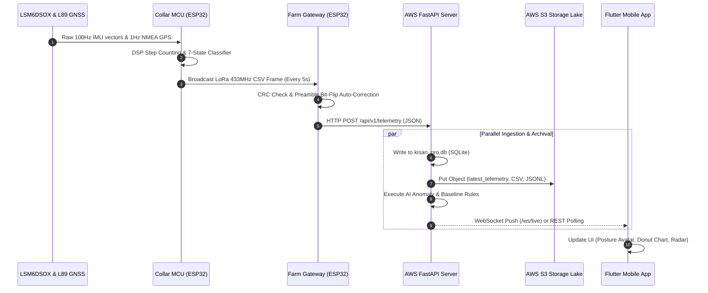
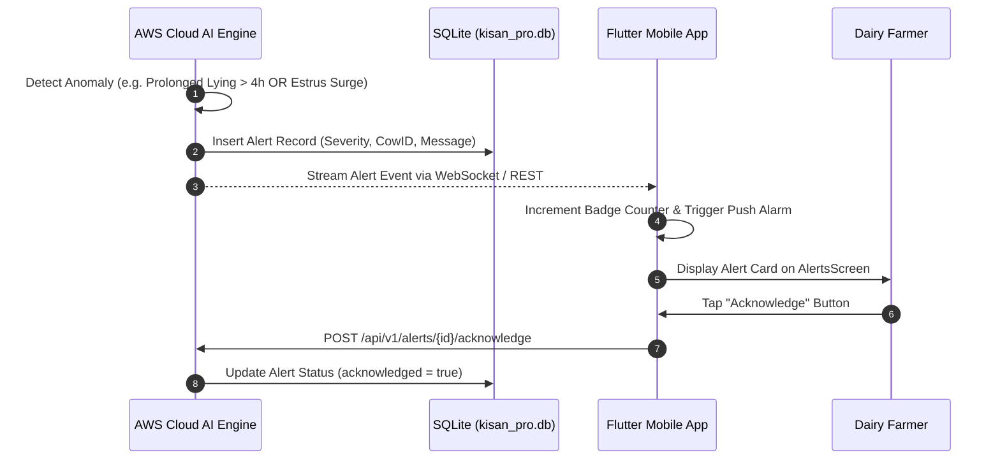

# 🏛️ System Architecture — Kisan Pro

## 1. System Overview

**Kisan Pro** implements a 5-tier, distributed IoT, Cloud, and Mobile architecture engineered for low-power edge telemetry, long-range wireless RF propagation, asynchronous cloud analytics, and native mobile decision support.

The system bridges physical collar-mounted hardware on free-ranging cattle to a local farm gateway over 433 MHz LoRa RF, which forwards JSON payloads over Wi-Fi to a high-performance AWS EC2 FastAPI server. The cloud backend executes continuous 21-day rolling baseline AI diagnostics, archives immutable ledgers into an AWS S3 data lake, and streams real-time telemetry to the Flutter mobile client.

---

## 2. Comprehensive System Architecture Diagram

```mermaid
flowchart TB
    subgraph TIER1["Tier 1: Edge Sensing Node (Cattle Collar)"]
        direction TB
        L89["🛰️ Quectel L89 Multi-GNSS<br/>(9600 Baud UART2: RXD2:16, TXD2:17)"]
        IMU["⚡ ST LSM6DSOX 6-DoF IMU<br/>(100 Hz I2C 0x6A: SDA:21, SCL:22)"]
        BATT["🔋 LiPo Battery ADC<br/>(GPIO 35: 12-Bit 2.0x Divider)"]
        MCU1["🧠 ESP32-WROOM-32 MCU<br/>(100Hz DSP & 7-State Classifier)"]
        SX_TX["📡 Semtech SX1278 LoRa TX<br/>(433 MHz, SF7, 125 kHz, SPI Bus)"]

        L89 -->|NMEA Sentences| MCU1
        IMU -->|Raw Accel & Gyro Vectors| MCU1
        BATT -->|Analog Voltage| MCU1
        MCU1 -->|Formatted CSV Packet| SX_TX
    end

    subgraph TIER2["Tier 2: Farm Edge Gateway Node (Stationary)"]
        direction TB
        SX_RX["📡 Semtech SX1278 LoRa RX<br/>(CRC Check & Packet Buffer)"]
        MCU2["🧠 ESP32 Gateway Forwarder<br/>(Bit-Flip Repair & JSON Serializer)"]
        WIFI["📶 2.4 GHz Wi-Fi Station<br/>(Non-Blocking Reconnect Watchdog)"]

        SX_RX -->|SPI Bus| MCU2
        MCU2 --> WIFI
    end

    subgraph TIER3["Tier 3: AWS EC2 Cloud Backend & AI Engine"]
        direction TB
        FASTAPI["⚡ FastAPI ASGI Application<br/>(Port 5000 / REST Endpoints)"]
        WS_GATEWAY["🔄 WebSocket Live Streamer<br/>(/ws/live Broadcast Hub)"]
        DB[("🗄️ SQLite Database<br/>(kisan_pro.db)")]
        ANOMALY["🧠 CattleAnalyticsEngine<br/>(21-Day Baseline & Anomaly Rules)"]

        WIFI -->|"HTTP POST /api/v1/telemetry"| FASTAPI
        FASTAPI --> DB
        FASTAPI --> ANOMALY
        FASTAPI --> WS_GATEWAY
        ANOMALY -->|"Generated Alarms"| DB
    end

    subgraph TIER4["Tier 4: AWS S3 Livestock Data Lake"]
        direction TB
        S3_LATEST["📄 latest_telemetry.json<br/>(Real-Time Atomic Snapshot)"]
        S3_CSV["📊 telemetry_YYYY-MM-DD.csv<br/>(Daily Tabular Partition)"]
        S3_JSONL["📜 cattle_whole_data.jsonl<br/>(Append-Only Historical Ledger)"]

        FASTAPI -->|"AWS IAM Boto3"| S3_LATEST
        FASTAPI -->|"AWS IAM Boto3"| S3_CSV
        FASTAPI -->|"AWS IAM Boto3"| S3_JSONL
    end

    subgraph TIER5["Tier 5: Flutter Mobile Application (Android)"]
        direction TB
        PROV["🔄 CattleProvider (State Hub)"]
        DASH["🐂 Posture & Behavioral Donut (DashboardScreen)"]
        RADAR["🛰️ GIS Pasture Radar & Navigation (RadarScreen)"]
        FERT["❤️ Heat Score & AI Countdown (FertilityScreen)"]
        ALERTS_UI["🚨 Push Alarms Feed (AlertsScreen)"]
        SETT["⚙️ Farm & Server Config (SettingsScreen)"]

        WS_GATEWAY -.->|"Sub-Second Stream"| PROV
        FASTAPI <-->|"REST API Sync (/api/v1/...)"| PROV
        PROV --> DASH
        PROV --> RADAR
        PROV --> FERT
        PROV --> ALERTS_UI
        PROV --> SETT
    end

    SX_TX ===|433 MHz LoRa RF (Every 5s)| SX_RX
```

---

## 3. Detailed Component Descriptions

### 3.1 `kisan_pro_sender` (Collar Edge Node)
- **Purpose**: Physical edge telemetry node mounted on the animal's neck collar.
- **Responsibilities**:
  - Sample ST LSM6DSOX 6-DoF IMU at 100 Hz (`104 Hz` data rate, $\pm 4g$ accel range, $\pm 500\text{ dps}$ gyro range).
  - Execute digital signal processing (DSP) dynamic step counting with moving baseline smoothing.
  - Classify 7 distinct postures (Standing `1`, Walking `2`, Super-Active `3`, Lying `4`, Fall `5`, Head Shake `6`, Grazing `7`).
  - Read non-blocking Quectel L89 GNSS via `HardwareSerial(2)` on pins 16 (RX) and 17 (TX).
  - Measure battery percentage ($3.3\text{V} - 4.2\text{V}$) via GPIO 35.
  - Broadcast CSV packet via LoRa SX1278 every 5000 ms.
- **Type**: Edge Embedded Firmware (C++ / Arduino / ESP32).

### 3.2 `kisan_pro_receiver` (Farm Gateway Node)
- **Purpose**: Stationary edge gateway bridging LoRa RF to Cloud Wi-Fi HTTP.
- **Responsibilities**:
  - Receive LoRa packets at 433 MHz with CRC validation and RSSI/SNR signal diagnostic logging.
  - Auto-correct RF bit-flips and corrupted preambles on cattle tags.
  - Serialize CSV tokens into standard JSON schemas.
  - Execute 4-tier HTTP POST failover (AWS EC2 primary + 3 local IP backup endpoints).
  - Non-blocking Wi-Fi station reconnection watchdog every 10 seconds.
- **Type**: Gateway Embedded Firmware (C++ / Arduino / ESP32).

### 3.3 `server` (AWS Cloud Server & AI Engine)
- **Purpose**: Cloud ingestion gateway, database manager, and machine learning anomaly engine.
- **Responsibilities**:
  - FastAPI endpoints for high-throughput async ingestion and querying.
  - WebSocket hub `/ws/live` broadcasting sub-second telemetry to mobile clients.
  - SQLite database management (`kisan_pro.db`) with tables: `telemetry`, `baseline`, `alerts`, `cows`, `geofence`.
  - Machine learning baseline calculation (21-day moving averages of daily steps, grazing hours, and headshakes).
  - Anomaly detection rules for Estrus Heat, Prolonged Lying, Geofence Breaches, Lethargy, and Head Shakes.
  - S3 cloud storage lake automated synchronization via Boto3.
- **Type**: Cloud Backend Application (Python 3.10+ / FastAPI / AsyncIO).

### 3.4 `mobile_app` (Flutter Mobile Application)
- **Purpose**: Native Android application for farmers and veterinarians.
- **Responsibilities**:
  - Provide an intuitive user experience across 5 navigation tabs.
  - `DashboardScreen`: Real-time posture badge, 2D avatar, battery level, step odometer, 24-hour behavioral Donut Chart with custom painters.
  - `RadarScreen`: Interactive GIS pasture radar with dynamic geofencing ($100\text{ m} - 10.0\text{ km}$) and Google Maps turn-by-turn navigation.
  - `FertilityScreen`: Estrus heat score index, 12-Hour AM-PM AI window countdown timer, and 21-day estrous cycle calendar.
  - `AlertsScreen`: Color-coded alert stream (`CRITICAL`, `WARNING`, `INFO`) with one-tap acknowledgment.
  - `SettingsScreen`: Farm metadata, cloud server URL configuration, and hardware pairing.
  - Dynamic 5-minute inactivity watchdog switching tags between `🟢 Live Collar` and `⚪ Offline (Standby)`.
- **Type**: Native Cross-Platform Mobile Client (Flutter 3.x / Dart 3.5).

---

## 4. Data Flow Workflows

### 4.1 Telemetry Acquisition & Ingestion Flow


### 4.2 Anomaly Alarm & Notification Workflow


---

## 5. Integration Points

| Integration Point | Protocol / Standard | Purpose | Endpoint / Payload |
| :--- | :--- | :--- | :--- |
| **Collar $\leftrightarrow$ Gateway** | LoRa RF (433 MHz, SF7, 125 kHz) | Long-range, low-power telemetry transmission | CSV Frame: `COW_ID,Lat,Lon,Speed,Alt,Satellites,BehaviorID,Battery,Steps` |
| **Gateway $\leftrightarrow$ Cloud** | HTTP/1.1 REST (JSON over Wi-Fi) | Telemetry ingestion to cloud | `POST /api/v1/telemetry` |
| **Cloud $\leftrightarrow$ Mobile App** | HTTP/1.1 REST & WebSockets | Telemetry polling, configuration, and real-time streaming | `/api/v1/cows`, `/api/v1/alerts`, `/api/v1/geofence`, `/ws/live` |
| **Cloud $\leftrightarrow$ AWS S3** | AWS SDK (Boto3 / HTTPS IAM) | Historical data lake archival | `s3://cattle-collar-sensor/farm_{phone}_{name}/{cow_id}/` |
| **Mobile App $\leftrightarrow$ Google Maps** | Android Intent / URL Scheme | Turn-by-turn navigation from farmer to cow | `google.navigation:q={lat},{lon}&mode=w` / `https://www.google.com/maps/dir/?api=1` |

---

## 6. Infrastructure Components

- **Edge Microcontrollers**: ESP32-WROOM-32 (Dual-core Tensilica Xtensa 32-bit LX6 @ 240 MHz).
- **RF Transceivers**: Semtech SX1278 (433 MHz ISM band, SPI interface).
- **Sensors**: STMicroelectronics LSM6DSOX (6-DoF I2C IMU), Quectel L89 (Multi-constellation GNSS UART).
- **Cloud Infrastructure**: AWS EC2 Linux Instance hosting FastAPI ASGI server on Elastic IP `15.206.32.94:5000`.
- **Database Engine**: Relational SQLite 3 (`kisan_pro.db`).
- **Cloud Storage**: AWS Simple Storage Service (S3) multi-part partitioned buckets.
- **Client Runtime**: Flutter 3.x SDK / Dart 3.5 VM running on Android API 21+.