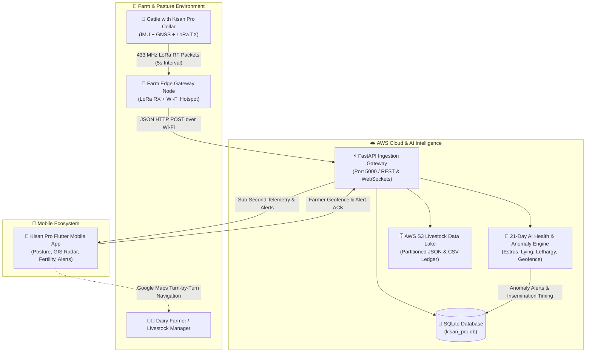

# 🌾 Business Overview — Kisan Pro

## 1. Business Context Diagram

---

## 2. Business Description

- **Business Description**:  
  **Kisan Pro** is an enterprise-grade precision livestock monitoring, smart collar telemetry, and AI veterinary intelligence platform. Designed specifically for cattle and dairy farming, the platform continuously acquires physical biomechanical kinematics (100 Hz 6-axis IMU) and geographic sub-meter GNSS positioning from collar devices mounted on cattle, transmitting metrics via ultra-low-power long-range LoRa RF (433 MHz) through a farm perimeter gateway to an AWS Cloud Analytics Engine and Flutter mobile interface.

- **Core Business Objectives**:
  1. **Automated Estrus (Heat) Detection & AM-PM AI Timing**: Maximize dairy conception rates and reduce calving intervals by continuously tracking mounting activity surges and computing optimal Artificial Insemination (AI) windows using the biological 12-Hour AM-PM Rule.
  2. **Early Disease & Calving Distress Detection**: Catch acute illnesses (e.g., milk fever, mastitis, foot rot, ruminal acidosis) days before clinical signs appear by flagging prolonged lying ($>4\text{ hours}$) and acute activity drops ($>50\%$ drop against 21-day learned baseline).
  3. **GIS Pasture Security & Geofence Enforcement**: Prevent cattle theft and wandering into hazardous terrain/roads by calculating real-time Haversine distance against dynamic pasture geofences ($100\text{ m} - 10\text{ km}$) and enabling direct turn-by-turn navigation for farmers.
  4. **Long-Term Herd Telemetry Data Lake**: Archive high-resolution continuous telemetry in AWS S3 structured storage (`latest_telemetry.json`, `telemetry_YYYY-MM-DD.csv`, and `cattle_whole_data.jsonl`) for veterinary audit, insurance certification, and agricultural machine learning.

---

## 3. Business Transactions

| Business Transaction ID | Name | Description | Key Stakeholders / Systems |
| :--- | :--- | :--- | :--- |
| **BT-01** | **Edge Sensor Fusion & Behavior Classification** | 100 Hz accelerometer/gyroscope sampling & non-blocking GPS parsing on the collar to classify postures into 7 discrete behavioral states every 5 seconds. | Collar Firmware (`kisan_pro_sender`), LSM6DSOX, Quectel L89 |
| **BT-02** | **LoRa Long-Range RF Dispatch** | Encodes telemetry into compact CSV payloads and broadcasts over 433 MHz RF with CRC validation up to long distances. | Collar Node, LoRa SX1278 |
| **BT-03** | **Farm Perimeter Gateway Ingestion & Auto-Correction** | Gateway receives LoRa RF frames, validates checksums, repairs preamble bit-flips (e.g. `'rA_1989'` $\to$ `'KA_1989'`), and executes multi-endpoint HTTP dispatch to AWS EC2 and local fallback servers. | Gateway Firmware (`kisan_pro_receiver`), Wi-Fi Station |
| **BT-04** | **Cloud Telemetry Ingestion & Storage Lake Archival** | FastAPI server ingests JSON payloads, updates `kisan_pro.db`, and synchronizes snapshots to AWS S3 storage partitions. | Cloud Backend (`server.py`), SQLite, AWS S3 |
| **BT-05** | **21-Day Baseline Calibration & Anomaly Alarms** | Machine learning engine profiles baseline activity per animal and raises real-time alarms (Estrus Surge, Prolonged Lying, Geofence Breach, Lethargy Drop, Head Shake agitation). | AI Engine (`analytics.py`), Cloud Backend |
| **BT-06** | **Real-Time Mobile Dashboard & Donut Visualization** | Mobile app streams live biometrics, displays 2D posture avatars, plots 24-hour behavioral donut charts, and computes wellness indexes. | Mobile App (`DashboardScreen`), Provider |
| **BT-07** | **Interactive Pasture Radar & Navigation** | Visualizes cattle position on an interactive GIS Radar, allows farmers to adjust geofence boundaries, and launches Google Maps turn-by-turn pathfinding. | Mobile App (`RadarScreen`), GIS Engine |
| **BT-08** | **Livestock Directory & 5-Minute Inactivity Watchdog** | Dynamically tracks live vs standby tags (`KA_1989`, `KA_1990`, `KA_1991`, `KA_1992`), switching status automatically based on the 300-second transmission heartbeat. | Mobile App (`CattleProvider`), Inactivity Watchdog |
| **BT-09** | **Fertility & Insemination Timing Countdown** | Displays live heat intensity scores and real-time countdown timer to the optimal AI window according to veterinary protocol. | Mobile App (`FertilityScreen`), Farmer |
| **BT-10** | **Alert Triage & Acknowledgment** | Farmers review push notifications categorized by severity (`CRITICAL`, `WARNING`, `INFO`) and acknowledge resolved incidents. | Mobile App (`AlertsScreen`), Cloud API |

---

## 4. Business Dictionary

- **Estrus (Heat)**: The period of sexual receptivity in cows characterized by hyper-activity, restlessness, mounting behavior, and increased step counts ($>2.2\times$ normal).
- **12-Hour AM-PM Rule**: Veterinary standard for Artificial Insemination (AI): Cows detected in estrus during the morning are bred in the evening; cows detected in the evening are bred the following morning.
- **7-State Posture Classifier**:
  1. *Standing (`1`)*: Vertical resting posture with baseline acceleration.
  2. *Walking (`2`)*: Periodic rhythmic gait ($1.2\text{ Hz} - 2.0\text{ Hz}$).
  3. *Super-Active / Estrus (`3`)*: High-amplitude motion bursts indicating restlessness or mounting.
  4. *Lying Down (`4`)*: Horizontal pitch deflection ($>45^\circ$).
  5. *Fall Alert (`5`)*: High-G sudden impact ($>2.5g$).
  6. *Head Shake (`6`)*: Rapid lateral tilt reversal oscillations ($>4\text{ Hz}$), indicating ear ticks/flies.
  7. *Grazing (`7`)*: Downward neck angle ($Z < 0, Y > 5\text{ m/s}^2$) accompanied by slow forward movement.
- **Rumination & Wellness Index**: Daily score out of 100 derived from authentic chewing motion and activity balance.
- **Geofence Radius**: Configurable circular safety zone ($100\text{ m} - 10.0\text{ km}$) centered at farm pasture coordinates.
- **5-Minute Inactivity Heartbeat**: Watchdog logic flagging collars as `🟢 Live` if packets arrive within $\le 300\text{ s}$, or transitioning them to `⚪ Offline (Standby)` if silent.

---

## 5. Component Level Business Descriptions

### 1. `kisan_pro_sender` (Collar Edge Transmitter Node)
- **Purpose**: Physical edge sensing node mounted securely on the cow's neck collar.
- **Responsibilities**:
  - Sample ST LSM6DSOX 6-DoF IMU at 100 Hz with non-blocking I2C.
  - Execute digital signal processing (DSP) for dynamic peak-to-valley step counting.
  - Classify 7 distinct behavioral postures in real time on the ESP32 microcontroller.
  - Acquire Quectel L89 multi-GNSS coordinates (Lat, Lon, Alt, Speed, Sats).
  - Measure LiPo battery voltage via 12-bit ADC with voltage divider.
  - Broadcast encrypted/structured CSV packet over 433 MHz LoRa RF every 5 seconds.

### 2. `kisan_pro_receiver` (Farm Perimeter Gateway Node)
- **Purpose**: Stationary gateway receiver deployed at the farm perimeter or barn shed.
- **Responsibilities**:
  - Continuously listen for 433 MHz LoRa RF frames with CRC integrity verification.
  - Parse and sanitize raw CSV frames, auto-correcting RF preamble bit-flips.
  - Format incoming telemetry into standard JSON schemas.
  - Maintain resilient Wi-Fi connectivity with automated non-blocking reconnection.
  - Forward JSON payloads to AWS EC2 Cloud Server (`http://15.206.32.94:5000/api/v1/telemetry`) with multi-tier local server failovers.

### 3. `server` (AWS Cloud Engine & AI Anomaly Detector)
- **Purpose**: Cloud backend and continuous machine learning health diagnostic pipeline.
- **Responsibilities**:
  - Provide asynchronous FastAPI REST endpoints and real-time WebSocket broadcasters.
  - Maintain relational SQLite database `kisan_pro.db` storing telemetry, cows, geofences, and alerts.
  - Compute 21-day rolling behavioral baselines per cow ID.
  - Execute real-time anomaly detection rules (Estrus AM-PM window, Prolonged Lying, Geofence Breaches, Acute Lethargy, Head Shake agitation).
  - Synchronize telemetry to AWS S3 Agricultural Data Lake partitions (`latest_telemetry.json`, `telemetry_YYYY-MM-DD.csv`, `cattle_whole_data.jsonl`).

### 4. `mobile_app` (Flutter Android Mobile Application)
- **Purpose**: Farmer and veterinarian mobile control center.
- **Responsibilities**:
  - Display real-time posture badges, dynamic 2D cattle avatar, odometer, and battery gauges.
  - Render 24-hour behavioral activity breakdown Donut Charts with custom vector painters.
  - Provide GIS Pasture Radar with dynamic geofencing and one-tap Google Maps turn-by-turn navigation.
  - Track estrus heat score and real-time countdown timer to optimal Artificial Insemination.
  - Manage live vs standby tags (`KA_1989` .. `KA_1992`) with dynamic 5-minute heartbeat detection.
  - Deliver instant categorized alert feeds (`CRITICAL`, `WARNING`, `INFO`) with one-tap acknowledgment.