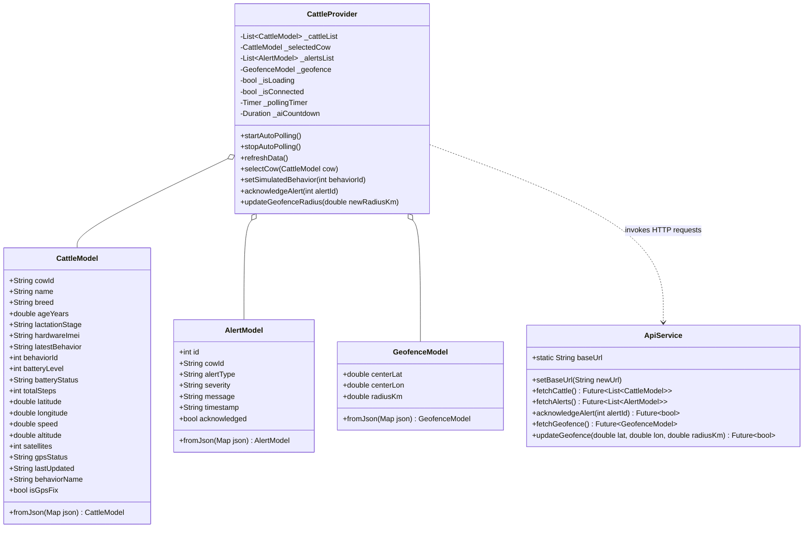

# 💻 Code Structure — Kisan Pro

## 1. Build System

| Component | Build System | Configuration File | Output Artifact |
| :--- | :--- | :--- | :--- |
| **Collar Edge Node** | Arduino IDE / ESP-IDF | `kisan_pro_sender/kisan_pro_sender.ino` | ESP32 Flash Binary (`.bin`) |
| **Farm Gateway Node** | Arduino IDE / ESP-IDF | `kisan_pro_receiver/kisan_pro_receiver.ino` | ESP32 Flash Binary (`.bin`) |
| **Cloud Backend** | Python 3.10+ / pip | `server/requirements.txt` / `server.py` | ASGI FastAPI Web Service |
| **Mobile Application** | Flutter 3.x / Dart 3.5+ | `mobile_app/pubspec.yaml` | Android APK (`.apk`) / AAB bundle |

---

## 2. Key Classes and Modules

---

## 3. Existing Files Inventory

| File Path | Component | Technical Purpose / Responsibilities |
| :--- | :--- | :--- |
| [`kisan_pro_sender/kisan_pro_sender.ino`](file:///c:/Users/geeth/OneDrive/Desktop/JRF_collar/kisan_pro_sender/kisan_pro_sender.ino) | Collar Edge Node | ESP32 firmware running 100 Hz LSM6DSOX IMU sampling, dynamic step counting DSP, 7-state posture classifier, non-blocking Quectel L89 GPS parsing, battery ADC measurement, and 433 MHz LoRa RF packet transmission every 5 seconds. |
| [`kisan_pro_receiver/kisan_pro_receiver.ino`](file:///c:/Users/geeth/OneDrive/Desktop/JRF_collar/kisan_pro_receiver/kisan_pro_receiver.ino) | Farm Gateway Node | ESP32 gateway listening for 433 MHz LoRa frames, CRC validation, preamble bit-flip auto-correction, JSON formatting, Wi-Fi reconnection watchdog, and 4-tier HTTP POST failover to AWS EC2 (`15.206.32.94:5000`) and local subnets. |
| [`mobile_app/pubspec.yaml`](file:///c:/Users/geeth/OneDrive/Desktop/JRF_collar/mobile_app/pubspec.yaml) | Mobile App | Flutter project manifest declaring package metadata, SDK constraints (`sdk: ^3.5.0`), dependencies (`provider`, `http`, `intl`, `google_fonts`, `url_launcher`, `cupertino_icons`), and assets. |
| [`mobile_app/lib/main.dart`](file:///c:/Users/geeth/OneDrive/Desktop/JRF_collar/mobile_app/lib/main.dart) | Mobile App | Flutter application entry point (`KisanProApp`), Material 3 theme configuration (forest green `#044E36`, teal `#0D9488`, slate `#F1F5F9`), and root `MainNavigationScreen` with 5-tab indexed navigation bar and live notification badges. |
| [`mobile_app/lib/models/cattle_model.dart`](file:///c:/Users/geeth/OneDrive/Desktop/JRF_collar/mobile_app/lib/models/cattle_model.dart) | Mobile App | Domain data model for cattle biometrics, GPS coordinates, behavioral postures (0-7), battery level/status, and JSON serialization factory. |
| [`mobile_app/lib/models/alert_model.dart`](file:///c:/Users/geeth/OneDrive/Desktop/JRF_collar/mobile_app/lib/models/alert_model.dart) | Mobile App | Domain data model for agricultural and health alerts with severity tiers (`CRITICAL`, `WARNING`, `INFO`), messages, timestamps, and acknowledgment flags. |
| [`mobile_app/lib/models/geofence_model.dart`](file:///c:/Users/geeth/OneDrive/Desktop/JRF_collar/mobile_app/lib/models/geofence_model.dart) | Mobile App | Domain model encapsulating pasture center coordinates (latitude, longitude) and operational radius in kilometers. |
| [`mobile_app/lib/providers/cattle_provider.dart`](file:///c:/Users/geeth/OneDrive/Desktop/JRF_collar/mobile_app/lib/providers/cattle_provider.dart) | Mobile App | Central ChangeNotifier state container managing cattle herd list, active selection, automated 3-second background polling, alert triage, estrus countdown timer, baseline calibration status, and manual simulation triggers. |
| [`mobile_app/lib/services/api_service.dart`](file:///c:/Users/geeth/OneDrive/Desktop/JRF_collar/mobile_app/lib/services/api_service.dart) | Mobile App | Network client handling REST HTTP requests (`fetchCattle`, `fetchAlerts`, `acknowledgeAlert`, `fetchGeofence`, `updateGeofence`) with timeout handling and dynamic cloud host configuration. |
| [`mobile_app/lib/screens/dashboard_screen.dart`](file:///c:/Users/geeth/OneDrive/Desktop/JRF_collar/mobile_app/lib/screens/dashboard_screen.dart) | Mobile App | Home posture view rendering live 2D cow avatar, posture badge pills, step odometer, battery status pill, 24-hour behavioral Donut Chart with custom vector painter, and rumination index. |
| [`mobile_app/lib/screens/radar_screen.dart`](file:///c:/Users/geeth/OneDrive/Desktop/JRF_collar/mobile_app/lib/screens/radar_screen.dart) | Mobile App | GIS Pasture Radar interface visualizing cattle relative to farm center, geofence radius slider ($100\text{ m} - 10.0\text{ km}$), distance metrics, and one-tap Google Maps turn-by-turn navigation. |
| [`mobile_app/lib/screens/fertility_screen.dart`](file:///c:/Users/geeth/OneDrive/Desktop/JRF_collar/mobile_app/lib/screens/fertility_screen.dart) | Mobile App | Estrus / Heat health dashboard showing heat intensity score (0-10), real-time Artificial Insemination (AI) 12-Hour AM-PM countdown timer, 21-day estrous cycle timeline, and baseline calibration status. |
| [`mobile_app/lib/screens/alerts_screen.dart`](file:///c:/Users/geeth/OneDrive/Desktop/JRF_collar/mobile_app/lib/screens/alerts_screen.dart) | Mobile App | Real-time push alarm feed categorized by severity (`CRITICAL`, `WARNING`, `INFO`), with single-tap acknowledgment actions. |
| [`mobile_app/lib/screens/settings_screen.dart`](file:///c:/Users/geeth/OneDrive/Desktop/JRF_collar/mobile_app/lib/screens/settings_screen.dart) | Mobile App | Configuration screen for farm owner metadata, cloud API host switching, LoRa radio parameters overview, and hardware pairing tools. |
| [`documents/README.md`](file:///c:/Users/geeth/OneDrive/Desktop/JRF_collar/documents/README.md) | Documentation | Complete project documentation detailing features, directory structure, and quick start guide. |
| [`documents/ARCHITECTURE.md`](file:///c:/Users/geeth/OneDrive/Desktop/JRF_collar/documents/ARCHITECTURE.md) | Documentation | 5-Tier system architecture, Mermaid diagrams, and telemetry packet schemas. |
| [`documents/IMPLEMENTATION_DETAILS.md`](file:///c:/Users/geeth/OneDrive/Desktop/JRF_collar/documents/IMPLEMENTATION_DETAILS.md) | Documentation | Mathematical algorithms for DSP step counting, 7-state classifier, 21-day baseline learning, and 5-minute inactivity watchdog. |
| [`documents/SENSORS_AND_PINOUT.md`](file:///c:/Users/geeth/OneDrive/Desktop/JRF_collar/documents/SENSORS_AND_PINOUT.md) | Documentation | Complete hardware schematics, GPIO pin mappings, voltage divider ratios, and wiring tables for ESP32, LSM6DSOX, Quectel L89, and SX1278. |
| [`documents/HOW_TO_RUN.md`](file:///c:/Users/geeth/OneDrive/Desktop/JRF_collar/documents/HOW_TO_RUN.md) | Documentation | Step-by-step flashing, server hosting, and mobile deployment manual. |

---

## 4. Software Design Patterns

1. **Provider / State Observer Pattern (`CattleProvider`)**:  
   Decouples business logic and network polling from the Flutter presentation layer. All screens (`DashboardScreen`, `RadarScreen`, `AlertsScreen`, etc.) subscribe to state updates reactively.
2. **Factory Method Pattern (`CattleModel.fromJson`, `AlertModel.fromJson`, `GeofenceModel.fromJson`)**:  
   Encapsulates JSON deserialization with safe fallback defaults, field name normalization (`battery_level` vs `battery`), and type casting.
3. **Multi-Tiered Failover Pipeline (`sendTelemetryToCloud`)**:  
   The ESP32 gateway node executes a sequential fallback strategy across AWS Cloud Server and multiple local Wi-Fi subnet IPs, guaranteeing packet delivery during intermittent connectivity.
4. **Moving Average Digital Signal Filtering (Edge DSP)**:  
   Applies exponential smoothing ($\text{Baseline}_{t} = 0.9 \cdot \text{Baseline}_{t-1} + 0.1 \cdot \|A\|_t$) to dynamically isolate step impacts from gravity and low-frequency body tilt.
5. **Dynamic Heartbeat Watchdog (`5-Minute Inactivity Window`)**:  
   Computes cattle online/offline state in-memory based on the delta between current time and the most recent hardware packet timestamp ($\Delta t \le 300\text{ s}$).
6. **Custom Vector Painter Pattern (`DonutChartPainter`)**:  
   Utilizes Flutter's low-level `CustomPainter` canvas to draw smooth anti-aliased circular arcs corresponding to 24-hour behavioral proportions.

---

## 5. Critical Dependencies

| Package / Library | Version | Usage | Purpose |
| :--- | :--- | :--- | :--- |
| `provider` | `^6.1.2` | Mobile App | Reactive state management across screens |
| `http` | `^1.2.2` | Mobile App | REST API networking with timeout and status handling |
| `intl` | `^0.19.0` | Mobile App | Date, time, and currency formatting |
| `google_fonts` | `^6.2.1` | Mobile App | Inter font family typography |
| `url_launcher` | `^6.3.0` | Mobile App | Direct invocation of Google Maps navigation intents |
| `LoRa` (Sandeep Mistry) | `v0.8.0` | Firmware | SPI interface and packet framing for Semtech SX1278 |
| `TinyGPSPlus` | `v1.0.3` | Firmware | NMEA sentence parsing for Quectel L89 multi-GNSS |
| `Adafruit LSM6DSOX` | `v1.1.2` | Firmware | I2C sensor driver for ST 6-DoF accelerometer & gyro |