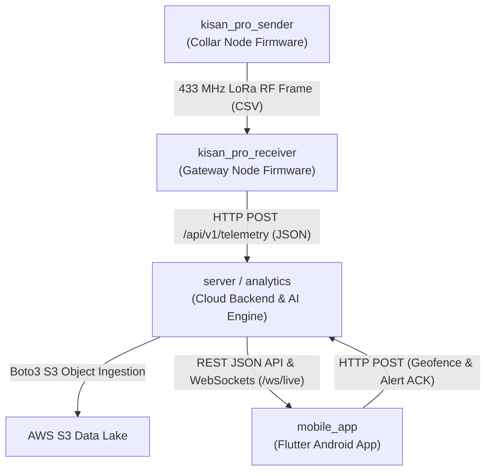

# 🔗 Dependencies — Kisan Pro

## 1. Internal Dependencies Diagram

---

## 2. Internal Component Relationships

| Origin Component | Target Component | Type | Description |
| :--- | :--- | :--- | :--- |
| `kisan_pro_sender` | `kisan_pro_receiver` | Wireless RF | Broadcasts encoded 9-token CSV frame every 5000 ms via 433 MHz LoRa radio. |
| `kisan_pro_receiver` | `server` (FastAPI) | Network HTTP | Transforms raw radio tokens into structured JSON and POSTs to `/api/v1/telemetry`. |
| `server` | AWS S3 Bucket | Cloud SDK | Uploads real-time snapshot (`latest_telemetry.json`), daily partitioned CSV, and continuous ledger (`cattle_whole_data.jsonl`). |
| `server` | `mobile_app` | HTTP / WebSocket | Delivers telemetry feeds, anomaly alarms, geofence definitions, and baseline calibration state. |
| `mobile_app` | `server` | Network HTTP | Sends alert acknowledgment requests and updates farm pasture geofence coordinates/radius. |

---

## 3. External Dependencies Inventory

### 3.1 Mobile Application (`mobile_app/pubspec.yaml`)

| Dependency Name | Declared Version | Purpose / Usage | License |
| :--- | :--- | :--- | :--- |
| **`flutter`** | SDK | Core UI engine, rendering pipeline, and widgets | BSD-3-Clause |
| **`cupertino_icons`** | `^1.0.8` | iOS-styled iconography assets | MIT |
| **`http`** | `^1.2.2` | Composable HTTP client for REST API communication | BSD-3-Clause |
| **`provider`** | `^6.1.2` | Reactive state management (`CattleProvider`) | MIT |
| **`intl`** | `^0.19.0` | Internationalization, date/time formatting, and localization | BSD-3-Clause |
| **`google_fonts`** | `^6.2.1` | Dynamic loading of Google Inter font family typography | Apache-2.0 |
| **`url_launcher`** | `^6.3.0` | Launching external apps and Google Maps navigation URLs | BSD-3-Clause |
| **`flutter_lints`** (dev) | `^4.0.0` | Recommended static analysis and style rules for Dart | BSD-3-Clause |

---

### 3.2 Firmware Dependencies (`kisan_pro_sender` & `kisan_pro_receiver`)

| Library Name | Version | Purpose / Usage | License |
| :--- | :--- | :--- | :--- |
| **`LoRa` (by Sandeep Mistry)** | `v0.8.0` | Semtech SX1278 SPI configuration, packet framing, and CRC checking | MIT |
| **`TinyGPSPlus`** | `v1.0.3` | NMEA sentence decoding for Quectel L89 multi-GNSS module | LGPL-2.1 |
| **`Adafruit_LSM6DSOX`** | `v1.1.2` | I2C sensor driver for ST LSM6DSOX 6-axis accelerometer & gyroscope | BSD-3-Clause |
| **`Adafruit Unified Sensor`** | `v1.1.14` | Unified sensor abstraction layer required by Adafruit drivers | Apache-2.0 |
| **`WiFi` & `HTTPClient`** | ESP32 Built-in | Native ESP32 Wi-Fi station connectivity and HTTP JSON client | LGPL-2.1 |
| **`Wire` & `SPI`** | ESP32 Built-in | Hardware communication busses for I2C (IMU) and SPI (LoRa) | LGPL-2.1 |

---

### 3.3 Backend Dependencies (`server/`)

| Package Name | Version | Purpose / Usage | License |
| :--- | :--- | :--- | :--- |
| **`fastapi`** | `^0.100.0` | Modern, fast web framework for building APIs | MIT |
| **`uvicorn`** | `^0.22.0` | High-performance ASGI web server | BSD-3-Clause |
| **`boto3`** | `^1.28.0` | AWS SDK for Python (S3 storage lake synchronization) | Apache-2.0 |
| **`python-dotenv`** | `^1.0.0` | Environment variable loader for AWS credentials & ports | BSD-3-Clause |
| **`pydantic`** | `^2.0.0` | Data validation and settings management using Python type annotations | MIT |