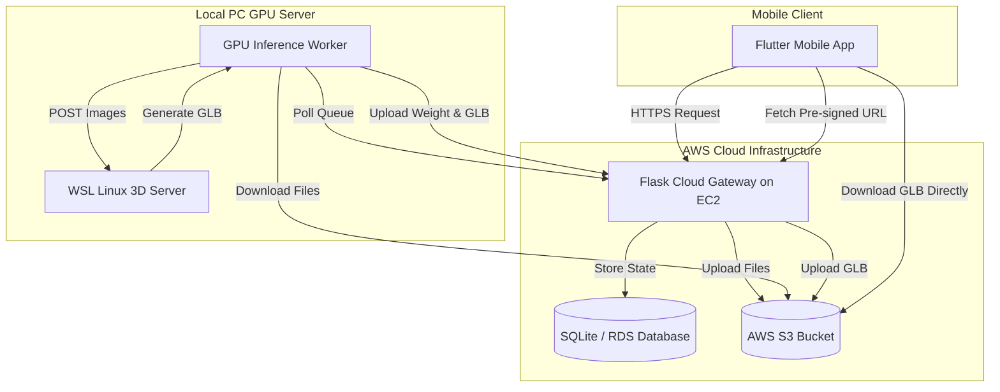

# System Architecture Document

This document describes the high-level architecture, network flows, and calculation layers of the Cattle Weight Monitoring System.

---

## 1. High-Level Architecture Overview

---

## 2. End-to-End Data Flow

1.  **Submission**:
    *   The farmer inputs cattle metadata (Name, ID, Breed, Section) and snaps 2–4 photos (Side, Back, Front, Right).
    *   The mobile app uploads files to the **AWS EC2 Flask Gateway**.
2.  **Cloud Storage & Queuing**:
    *   The gateway uploads the images to **AWS S3** (`kisanpro-cattle-weight-data`) under unique keys.
    *   The gateway registers a task in the **SQLite Database** (`CloudTask` table) with status `pending`.
3.  **Inference Polling**:
    *   The **Local GPU Worker** polls the EC2 `/api/worker/next-task` endpoint.
    *   The worker receives the task and downloads the images from **S3** using temporary pre-signed S3 URLs.
4.  **Processing & Keypoints**:
    *   The worker detects 7 side keypoints and 2 back keypoints using local deep learning models (`MobilePoseNetV3`).
    *   It calculates dimensional measurements (OBL, WH, HG, HL) and uses they to calculate the cattle's weight.
5.  **3D Model Generation**:
    *   The worker posts the side/back images to the **WSL 3D Server** (`localhost:9090`).
    *   The WSL server processes the images through the **TRELLIS.2** model to reconstruct an interactive 3D mesh (`model.glb`).
    *   The worker downloads the finished GLB locally.
6.  **Resolution & Saving**:
    *   The worker uploads the predicted weight, dimensions, and the GLB file back to the cloud gateway.
    *   The gateway saves the GLB to **S3** and updates the task status to `completed` in the database.
7.  **Rendering**:
    *   The mobile app detects the `completed` status, retrieves the direct pre-signed S3 URL for the GLB, and downloads it directly to render in the interactive `<model-viewer>` canvas.

---

## 3. Weight Estimation Calculation Layer

### A. Perimeter Approximation (Ramanujan's Formula)
The heart girth ($HG$) of the cattle represents the perimeter of the chest cross-section. The cross-section is modeled as an ellipse with semi-axes $a$ (depth/2) and $b$ (width/2). 
We approximate the perimeter using **Ramanujan's First Approximation**:
$$h = \frac{(a - b)^2}{(a + b)^2}$$
$$HG \approx \pi (a + b) \left( 1 + \frac{3h}{10 + \sqrt{4 - 3h}} \right)$$

### B. Decoupled Dimension Calibration
To prevent scale distortions from affecting accuracy and UI, measurements are processed in two separate tracks:
1.  **Physical track**: Calculates actual dimensions based on physical pixel-to-cm ratios. Used for **veterinary formulas** and **display on the mobile screen**.
2.  **Feature track**: Applies specific breed scaling modifiers (e.g. `0.1087` width scale for adult Indian cows) to align features with the ML model's training distribution.

### C. Weight Calculation Logic
Depending on the category and breed, weight is estimated via three distinct mathematical models:
*   **Calves**: Uses the metric-modified **Schaeffer Formula**:
    $$\text{Weight (kg)} = \frac{OBL \times HG^2}{10815}$$
*   **Draft Breeds (e.g. Hallikar, Deoni, Ongole)**: Uses the **Agarwal Formula**:
    $$\text{Weight (lbs)} = \frac{Girth \times Length}{Y}$$
    *Where $Y$ is a scalar coefficient ($8.0$, $8.5$, or $9.0$) determined by Girth size, and results are converted to kg.*
*   **Dairy & Beef Cattle**: Uses the **ExtraTrees Regression Model** built with 17 biometric features extracted from the keypoints.
