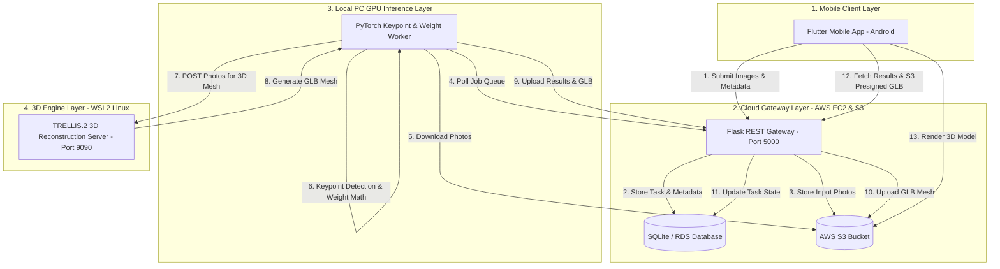

# Cattle Weight Monitoring System

A production-grade, AI-powered non-contact livestock weight estimation and 3D body condition analysis platform. The system combines deep learning keypoint detection, veterinary anthropometric equations, biometric regression models, and TRELLIS.2 3D mesh reconstruction to calculate cattle weight without a physical weighing scale.

---

## Clean Architecture & System Design

The platform uses a decoupled, distributed clean architecture operating across four distinct layers:



### Component Breakdown
1. **Mobile Client (Flutter App)**: User interface for farmers to log cattle, input manual tape measurements or upload multi-view photos (Side, Back, Front, Right), track weight history, view health alerts, and inspect 3D cattle models.
2. **Cloud Gateway (AWS EC2 & S3)**: Central REST API backend running Flask + Gunicorn on AWS EC2, backed by SQLite and AWS S3 (`kisanpro-cattle-weight-data`) for persistent asset storage and job queuing.
3. **Local PC GPU Worker (Windows)**: Background PyTorch worker that polls pending inference jobs from the cloud gateway, extracts biometric keypoints via MobilePoseNetV3, calculates physical & scaled dimensions, and executes weight prediction models.
4. **WSL 3D Reconstruction Engine (WSL2 Linux)**: High-performance 3D pipeline running **TRELLIS.2** + **BiRefNet** foreground segmentation in WSL2 Linux to convert multi-view cattle photos into interactive `.glb` 3D meshes.

---

## Core Implementation & Weight Estimation Logic

### 1. Keypoint Extraction & Metric Scaling
- **Side View Model**: Identifies 7 critical skeletal anatomical points: Humerus Head (Shoulder), Pin Bone, Wither, Chest Bottom, Flank Bottom, Back Ridge, Abdomen Peak.
- **Back View Model**: Identifies 2 key points across the hip width.
- **Scale Calibration**: Reference pixel-to-centimeter calibration is computed from user input or section ratio constraints ($OBL = \text{Pixel Distance} \times \text{Pixel Scale}$).

### 2. Decoupled Dimension Architecture
To maintain maximum accuracy for veterinary formulas while preserving machine learning model performance, measurements are processed in two separate tracks:
- **Physical Track ($HG_{\text{physical}}$)**: Calculates true physical measurements using Ramanujan's ellipse perimeter formula:
  $$h = \frac{(a - b)^2}{(a + b)^2}$$
  $$HG \approx \pi (a + b) \left( 1 + \frac{3h}{10 + \sqrt{4 - 3h}} \right)$$
  *(Displayed directly in the mobile UI and used for veterinary formulas).*
- **Scaled Track ($HG_{\text{scaled}}$)**: Applies breed-specific depth and width scaling factors (e.g. `depth_scale = 0.7850`, `width_scale = 0.8800` for Dairy Cattle) to align feature inputs with the ExtraTrees regressor training distribution.

### 3. Breed & Section Weight Equations
Depending on the category, age, and breed, weight is computed using specialized mathematical models:
- **Calves ($\le 95\text{ cm } OBL$)**: Uses the metric-modified **Schaeffer Formula**:
  $$\text{Weight (kg)} = \frac{OBL \times HG^2}{10815}$$
- **Draft Breeds (e.g. Hallikar, Deoni, Ongole, Krishna Valley)**: Uses the **Agarwal Formula**:
  $$\text{Weight (lbs)} = \frac{HG \times OBL}{Y}$$
  *(where $Y \in \{8.0, 8.5, 9.0\}$ based on girth thresholds, converted to kg).*
- **Dairy & Beef Cattle (e.g. HF, Jersey, Gir, Sahiwal, Kankrej)**: Uses an **ExtraTrees Regressor Model** trained on 17 biometric anatomical ratios.

---

## Running Commands & Execution Guide

Follow these exact commands to run the system across all 4 environments.

### 1. AWS EC2 Cloud Gateway Server

Run on your AWS EC2 terminal:

```bash
# 1. Connect to EC2 & terminate old processes
pkill -f gunicorn

# 2. Go to cloud gateway folder
cd /home/ec2-user/cloud_gateway

# 3. Activate Python virtual environment
source venv/bin/activate

# 4. Start Gunicorn Production Gateway Server
gunicorn -w 4 -b 0.0.0.0:5000 app_cloud:app
```

---

### 2. 3D Reconstruction Server (WSL2 Linux)

Run in a Windows PowerShell window by switching into WSL:

```powershell
# 1. Open WSL Linux environment
wsl

# 2. Navigate to 3D server folder
cd /mnt/e/Weight_monitoring_production_code_without_AWS/wsl_3d_server

# 3. Launch 3D server in auto-restart loop (Port 9090)
bash run_forever.sh
```

---

### 3. Local PC GPU Inference Worker (Windows PowerShell)

Run in a separate Windows PowerShell window:

```powershell
# 1. Switch to project directory
E:
cd E:\Weight_monitoring_production_code_without_AWS

# 2. Run PyTorch GPU worker daemon
python local_pc_worker/gpu_worker.py
```

---

### 4. Mobile Client Application (Flutter Android)

Run in a Windows PowerShell window with your Android phone connected via USB:

```powershell
# 1. Verify USB device connection
C:\Users\GITAM\AppData\Local\Android\Sdk\platform-tools\adb.exe devices

# 2. Navigate to Flutter app folder
E:
cd E:\Weight_monitoring_production_code_without_AWS\cattle_weight_app

# 3. Build & Install Release APK to Connected Phone
flutter run -d TOOJ6HXOW4NBKVS8 --release
```

---

## Technology Stack

| Layer | Technologies Used |
|---|---|
| **Mobile App** | Flutter 3.x, Dart, ModelViewer Plus, Provider |
| **Cloud Gateway** | Python 3.10, Flask, Gunicorn, SQLite, AWS S3, Boto3, PyJWT |
| **GPU Worker** | PyTorch, OpenCV, MobileNetV3, Scikit-Learn, ExtraTrees |
| **3D Engine** | TRELLIS.2, BiRefNet, PyTorch 2.x, CUDA 12, Trimesh, o-voxel |
